# Objectifs pédagogiques

- Comprendre la mouvence **NoSQL**.
- Critiquer les forces et les faiblesses des différents modèles de données.
- Adapter la configuration d'un système distribué à certains scénarios
- Concevoir un système multi-modèle adapté.

---

# Organisation de l'unité

## BIM1 & BIM2

- 2h par semaine théorie
- 2h par semaine de laboratoire

--- 

L'**évaluation** repose sur 
* la réalisation d'un système **polyglotte** illustrant la gestion de données diverses dans une application moderne.
* un examen théorique.

---

# Plan du cours

* Introduction au NoSQL
* Introduction aux 4 modèles de données "typiques"
* Concepts de systèmes distribués
  * CAP - BASE
  * Réplication
  * Sharding
* Réflexion sur les agrégats
* Série chronologique DB
* NewSQL
* Recherche de données

---
<!-- _class: transition2 -->

Cours 01 : Introduction au NoSQL

---

<!-- _class: cite -->  

Qu'est ce que le NoSQL ?

Est-il meilleur que le modèle relationnel ?

---

<!-- _class: transition -->

Retour sur le modèle relationnel

---

Les bases de données relationnelles, ont longtemps été le choix par défaut.

* Oracle DB
* MySQL,
* PostgreSQL,
* ...

---

# Clés du succès

* **Persistance** et **manipulation** des données
* Gestion de la **concurrence**
* **Intégration**
* **Modèle standard**
---
## Données persistantes

* Gestion de données non volatile.
* Lecture, écriture, recherche plus facile qu'un système de fichier.
  - manipulation de petits éléments d'information,
  - récupération en *lots*,
  - agréger l'information (somme, moyenne...)
  - ...

---

## Contrôle de la concurrence

* Plusieurs utilisateurs peuvent modifier le même morceau d'information en même temps.
  > Risque : *conflits*
  > Solution : *transactions* (atomicité & rollback en cas d'erreur)
---

## Intégrer (lier) des applications en utilisant une base de données partagée

<center>

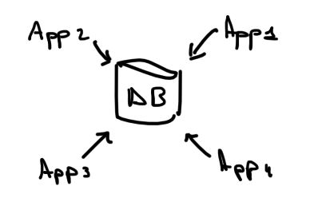

</center>

* Les données modifiées par une application doit être vue par les autres ;
* garantie de cohérence, une application ne doit pas être en mesure de corrompre les données d'une autre application
* ...

---

## Modèle standard

Quelques différences entre les bases de données relationnelles, mais globalement identiques.

* Compétences des développeurs réutilisées dans beaucoup de projets.
* Requêtes SQL et fonctionnement de base identique.
* organisation des données adaptées à la majorité des requêtes,
* Concept de transaction, trigger...

---

# Impedance missmatch

Coexistance de deux représentations

* le modèle relationnel ;
* les structures en mémoire :
  * listes,
  * tableaux,
  * objets imbriqués,
  * héritage,
  * ...

> Traduction nécessaire, frustration des développeurs...
---

<center>

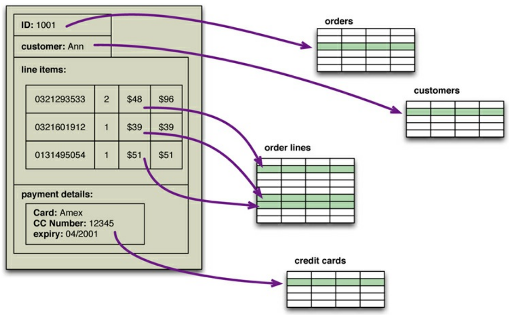

</center>

---

*1990 :* Naissance de l'orienté objet et des *bases de données orientées objet* :face_with_open_eyes_and_hand_over_mouth:.

<center>


</center>

---

> ## Les **ORM** facilite, mais le développeur ne peut ignorer ce qu'il fait.
>
> - le lazy/eager loading,
> - les associations (`1..N`, `N..N`),
> - coût des jointures,
> - la gestion des index,
> - nécessité d'écrire des requêtes plus complexes,
> - ...

---

# Bdd applicative & bdd intégrative

## Base de donnée avec le rôle d'intégrer

Application implémentée par des équipes différentes sont unies par une même base de données. Le *SQL* joue un rôle la flexibilité de l'utilisation du schéma en joue un autre.

Inconvénients : 
* La structure peut devenir extrêment complexe.
* Syncronisation entre les équipes nécessaires (développement plus difficile).
* Des applications différentes ont des besoins différents. Ex. performance -> index (problème d'insertion pour une application A - pour une meilleure recherche de l'application B).

---

## Base de donnée applicative

Changement dans les années 2000, utilisation de services web.

> ## Les services web ([Wikipedia](https://fr.wikipedia.org/wiki/Service_web))
> Un service web est un protocole d'interface informatique de la famille des technologies web permettant la communication et l'échange de données entre applications et systèmes hétérogènes dans des **environnements distribués**. Il s'agit donc d'un ensemble de fonctionnalités exposées sur internet ou sur un intranet, par et pour des applications ou machines, sans intervention humaine, de manière synchrone ou asynchrone. 
>
> Le protocole de communication est défini dans le cadre de la norme SOAP dans la signature du service exposé (WSDL). Actuellement, le protocole de transport est essentiellement TCP (via HTTP)

---

> ## Base de donnée applicative
> * communication des applications via le protocol HTTP.
> * Une et une seule application accède à la base de donnée. 

Possibilité de communiquer grâce à des structures de données plus riches ; d'abord XML, ensuite JSON.

* tableaux
* données imbriquées
* listes

---

Malgré cela, pas de ruée pour stocker les données différemment. Le modèle relationnel est maîtrisé et fonctionne suffisamment bien.

---

# Utilisation de Cluster

## Web 2.0 et bulle internet des années 2000.

Activités, tracking, gestion des données des réseaux sociaux (liens...) => la quantité de données explose.

> 2 options face à cette quantité d'information
> 
> * Scalabilité verticale
> * Scalabilité horizontale

---


## Scaling vertical (scaling-up)

<div class="columns">
<div>

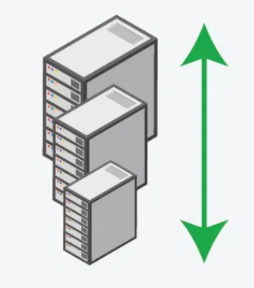
Crédits : [geeks for geeks](https://www.geeksforgeeks.org/system-design/system-design-horizontal-and-vertical-scaling/)

</div>
<div>

* Pas de changement dans le code de l'application,
* réseau plus simple,
* maintenance plus facile.

</div>
</div>


---

### Scaling horizontal (scaline-out)

<div class="columns">
<div>

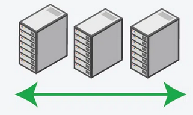
Crédits : [geeks for geeks](https://www.geeksforgeeks.org/system-design/system-design-horizontal-and-vertical-scaling/)

</div>
<div>

* Augmente la "disponibilité",
* plus robuste,
* facilité d'augmenter la charge.

</div>
</div>


⚠️ Les bases de données relationnelles ne sont pas prévues pour ce type d'architecture !

---

Adaptation des bases de données relationnelles aux clusters

* Challenges techniques :
   * Sous système avec disque partagé.
   * Séparation par shard (géré par l'application).

* Coût des licences : 1 machine = 1 licence

=> Google et Amazon influence un changement.

---

# Cluster ([Wikipédia](https://fr.wikipedia.org/wiki/Grappe_de_serveurs))
Un cluster désigne des techniques consistant à regrouper plusieurs ordinateurs **indépendants** appelés noeuds, afin de permettre une **gestion globale** et de dépasser les limitations d'un ordinateur pour **augmenter la disponibilité**, **facliliter la montée en charge**, permettre une **répartition de la charge**, faciliter la **gestion des ressources**.

La création de petits cluster est un procédé peu coûteux, consistant à grouper plusieurs ordinateurs en **réseau**.

---


# Émergence du NoSQL

## Origine du terme

1. 1998 - Apparition du terme NoSQL ([Strozzi NoSQL](https://en.wikipedia.org/wiki/Strozzi_NoSQL))
   * Fichier "ASCII" (format *relationnel*)
   * manipulé par ~~SQL~~ des scripts *shell*.
   * aucune influence sur les BDD traitées dans ce cours.

1. 2005 - première release de BigTable (Google)
   * wide-column et clé-valeur
   * forte charge opérationnelle et capacité d'analyse.


---

3. [Papier Amazon Dynamo 2007](https://www.allthingsdistributed.com/2007/10/amazons_dynamo.html).

1. **11 juin 2009**, meetup informel à SanFrancisco organisé par Johan Oskarsson. Objetif : discuter de **base de données distribuées** & **non-relationnelles**.
   > ## Il fallait
   > * un bon hashtag,
   > * pas trop utilisé sur Google
   > * => *#NoSQL* proposé dans le chan irc #cassandra. Ne représente pas vraiment le sujet, mais est un bon hashtag 🤡) 

---

Sujets des talks : 
 * Voldemort (clé-valeur)
 * Cassandra (wide column store)
 * Dynomite (clé-valeur)
 * HBase (wide column store)
 * Hypertable (wide column store)
 * CouchDB (document)
 * MongoDB (document)

---

# ~~Définition~~ Caractéristiques du NoSQL

Il n'existe pas de définition, plutôt un ensemble de caractéristiques.
* Pas d'utilisation du SQL
* XXI siècle
* Non relationnel
* Sans schéma ⚠️
* Distribué
* Autres propriétés que les propriétés ACID.

---

Les caractéristiques ne sont pas toujours rencontrées : 

Ex : Modèle graphe sur un serveur unique.

---

<!-- _class: cite -->
Au final, il est préférable de voir le NoSQL comme une mouvence. Stocker les données en choisissant le modèle de donnée et l'architecture la plus adaptée aux besoins. Les bdd NoSQL et les BDD relationnelles sont devenues des options.

---

2 raisons d'utiliser le NoSQL : 

* besoins de performance (scalabilité)
* améliorer la productivité du développement d'une applicaation

---

# Quelques mots-clés

<div class="columns">
<div>

* modèles de données
* Impédence missmatch
* Scalabilité
* Cluster
* Sans schéma
* CAP

</div>
<div>

* Sharding
* Réplication
* Aptitude au Big Data
* Performance
* dénormalisation
* Haute disponibilité

</div>
</div>

---
<!-- _class: transition2 -->

Cours 02 : Modèles de données "agrégat"

---

Un *modèle de donnée* décrit comment intéragir avec les données.  

* à ne pas confondre avec le modèle de stockage qui décrit comment la base de donnée stoque et manipule les donnée en interne.

---

Généralement, on fait le lien avec

> ## Modélisation des données (Wikipedia)
>
> Dans la conception d'un système d'information, la *modélisation des données* est l'analyse et la conception de l'information contenue dans le système afin de représenter la structure de ces informations et de structurer le stockage et les traitements informatiques.
>
> Il s'agit essentiellement d'*identifier les entités logiques* et *les dépendances logiques* entre ces entités. La modélisation des données est une représentation abstraite, dans le sens où les valeurs des données individuelles observées sont ignorées au profit de la structure, des relations, des noms et des formats des données pertinentes, même si une liste de valeurs valides est souvent enregistrée. 

Représentation qu'on peut faire à l'aide d'un diagramme ~~entité-relation~~ entité-association.

---

<!-- _class: cite -->

Dans les slides qui suivent, nous utiliserons le terme *modèle de données* pour décrire la manière dont les base de données organisent les données (métamodèle).

---
<center>

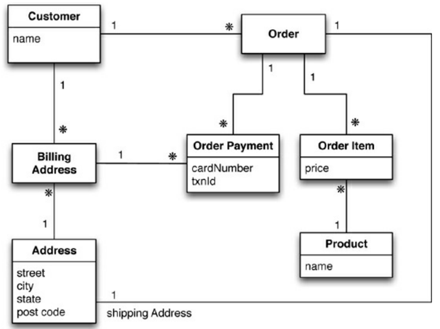

*Figure 1.1.* Diagramme entité-association normalisé.

</center>

---

## Le modèle de donnée relationnel

* Ensemble de table (*relation*)
* Chaque table possède des lignes ou enregistrement (*tuple*) qui représente des instances.
* Les instances sont décritent au travers de colonnes (⚠️ 1 valeur par *cellule*).
* Une colonne peut faire référence à un autre relation constituant une association entre elles-deux

---

## Modèles de données du NoSQL

> Orientées agrégats
> * Document
> * Clé-valeur
> * Famille de colonnes

> Non orientées agrégats
> * Graphe

---

# *Agrégats*

Orientation différente du relationnel :

- Modèle Relationnel : On prend l'information et on la divise en tuples (plats, non imbriqués)  
- Orientation agrégat : On pense à comment manipuler les données. Souvent, on veut des **structures complexes** :
  - Listes  
  - Structures imbriquées  

---

> ## Définition
> 
> Terme qui vient de [Domain-Driven Design](https://fabiofumarola.github.io/nosql/readingMaterial/Evans03.pdf). Un *agrégat* est une collection d'objets liés que l'on souhaite traité comme *unité d'information*. En particulier, cela forme une unité pour 
> * *la manipulation de donnée* et 
> * *la gestion de la cohérence*.

## Avantages

* Un agrégat forme une unité naturelle pour la réplication et le sharding (dans un cluster).
* Le développeur a l'habitude de manipuler des données imbriquées, des listes, tableaux...

---

<center>
Diagramme entité-association normalisé.


</center>

---

<center>

Échantillon de données

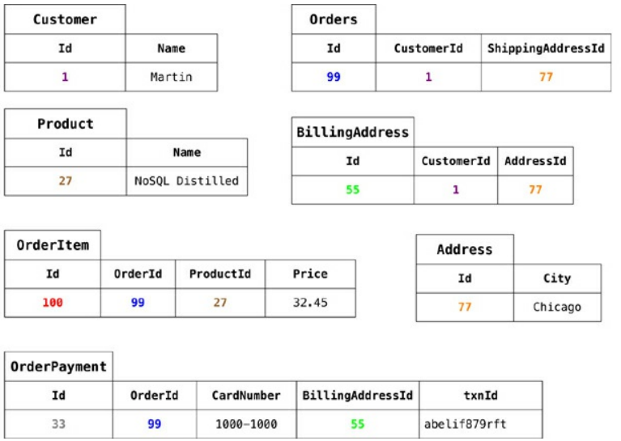

</center>

---

<center>

Diagramme pensé en terme d'agrégat (solution 1)

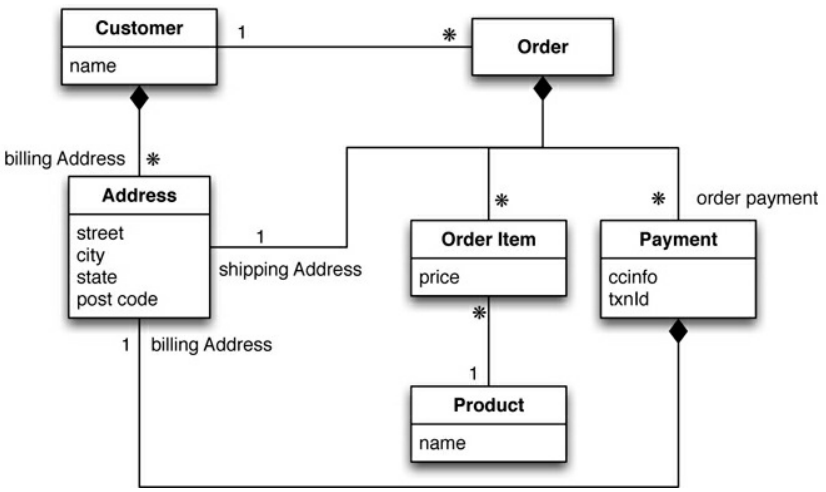

</center>

---

```json 

{ // in customers
  "id": 1,
  "name": "Martin",
  "billingAddress": [{"city": "Chicago"}] ⚠️ Dénormalisation
}

{ // in orders
  "id": 99,
  "customerId": 1,
  "orderItems": [{
      "productId": 27,
      "price": 32.45,
      "productName": "NoSQL Distilled"
    }
  ],
  "shippingAddress": [{"city":"Chicago"}], ⚠️
  "orderPayment": [{
      "ccinfo":"1000-1000-1000-1000",
      "txnId":"abelif879rft",
      "billingAddress":{"city":"Chicago"} ⚠️
    }
  ]
}
```

---

* Apparition de 3 copies d'une même adresse (*dénormalisation*). 
   * 🗒️ En relationnel, il est nécessaire de prévenir la modification d'une ligne d'adresse.
* Le lien entre un client et une commande ne fait partie d'aucun agrégat. → Il s'agit d'une association.

* > Dénormalisation du nom du produit. Pourquoi est-ce acceptable/souhaitable en NoSQl ?
  > * On souhaite minimiser le nombre accès aux agrégats.

* ⚠️ Ce qui compte, ce n'est pas vraiment la façon exacte dont on dessine la frontière d'un agrégat, mais plutôt de réfléchir à la manière dont on va accéder aux données.

---

<center>

Diagramme pensé en terme d'agrégats (solution 2)
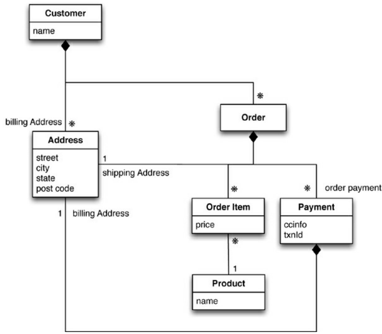
</center>

---

```json
{
  "customer": {
    "id": 1,
    "name": "Martin",
    "billingAddress": [
      { "city": "Chicago" }
    ],

    "orders": [ {
        "id": 99,
        "customerId": 1,
        "orderItems": [ {
            "productId": 27,
            "price": 32.45,
            "productName": "NoSQL Distilled"
          }
        ],
        "shippingAddress": [
          { "city": "Chicago" }
        ],
        "orderPayment": [ {
            "ccinfo": "1000-1000-1000-1000",
            "txnId": "abelif879rft",
            "billingAddress": { "city": "Chicago" }
          }
        ]
      }
    ]
  }
}
```
---

<!-- _class: cite -->

Quelle agrégation est meilleure ?

---

Cela dépend de comment on souhaite manipuler les données
* Accès client ↛  accès aux commandes ⇒ modèle 1
   > Permet d'accéder individuellement aux commandes
* Accès client → accès aux commandes ⇒ modèle 2

Dépend de l'application, ce qui en fait un désavantage par rapport aux systèmes ignorant les agrégats.

---

## Non conscient des agrégats vs orienté agrégat

- **Relational & Graph DBs** : Non conscient des agrégats
  → pas de notion d'agrégat, juste des relations sans sémantique entre les données.
- **NoSQL (Key-Value, Document, Column-Family)** : aggregate-oriented  
  → l'agrégat indique l'unité de stockage et d'accès


---

## Pourquoi l'orientation agrégat ?

- Facilite le **stockage distribué en cluster**  
- L'agrégat indique quelles données doivent vivre ensemble sur le même noeud 
- Simplifie la gestion de la cohérence locale

⇒ Une bdd relationnelle ne peut pas utiliser des données d'agrégat pour optimiser le stockage et la distribution de données.

---

Ne pas connaître les agrégats est-il un handicap ?

* Parmi les deux modèles d'agrégat précédement proposés.Comment réaliser un historique de la vente des produits ?

---

## Conséquence sur les transactions

- **SGBDR** : transactions ACID multi-tables (sans limite)
- **NoSQL agrégat-orienté** : atomicité **au niveau d'un seul agrégat**  
  → si plusieurs agrégats : gestion à la charge de l'application  
- **Graph & relationnel** : ACID complet possible

> ## Transation ACID (Atomique, cohérent, isolé, durable)
> 
> Permet 
> * de mettre à jour plusieurs table en une opération. 
> * l'opération est réussie ou non-appliquée
> * les opérations concurrente sont isolées et ne peuvent pas voir des mises à jours partielles.

---

<!-- _class: transition -->
Modèles Clé-valeur & Document

---

## Base de données Clé-valeur

- Données = { **clé** → **agrégat opaque** }  
- Avantages :  
  - Flexibilité totale sur le contenu  
  - Performance simple (lookup par clé)  
- Limite : pas de requêtes internes, pas de sous-récupération

---

## Base de données Document

- Données = { **clé** → **document structuré** }  
- Avantages :  
  - Requêtes par *"clé"* internes  
  - Récupération partielle possible  
  - Index sur le contenu  
- Limite : moins libre que clé-valeur

---

## Clé-valeur vs Document

- **Key-Value** : lookup uniquement par clé  
- **Document** : requêtes riches sur la structure  
- La frontière est floue (Redis, Riak, etc.)

---

<!-- _class: transition -->
Famille de colonne

---

## Origine : Google Bigtable

- Modèle repris par **HBase** et **Cassandra**  
- Stockage en **colonnes groupées (famille de colonnes)**  
- Différent des colonnes « relationnelles » classiques

---

## Structure

- Map à **deux niveaux :**
  - **Row** (identifiant → agrégat)  
  - **Columns** regroupées en **familles**  
- Accès possible : tout le row ou colonnes spécifiques

---

<center>

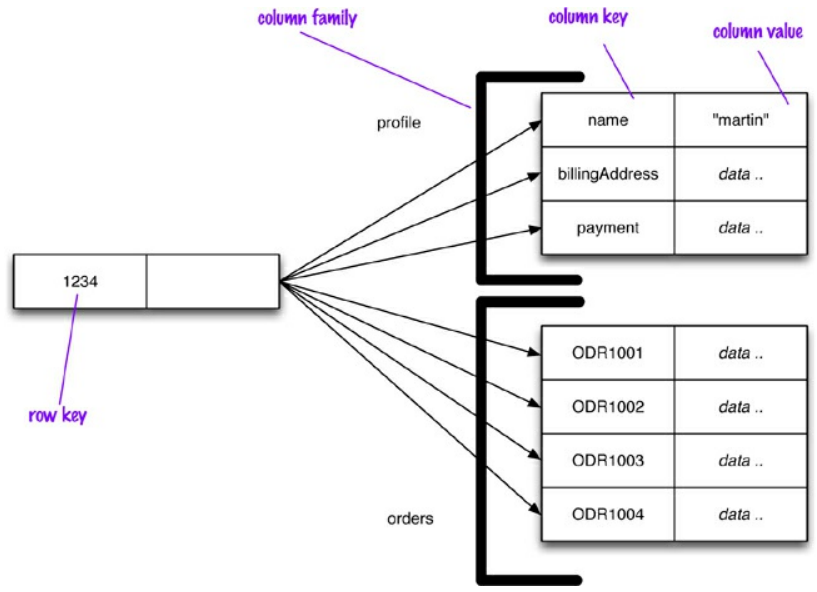

</center>

---

<!-- _class: transition -->
Comparaison des 3 modèles

---

## Comparaison des 3 modèles

- **Key-Value** : agrégat opaque, lookup par clé uniquement  
- **Document** : agrégat transparent, requêtes internes possibles  
- **Column-Family** : agrégat en 2 niveaux (row + familles de colonnes)

---

## Points communs

- Agrégat = unité d'accès et de mise à jour  
- Optimisé pour le **cluster**
- Donne un compromis entre **structure** et **flexibilité**

---

<!-- _class: transition2 -->

Cours 03 : Plus de détail sur les modèles de données

---

<!-- _class: transition -->

Associations

---

# Rapel 
2 cas :

1. Accès client → accès aux commandes
1. Accès individuels aux commandes

---

Récupération des détails du client dans le cas n°2 :

1. on récupère l'enregistrement lié à la commande,
2. on lit l'ID du client,
3. on récupère l'agrégat du client.

> ⚠️ Attention, la base de donnée n'aura pas connaissance de ce lien.
>    * Conséquences ?
>
> Certaines bdd mettent en place des méchanismes pour optimiser : index (MongoDB), metadonnée (Riak).
---

### Modèlisation alternative (Client intégré à l'ordre)

``` json
{
  "_id": 456,
  "customer": { "id": 123, "name": "Alice", "email": "alice@example.com" },
  "total": 25.0
  ...
}
```

---

| Modèle                  | La base "connait" la relation ? | Requêtes croisées possibles ? | Risque d'incohérence |
|--------------------------|----------------------------------|--------------------------------|-----------------------|
| **SQL**                 | ✅ Oui (clé étrangère)           | ✅ Jointures puissantes         | Faible (contrainte FK et ACID) |
| **Clé-valeur pur**      | ❌ Non (juste ID stocké)        | ❌ Non                          | Moyen (c'est à l'app de gérer) |
| **Document (cas n°1 - par référence)** | ⚠️ Un peu (via index)          | ✅ Oui (via index)              | Moyen (pas de FK stricte) |
| **Document (embedding)** | ❌ Non (pas de lien)            | ❌ Non  (mais pas besoin)    | Élevé (duplication) |
| **Clé-valeur avec liens (Riak)** | ✅ Oui (via metadata)        | ⚠️ Limité (suivi de lien interne au sgbd)        | Moyen (pas de validation à l'écriture)|

---

<!-- _class: transition -->

Et avec le modèle graphe ?

---

<center>

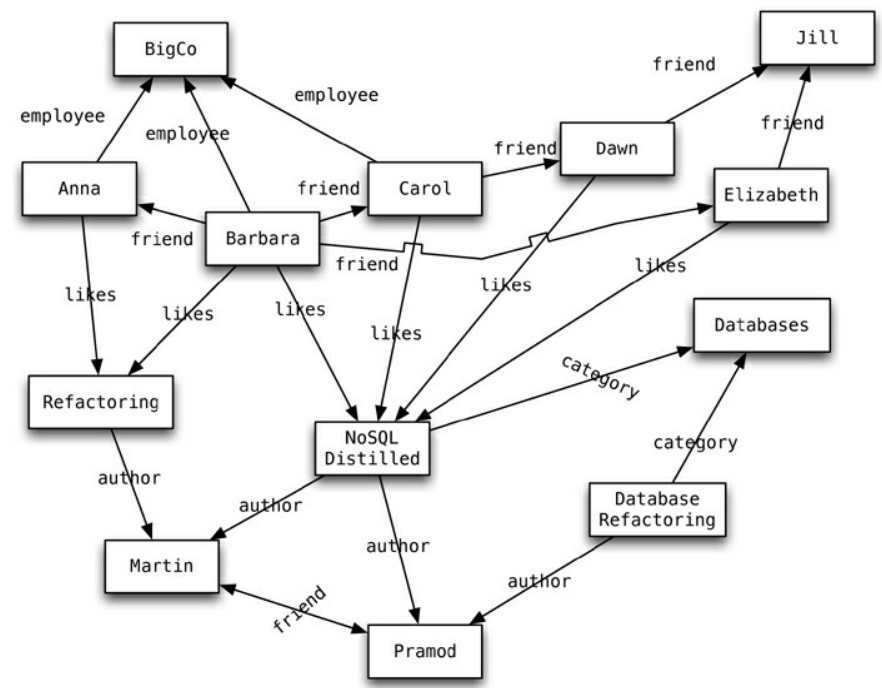
</center>

---

> ## Graphe de connaissance ([wikipedia](https://en.wikipedia.org/wiki/Knowledge_graph))
> In knowledge representation and reasoning, a *knowledge graph* is a knowledge base that uses a graph-structured data model or topology to represent and operate on data. Knowledge graphs are often used to store interlinked descriptions of entities – objects, events, situations or abstract concepts – while also encoding the free-form semantics or relationships underlying these entities.

> ## Traduction & simplification
> Un graphe de connaissances est une base de données qui utilise un graphe (sommets et arêtes) pour représenter l'information.
Il permet de stocker des descriptions reliées entre elles concernant des entités (par exemple : objets, personnes, événements, situations ou idées abstraites) et de représenter aussi les relations qui existent entre ces entités.

---

<!-- _class: cite -->

Trouver les livres de la catégorie bases de données écrits par un auteur apprécié par un ami.

---

| Modèle                  | La base "connait" la relation ? | Requêtes croisées possibles ? | Risque d'incohérence |
|--------------------------|----------------------------------|--------------------------------|-----------------------|
| **Graphe (Neo4j)** | ✅ Oui (objet de 1ère classe)        | ✅✅ Oui        | Faible ([first-class citizen](https://neo4j.com/news/5-factors-driving-graph-database-explosion/))|

---

# Dans un modèle relationnel

On peut parcourir les clés étrangères à l'aide des jointures, mais c'est vite couteux, difficile à écrire, lire...

## Exemple :
``` sql
SELECT DISTINCT vArrivee.nom, vArrivee.pays
FROM ville vDepart
JOIN troncon t1 ON vDepart.idville = t1.villeDepart
JOIN troncon t2 ON t1.villeArrivee = t2.villeDepart
JOIN troncon t3 ON t2.villeArrivee = t3.villeDepart
JOIN ville vArrivee ON t3.villeArrivee = vArrivee.idville
WHERE vDepart.nom = 'Bruxelles';
```

---

Dans une base de données graphe, la plupart des requêtes servent surtout à explorer les relations entre les données.

1. Point de départ : recherche par un attribut indexé
1. suivi des arêtes

---

# Modèle graphe vs modèles agrégats
* Nature différente des agrégats (voir opposé)
* Sur un serveur unique (~~distribué dans un cluster~~)
* ACID complet
* Liens avec les autres sgbd NoSQL : 
  * Augmentation d'intérêt conjointement
  * rejet du modèle relationnel.

---

<!-- _class: transition -->

Sans schéma

---

<!-- _class: cite -->
Les bases de données NoSQL sont « sans schéma ».

---

## Modèle relationnelle : Une camisole

* Avant de stocker des données : définir un **schéma**  
  * Tables  
  * Colonnes (sémantique & type)
  * contraintes
  * ...
* Impossible de stocker sans schéma préalable

--- 
## NoSQL : un stockage plus flexible

- Pas de schéma imposé  
- Chaque type de NoSQL permet d'ajouter librement :
  - **Clé-valeur** : n'importe quelle donnée associée à une clé  
  - **Document** : structure libre dans chaque document  
  - **Famille de colonne** : données dans les colonnes au choix  
  - **Graphe** : nouvelles arêtes et propriétés ajoutées librement 

---

## Avantages du *sans schéma*

* Plus grande liberté et flexibilité,
* Pas besoin de tout prévoir à l'avance,  
* Adaptation facile au projet en cours,
* Suppression de données non utilisées (sans effets de bord),
* Ajout de données sans faire des "trous".

---

## Limites du *Schemaless*

- Programmes supposent une **structure implicite** / **schéma à la lecture** :
  - Ex. champ `billingAddress` ≠ `addressForBilling` (valeur ≠ "Bob")
  - Les types doivent être cohérents (ex. `5` ≠ `"five"`)  
- Le schéma est **dans le code applicatif** :
  - Rend la compréhension des données plus difficile (doc)
  - La BD ne peut pas optimiser ni valider

---

## Pourquoi garder un schéma ?

* Schéma fixe pour :
  * Cohérence  
  * Optimisation  
  * Validation  
* La **rejet du schéma** par NoSQL est une rupture importante

---

> ## *Schéma implicite*
> Ensemble de supposition - à propos de la structure de donnée - faites dans l'application qui manipule les données.

---

## Problèmes pratiques au schéma implicite

* Pour comprendre les données il peut être nécessaire de plonger de le code
   > ⚠️ Attention, aussi valide dans le modèle relationnelle (column1, column2...).
* risques ☢️ : incohérences, incompatibilités
* Approches possibles :
  * Centraliser l'accès aux données : via une seule appli + API (service web)
  * Délimiter clairement les zones accessibles par chaque appli 🤮.

---

## Schémas relationnels : plus flexibles qu'on ne pense

* SQL permet de modifier un schéma à tout moment
* Des colonnes peuvent être ajoutées à la volée  
* On peut stocker différentes valeurs dans une même colonne (devrions nous le faire ?) → privilégier une bdd sans schéma.

---

## En résumé

- Le *« sans schéma »*
  * pour 👍 : Flexibilité, adaptation rapide, gestion des données variées
  * contre 👎 difficultés d'optimisation et de validation
* > ## En réalité
  > * **le schéma n'a pas disparu**, bdd ↦ app
  > * La flexibilité s'arrête à l'horizon des agrégats.

---

<!-- _class: transition -->

Vues et Vues matérialisées

---

## Limite des modèles orientés agrégats

* Pratique pour accéder à une commande complète
* moins pour des questions globales (ex. vente total de la semaine des produit)  
* Nécessite souvent de lire **tous les ordres** → coûteux  
* Les index aident, mais on va contre la structure.
  * à la base on veut des agrégats autonomes

---

> ## *Vue classique*
> 
> - Définie par une **requête SQL**  
> - Ne stocke pas les résultats  
> - À chaque accès : la requête est **recalculée**

---

> ## [Vues matérialisées](https://www.postgresql.org/docs/current/rules-materializedviews.html)
> * Vue dont le *resultat est persisté* sous format "relation"
>   ``` sql
>   CREATE MATERIALIZED VIEW mymatview AS SELECT * FROM mytab;
>   ```
> * ≠ tables : pas de modification directe
> * *requête persisté*
>   * ⟳ mise à jour
>     ``` sql
>     REFRESH MATERIALIZED VIEW mymatview;
>     ```

---

| Caractéristique | Vue classique | Vue matérialisée |
|-----------------|---------------|------------------|
| **Stockage** | Non | Oui |
| **Fraîcheur des données** | Toujours à jour | Peut être périmée |
| **Performance lecture** | Plus lente | Très rapide |
| **Mémoire utilisée** | Faible | Plus élevée |
| **Cas d'usage** | Données fraîches | Requêtes lourdes et répétées + léger retard toléré |

---

## NoSQL et vues

- Vue classique existante (potentiellement très coûteuses)
- **vues matérialisées** (usage plus fréquent)
  - fait des algorithmes type **Map-Reduce**
  - Très central dans les bases orientées agrégats 
     → requête hors agrégat fréquentes. 

Ex: 📖 [Solution MongoDB](https://www.mongodb.com/docs/manual/core/materialized-views/)

---

## Stratégies de mise à jour

* **Eager** (immédiat)  
  * Mise à jour en même temps que les données de base  
  * Fraîcheur maximale  
  * Coût élevé en écriture

* **Batch** (périodique)  
  * Recalcul régulier  
  * Moins coûteux  
  * Données périmée (compréhension du métier : *ex.* produit vendu / semaine)

---

## Implémentations possibles hors base de données

* Construire la vue en dehors de la BD et la réinjecter  
* Laisser la base calculer et maintenir la vue selon une configruation (trigger)
* Usage d'**incremental map-reduce** (mise à jour incrémentale)  

---

## Dénormalisation interne

- Exemple : document *commande* contenant un résumé (*résumé de commande*)  
   - Évite de parcourir tout l'objet pour une requête simple  
- Dans les bases **column-family** : vues matérialisées gérées dans d'autres familles de colonnes  
- Mise à jour possible dans la **même transaction atomique**

---

## En résumé

- Les **agrégats** facilitent certains accès, mais compliquent les requêtes globales  
- Les **vues matérialisées** apportent une solution :  
  - Rapidité en lecture  
  - Flexibilité d'accès  
  - Mais nécessitent une gestion des mises à jour (eager ou batch)

---

<!-- _class: transition -->
Modélisation pour les accès données

---

## Réflexion

* Comment modéliser la bd commandes/client.
  * pour pouvoir faire des requêtes individuelles sur les commandes.
  * pouvoir récupérer efficacement les commandes réalisées par un client.

* Dans le cas développé, comment peut-on optimiser la requête : quelles commandes contiennent un produit donné.

-> la manière de créer les agrégats dépend des lectures que nous souhaitons faire.

---

<!-- _class: transition -->

 III - Distribution des données

---

<!-- _class: transition2 -->

1 - Introduction

---

<center>

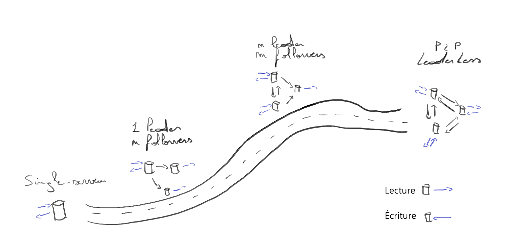

</center>

---

<!-- _class: transition3 -->

Départ : Aucune distribution

---

> « Plus simple, la première des options de distribution est celle que nous recommandons le plus souvent : **aucune distribution**. »

- La base de données tourne sur **une seule machine**  
  → gère **toutes les lectures et écritures**  
- Cette approche **évite toute complexité** :
  - plus simple à administrer
  - plus facile à raisonner pour les développeurs
- Si possible : **préférer toujours un modèle mono-serveur**.

---

# Quand le mono-serveur reste pertinent

Même si de nombreuses bases NoSQL sont conçues pour les **clusters** :

- Le **modèle de données** du NoSQL peut mieux convenir à l’application,  
  **même sur un seul serveur**.
- Exemple :  
  - **Bases de données graphe** → fonctionnement optimal sur un seul nœud  
  - **Document stores** ou **key-value stores** → efficaces pour des agrégats simples

> ⚠️ Si l’on peut éviter la distribution, **on choisira toujours une approche mono-serveur**.

---

<!-- _class: transition3 -->

On the road

---

<!-- _class: cite -->

Que se passe-t-il lorsque **plusieurs machines** participent au stockage et à la récupération des données ?

---

# Pourquoi distribuer les données ?

*  **Scalabilité**  
  Répartir la charge (lecture, écriture, volume) sur plusieurs machines.

* **Tolérance aux pannes / Haute disponibilité**  
  Le système continue de fonctionner même si une machine (ou un datacenter) tombe en panne.

* **Latence**  
  Servir les utilisateurs depuis des serveurs **géographiquement proches** pour réduire les délais réseau.

---

<!-- _class: cite -->

Quelle est la différence entre un noeud, un cluster et un datacenter ?

---

# Cas Cassandra

<center>

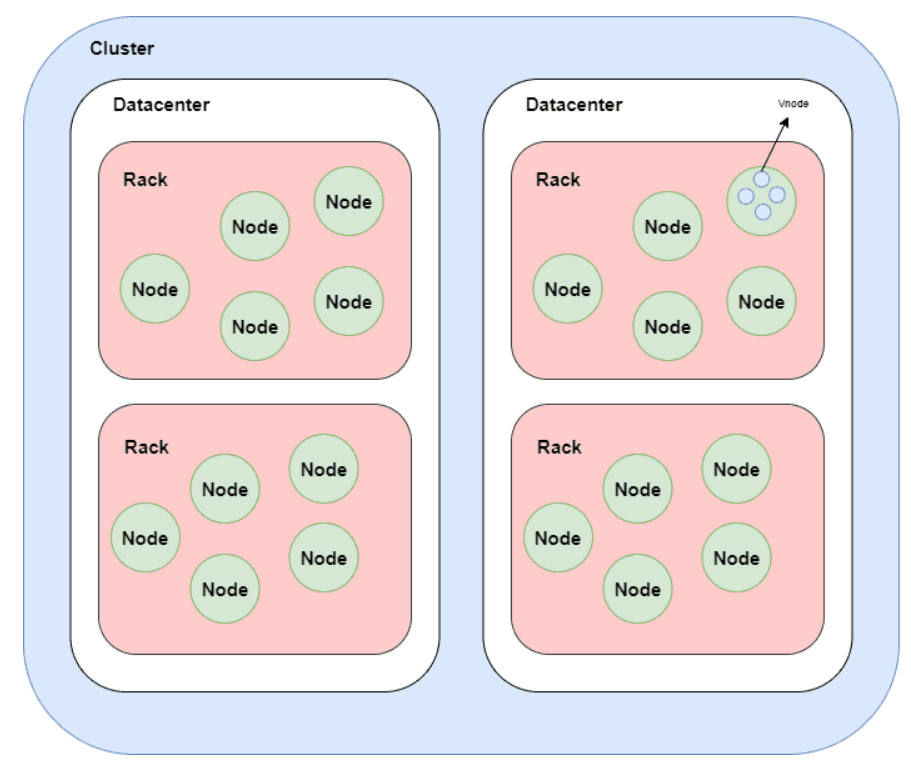
</center>

[Cluster, Datacenters, Racks and Nodes in Cassandra (Baeldung)](https://www.baeldung.com/cassandra-cluster-datacenters-racks-nodes)

---


# Monter en charge : vertical vs horizontal

##  Scalabilité verticale (scale up)
- Acheter une **machine plus puissante** : plus de CPU, RAM, disques.
- Simple à mettre en place, mais :
  - coût croît **plus vite que linéairement**
  - bottlenecks (réseau...) 
  - limites physiques (ex: nonuniform memory access) et géographiques

## Scalabilité horizontale (scale out)
- Ajouter **plusieurs machines** (noeuds) travaillant de manière distribuée.  
- Nécessite des mécanismes de coordination, mais plus flexible et résilient.
---

# Architectures possibles

---

### 1️⃣ Mémoire partagée (shared-memory)
> Une seule machine avec de multiples processeurs et mémoire commune (OS unique).  
✅ Simple  
❌ Coût élevé, tolérance de panne limitée.

### 2️⃣ Disque partagé (shared-disk)
> Plusieurs machines partagent les mêmes disques via un réseau rapide.  
✅ Utilisé en entrepôts de données.  
❌ Problèmes de **verrouillage** et de **concurrence**.

### 3️⃣ Sans partage (shared-nothing)
> Chaque nœud a ses **propres CPU, RAM, disque**.  
✅ Très populaire, peu coûteux, extensible  
❌ Complexité accrue pour les développeurs.

---

# Entrepôt de données (data warehouse)

> [Wikipedia](https://fr.wikipedia.org/wiki/Entrep%C3%B4t_de_donn%C3%A9es)
> Un *entrepôt de données (data warehouse)* est une **base de données** regroupant une partie ou l'**ensemble des données fonctionnelles d'une entreprise**. Il entre dans le cadre de l'**informatique décisionnelle** ; son but est de fournir un ensemble de données servant de **référence unique**, utilisée pour la **prise de décisions** dans l'entreprise par le biais de **statistiques et de rapports** réalisés via des outils de reporting. 
>
> D'un point de vue technique, il sert surtout à 'délester' les bases de données opérationnelles des requêtes pouvant nuire à leurs performances.

---

<div class="columns">
<div>


[Wikipedia](https://fr.wikipedia.org/wiki/Entrep%C3%B4t_de_donn%C3%A9es#/media/Fichier:Data_warehouse_overview.JPG)

</div>
<div>

> [Wikipedia](https://fr.wikipedia.org/wiki/Entrep%C3%B4t_de_donn%C3%A9es)
> - extraction des données de production, transformations éventuelles et chargement de l'entrepôt (c'est l'ETL ou Extract, Transform and Load ou encore datapumping).
> - on peut voir l'entrepôt de données comme une **architecture décisionnelle** capable à la fois de gérer l'**hétérogénéité** et le **changement** et dont l'enjeu est de **transformer** les données en **informations directement exploitables** par les utilisateurs du métier concerné. 
</div>
</div>

---

# Modèle "Shared-nothing" ou horizontal scaling ou scaling out

## Avantages
- Pas besoin de matériel spécialisé
- Possibilité de répartir les données **dans plusieurs régions**  
- Réduction de la latence et meilleure résilience  
- Accessible même aux **petites entreprises** via le cloud

## Mais attention
> Plus de puissance ⟹ aussi plus de complexité à gérer (cohérence, pannes, synchronisation…)

---

# Réplication et Partitionnement

## Réplication

> Copier les **mêmes données** sur plusieurs nœuds (potentiellement dans différents lieux).  
>   * Assure la **redondance** et la **résilience** (des noeuds peuvent être indisponibles).
>   * Peut aider à améliorer les performances.

## Partitionnement (sharding)
> Découper une grosse base de donnée en sous-ensembles (appelés *partition* ou *shard*) ; répartis sur plusieurs nœuds.

---

## Réplication 🤝 partitionnement
> Les deux techniques sont souvent **combinées**.

<center>

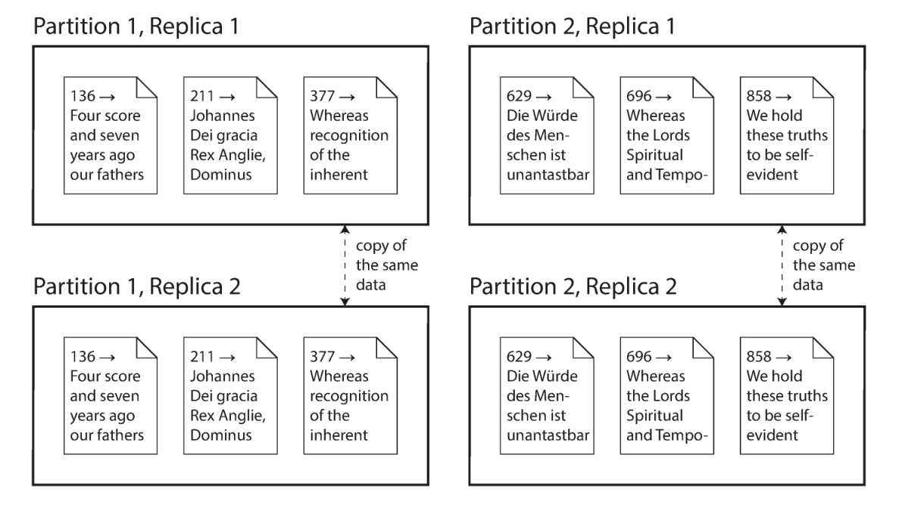

</center>

---

# Théorème CAP

<div class="columns">
<div>

<center>

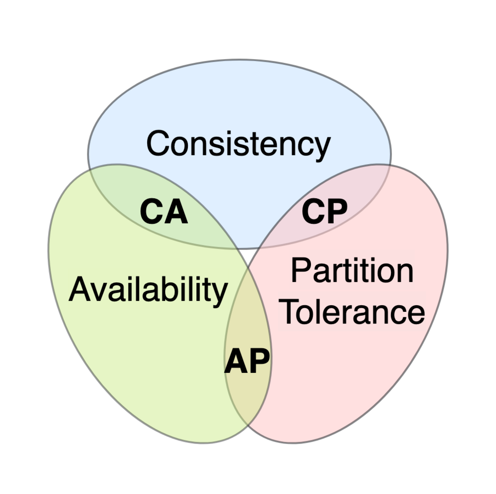

</center>

</div>
<div>

- Cohérence
- disponibilité
- tolérance aux partition
* *choisissez-en deux !*

</div>
</div>

---

> [Wikipedia](https://en.wikipedia.org/wiki/CAP_theorem)
> * **Disponibilité** - Chaque requête reçue par un noeud non défaillant du système doit aboutir à une réponse. (définition formulée dans le théorème CAP, par Gilbert et Lynch.)
>   |Théorème CAP||architecture logicielle|
>   |---|---|---|
>   |Disponibilité (pas de délais)|≠|haute disponibilité ou faible latence|
> * **Cohérence (~~consistance~~)** - Chaque lecture reçoit la donnée la plus récente écrite, ou une erreur.
>   |Théorème CAP||Transaction ACID|
>   |---|---|---|
>   |Cohérence de réplication ou linéarisable|≠|Cohérence logique|
> * **Tolérance aux partitions** - Le système continue de fonctionner même si un nombre arbitraire de messages est perdu (ou retardé) par le réseau entre les noeuds.

---

<center>


</center>

> <span class="ref">📖 [CAP - Julia Evans]https://jvns.ca/blog/2016/11/19/a-critique-of-the-cap-theorem/</span>
> <Span class="ref">📖 [Martin Kleppmann - A Critique of the CAP Theorem](https://arxiv.org/abs/1509.05393)</span>

---

<!-- _class: transition2 -->

2 - Réplication

---

<!-- _class: transition2 -->

Distribution des données : Réplication

---

<!-- _class: cite -->

La réplication consiste à conserver une copie des mêmes données sur plusieurs machines connectées entre elles via un réseau.

---

# Objectifs

* Garder les données proche géographiquement (↘ latence).
* Permettre au système de continuer à fonctionner même si certains de ses noeuds tombent en panne. (↗ la disponibilité).
* Augmenter horizontallement (scale-out) le nombre de machines qui répondent aux requêtes de lectures (↗ capacité traitement). 

---

* Le jeu de donnée peut tenir sur un seul noeud (pas de partition).
* l'enjeu réside dans le changement (pas de changement -> on copie et c'est fini).
* 3 approches : 
   * Réplication à *leader unique*
   * Réplication à *multi-leader*
   * Réplication *sans leader (P2P)*

---


---

<center>


<center>


---


<!-- _class: biblio -->

- **Kleppmann, M. (2015).** A Critique of the CAP Theorem. [🔗](https://martin.kleppmann.com/2015/05/11/please-stop-calling-databases-cp-or-ap.html)
- **Kleppmann, M. (2017).** Designing data-intensive applications.
- **Sadalage, P. J., & Fowler, M. (2013).** NoSQL distilled: a brief guide to the emerging world of polyglot persistence. Pearson Education.

---

<!-- _class: transition2 -->  

Merci !