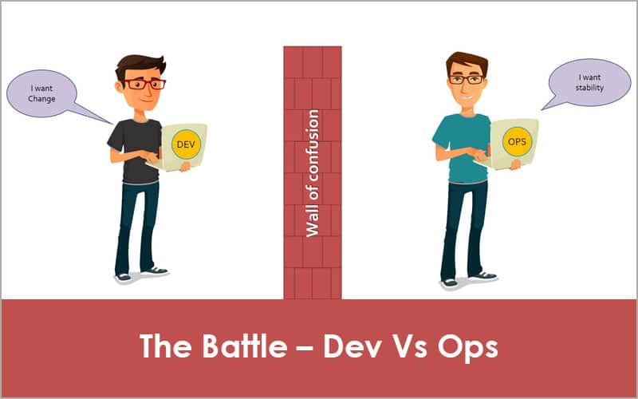
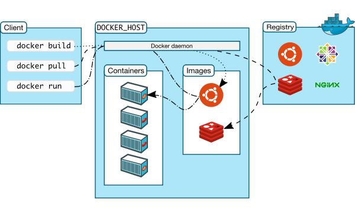
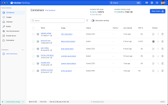
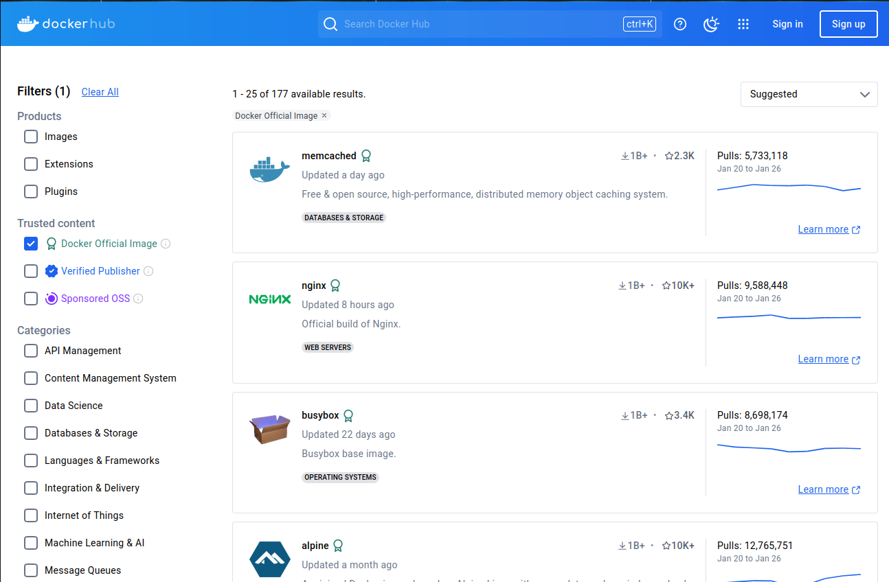
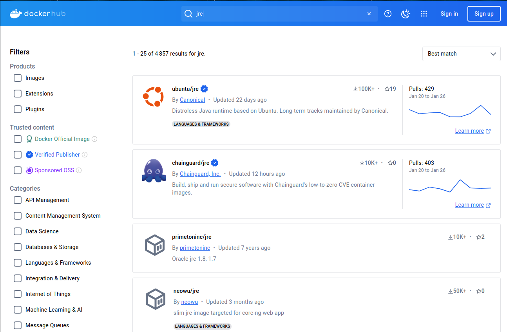

# Organisation de l'unité

<div class="columns">
<div>

## BIM3

- 2H par semaine de théorie
- 2H par semaine de laboratoire

</div>  
<div>    

## BIM4

- 4H par semaine de laboratoire

</div>    
</div> 

<div class="center">
<br>
Planning détaillé disponible sur PoEsi
</div>

--- 
 
<!-- _class: cite -->        

L'**évaluation** de l'unité repose sur un contrôle continu combinant un **QCM** pour 25% de la note et la **réalisation de scénarios pratiques** pour 75% de la note. 

---

# DevOps : Contexte et origine

<div class="columns">
<div>

<center>



</center>

</div>
<div>

## Problème
Manque de collaboration :
    - Le développement ajoute des nouvelles fonctionnalités.
    - Les opérations garantissent la stabilité du système.

## Solution 
Intégration des pratiques Agile et Lean.

</div>
</div>


--- 

# Historique du DevOps

- **2007-2008** : Naissance du concept lors d'une discussion sur les pratiques de collaboration entre développement et opérations.
- **2009** : Première conférence DevOpsDays organisée par Patrick Debois.
- **Années 2010** : Adoption croissante par les entreprises pour améliorer la livraison continue et la qualité des logiciels.
- **Aujourd'hui** : DevOps est un standard pour la gestion du cycle de vie des logiciels.

--- 
 
<!-- _class: cite -->        

DevOps est une **culture** et un ensemble de **pratiques** visant à améliorer la collaboration entre les équipes de développement (Dev) et des opérations (Ops).

---

# Principes Clés
- **Automatisation** des processus.
- **Amélioration continue** : **Intégration continue** (CI) et **Livraison continue** (CD).
- **Monitoring**.
- **Collaboration renforcée** entre équipes.


---
# DevOps : Cycle de vie


---

# Outils populaires

<div class="columns">
<div>

### Planification et Collaboration
- **Jira**, **Trello**

### Développement
- **Git**, **SVN**

### Vérification du code
- **xUnit**, **Selenium**, **SonarQube**

### Package et release
- **Docker**

</div>

<div>

### Intégration et Livraison
- **Jenkins**, **Travis CI**,**GitLab CI/CD**

### Configuration et Orchestration
- **Ansible**, **Puppet**, **Terraform**, **Kubernetes**

### Monitoring
- **Prometheus**, **Grafana**
</div>

---        
     
# Matières

<div class="columns">
<div>
      
<!-- _class: cool-list -->

### Dev

1. *Docker et Docker-compose*
2. *Sonarqube*
3. *Gitlab CI/CD*
   
</div>  
<div>    

### Ops

5. *Terraform* 
6. *AWS/Azure/AlwaysData* 
7. *Prometheus*
 
</div>    
</div> 

---

<!-- _class: transition2 -->  

Conteneurisation avec Docker

--- 

<!-- _class: cite -->    

**Docker** est une plateforme qui permet de créer, déployer et exécuter des applications dans des conteneurs légers, portables et isolés. Ces **conteneurs** regroupent tout ce dont une application a besoin pour fonctionner garantissant qu'elle s'exécute de manière cohérente, quelle que soit l'environnement.

---
# Exemple : Tester Wordpress sous Ubuntu

<div class="columns">
<div>

## Installation native

[Description détaillée via ce lien](https://developer.wordpress.org/advanced-administration/before-install/)

1. Installer apache
1. Installer PHP
1. Installer mysql
1. Créer une base de données
1. Télécharger WordPress
1. Configurer Wordpress


</div>
<div>

## Installation Docker

1. Créer un fichier `docker-compose.yml`
1. Copier le contenu du fichier de [Docker Hub](https://hub.docker.com/_/wordpressl)
1. Démarrer Wordpress via `docker-compose up -d`

</div>
</div>

---
# Installation Native vs Docker

|               | Installation native | Via Docker |
|---------------|----------------------|--------------|
| Simplicité    | Complexe (packages, dépendances) | Très simple (une commande) |
| Isolation     | Nécessite configuration spécifique | Complètement isolé |
| Portabilité   | Dépend de l’OS et du package manager | Fonctionne partout |
| Maintenance   | Mise à jour manuelle | Facile avec les images Docker |


---

# Différences avec une Machine Virtuelle

| Critère         | Machine Virtuelle    | Docker |
|-----------------|----------------------|----------|
| Isolation       | Complète (OS dédié)  | Processus isolés |
| Poids           | Lourd (Giga Octets)  | Léger (Méga Octets) |
| Performance     | Moins performant     | Plus performant |
| Démarrage       | Lent (minutes)       | Rapide (secondes) |


--- 

# Architecture

<div class="columns">
<div>

<center>



</center>

</div>
<div>

- **Docker Engine** : Composant central assurant l'exécution des conteneurs.
  - **Docker Client** : Interface en ligne de commande ou graphique permettant d’interagir avec Docker.
  - **Docker Daemon (dockerd)** : Service de fond qui gère les conteneurs, images et réseaux.
- **Docker Registry** : Stocke et distribue les images Docker (ex. Docker Hub, GitHub Container Registry).

</div>
</div>

---

# Installation :  Docker

<div class="columns">
<div>

## Linux

- Installer **Docker Engine**
- Configurer Docker en tant qu'utilisateur non-root
- [Lien vers Docker Engine](https://docs.docker.com/engine/install/)
- Installer **Docker Desktop** n'est pas obligatoire

</div>
<div>

## MacOS
- Installer **Docker Desktop**
- [Lien vers Docker Desktop](https://docs.docker.com/desktop/)

## Windows
- Activer **WSL 2**
- Installer **Docker Desktop**

</div>
</div>

---

# Installation : Docker Desktop

<div class="columns">
<div>

<center>




</center>

</div>
<div>

- Fournit une interface utilisateur pour gérer les conteneurs et images.
- Intègre le moteur Docker sur MacOS et Windows.
- Sur **Windows**, utilise **WSL 2** (ou Hyper-V si WSL 2 n'est pas activé).
- Sur **MacOS**, utilise un **hyperviseur léger** basé sur Apple Hypervisor Framework.
- Facilite l’accès aux registres Docker et aux extensions Docker.

</div>
</div>

---

# Concept clé 1 : Registres Docker

<div class="columns">
<div>

<center>




</center>

</div>
<div>

- Stockent et distribuent des **images Docker**
- Exemples : 
  - **Docker Hub** *(public)* : registre par défaut
  - GitHub Container Registry
  - AWS ECR, Azure ACR *(privés)*

</div>
</div>

---

# Concept clé 2 : Images Docker

- Contiennent tout le nécessaire pour exécuter une application (code, runtime, dépendances...)
- Versionnées et partageables via des **registres**
- Création avec un **Dockerfile**
- Les images sont souvent versionnées avec des **tags** (ex. `postgres:15`, `postgres:latest`)
- `latest` pointe vers la version par défaut si aucun tag n’est spécifié.
- Téléchargeable via une commande du type `docker pull postgres:15`

---

# Informations sur l'image

Lister les images locales via `docker image ls`

```bash
REPOSITORY   TAG       IMAGE ID       CREATED        SIZE
postgres     15        19f99b135e18   2 months ago   426MB
```

[Informations complètes sur une image accessible via Docker Hub](https://hub.docker.com/_/postgres/) ou `docker image inspect postgres:15`

---

# Images Docker Officielles ✅

<div class="columns">
<div>

<center>



</center>

</div>
<div>

- Maintenues par l’éditeur officiel ou la communauté Docker
- Sécurisées et mises à jour régulièrement
- Exemples : 
  - `postgres`
  - `nginx`
  - `node`
  - `python`
  - `java`

</div>
</div>

---

# Taille des images

- Une image Docker dépend entre autre de l’OS sous-jacent
- Par exemple les versions **Alpine** sont plus légères
- Alpine Linux est une distribution Linux ultra-légère


```bash
REPOSITORY   TAG         IMAGE ID       CREATED        SIZE
postgres     15-alpine   28223f2e117a   2 months ago   273MB
postgres     15          19f99b135e18   2 months ago   426MB
```

---

# Concept clé 3 : Conteneurs

- Instances exécutables d’une **image Docker**.
- Isolés et légers.
- Peuvent être arrêtés, redémarrés, supprimés via leur nom ou leur ID.

```bash
docker run    python:latest
docker stop   keen_banach
docker start  keen_banach
docker rm     keen_banach
```

---

# Nommage des conteneurs

- Chaque conteneur peut être nommé pour une identification plus facile.
- Utilisation de `--name` lors du démarrage d’un conteneur :
```bash
docker run --name mon_python python:latest
```
- Un conteneur nommé est plus facile à gérer pour les commandes comme `docker stop`

---

# Que se passe-t-il si aucun nom n’est attribué ?

- Docker génère automatiquement un nom aléatoire.
- Les noms sont composés de deux mots (ex: `eager_tesla`).
- Pour voir le nom généré :
```bash
docker ps
```
- Exemple de sortie :
```bash
CONTAINER ID   NAME          IMAGE        STATUS
f2d1a4f3c2f3  eager_tesla  postgres:15  Up 2 minutes
```
- Il est recommandé d’attribuer un nom explicite pour une meilleure gestion.

---

# Binding des ports

- Le binding des ports permet de rediriger un port de l’hôte vers un port du conteneur.
- Syntaxe : `-p <port_hôte>:<port_conteneur>`
- Exemple avec PostgreSQL :
```bash
docker run -p 5432:5432 postgres:15
```

- Pour voir les ports exposés :
```bash
docker ps
```

---

# Variables d’environnement dans les conteneurs

- Permettent de configurer des paramètres sans modifier l’image
- Exemples pour PostgreSQL :
  - `POSTGRES_USER` : Nom d’utilisateur par défaut
  - `POSTGRES_PASSWORD` : Mot de passe de l’utilisateur
  - `POSTGRES_DB` : Nom de la base de données par défaut

```bash
docker run \
  --name postgres \
  -e POSTGRES_USER=admin \
  -e POSTGRES_PASSWORD=secret \
  -e POSTGRES_DB=mydatabase \
  -p 5432:5432 \
  postgres:15
```

---

# Visualiser les logs d’un conteneur

- **Voir les logs en temps réel** :
```bash
docker logs -f <name>
```
- **Afficher les dernières lignes** :
```bash
docker logs --tail 100 <name>
```

---

# Exécuter une requête dans PostgreSQL

- Vérifier le nom du conteneur PostgreSQL :
```bash
docker ps
```
- Se connecter au conteneur et exécuter une requête SQL :
```bash
docker exec -it postgres psql -U admin -d mydatabase -c "SELECT * FROM person;"
```

```bash
docker exec -it postgres psql -U admin -d mydatabase -c "CREATE TABLE person 
(firstname VARCHAR(255), lastname VARCHAR(255));"
```

---

# Remarque docker exec -it

L’option `-it` dans la commande est une combinaison de deux flags :

- `-i` pour **interactive** : Garde l’entrée standard (stdin) ouverte, permettant d’interagir avec le conteneur.
- `-t` pour **tty** (teletypewriter) : Alloue un terminal pseudo-TTY pour une expérience interactive. Permet aux programmes d’interagir comme s’ils étaient exécutés dans un véritable terminal (affichage des couleurs, exécution des commandes).

Utilisé ensemble `-it` : Permet d’interagir avec le conteneur **comme un terminal classique**. 

---

# Concept clé 4 : Dockerfile

- Fichier permettant de créer une **image Docker personnalisée**
    - **FROM** : Spécifie l’image de base
    - **ENV** : Définit des variables d’environnement
```dockerfile
FROM postgres:15
ENV POSTGRES_USER=myuser
ENV POSTGRES_PASSWORD=mypassword
ENV POSTGRES_DB=mydb
```

- Construire l’image :
```bash
docker build -t mon-postgres .
```

---

# Directives Dockerfile

<div class="columns">
<div>

- **RUN** : Exécute une commande lors de la construction de l’image
- **COPY** : Copie des fichiers depuis l’hôte vers l’image
- **WORKDIR** : Définit le répertoire de travail par défaut
- **EXPOSE** : Indique un port que le conteneur écoutera
- **CMD** : Définit une commande par défaut pour le conteneur

</div>
<div>

Exemple :
```dockerfile
FROM postgres:15
WORKDIR /app
COPY . /app
RUN apt-get update && apt-get install -y nano
ENV POSTGRES_USER=myuser
EXPOSE 5432
CMD ["postgres"]
```

</div>
</div>

---

# Remarque : spécifier la version dans FROM

- Toujours utiliser une version spécifique pour éviter des surprises

```dockerfile
FROM postgres:15
```

- Utiliser `latest` avec prudence !

---

# Concept clé 5 : Image Layers

- Une image est composée de plusieurs **layers** (couches)
- Couche consultable via `docker history <image>`

---

# Liens Layers-Dockerfile

```Dockerfile 
# Utilisation de l'image Ubuntu comme base
FROM ubuntu:24.04

# Mettre à jour les paquets et installer curl
RUN apt-get update && apt-get install -y curl

# Définir un message de bienvenue
CMD echo "Bienvenue dans votre premier conteneur Docker !"
```

```bash
IMAGE          CREATED          CREATED BY                                      SIZE      COMMENT
9ff3052babf9   38 seconds ago   CMD ["/bin/sh" "-c" "echo \"Bienvenue dans v…   0B        buildkit.dockerfile.v0
<missing>      38 seconds ago   RUN /bin/sh -c apt-get update && apt-get ins…   54.4MB    buildkit.dockerfile.v0
<missing>      8 days ago       /bin/sh -c #(nop)  CMD ["/bin/bash"]            0B        
<missing>      8 days ago       /bin/sh -c #(nop) ADD file:6df775300d76441aa…   78.1MB    
<missing>      8 days ago       /bin/sh -c #(nop)  LABEL org.opencontainers.…   0B        
<missing>      8 days ago       /bin/sh -c #(nop)  LABEL org.opencontainers.…   0B        
<missing>      8 days ago       /bin/sh -c #(nop)  ARG LAUNCHPAD_BUILD_ARCH     0B        
<missing>      8 days ago       /bin/sh -c #(nop)  ARG RELEASE                  0B        
```

---
# Concept clé 6 : Multi-stage builds

## Single-stage builds

Image Docker construite en une seule étape, contenant à la fois les outils de compilation et l’application finale

```dockerfile
# Utilisation d'une image contenant Maven et JDK 17
FROM maven:3.9-eclipse-temurin-17

# Définition du répertoire de travail
WORKDIR /app

# Copier les fichiers du projet dans le conteneur
COPY pom.xml .
COPY src ./src
```
---
# Multi-stage builds

## Single-stage builds (suite du Dockerfile)

```dockerfile
# Compiler l'application
RUN mvn clean package -DskipTests

# Exposer le port utilisé par l'application
EXPOSE 8080

# Démarrer l'application
CMD ["java", "-jar", "target/app.jar"]
```

---

# Multi-stage builds

Une image Multi-Stage **sépare** la **construction** et **l’exécution** en plusieurs étapes, ne conservant que l’exécutable final dans une **image allégée**.

```dockerfile
# Étape 1 : Construction de l'application, étape nommée "builder"
FROM maven:3.9-eclipse-temurin-17 AS builder

# Définir le répertoire de travail
WORKDIR /app

# Copier les fichiers du projet dans le conteneur
COPY pom.xml .
COPY src ./src

# Télécharger les dépendances et compiler l'application
RUN mvn clean package -DskipTests
```

---

# Multi-stage builds

## Multi-stage builds (suite du Dockerfile)

```dockerfile
# Étape 2 : Création d'une image légère pour l'exécution
FROM eclipse-temurin:17-jre

# Définir le répertoire de travail
WORKDIR /app

# Copier uniquement le JAR compilé depuis l'étape précédente (nommée "builder")
COPY --from=builder /app/target/*.jar app.jar

EXPOSE 8080

CMD ["java", "-jar", "app.jar"]
```
---

# Comparaison Single Stage - Multi Stage

| Critère            | Single-Stage                         | Multi-Stage                         |
|--------------------|----------------------------------|----------------------------------|
| **Taille de l’image** | Plus lourde (Maven et JDK inclus) | Plus légère (seulement JRE et JAR) |
| **Performance**    | Démarrage légèrement plus lent  | Plus rapide car optimisé         |
| **Sécurité**       | Maven et outils de build inutiles en production | Pas d'outils de build dans l’image finale |

```bash
REPOSITORY           TAG       IMAGE ID       CREATED          SIZE
image-multi-stage    latest    fcc6267ba8f7   4 seconds ago    283MB
image-single-stage   latest    4068a159c3d2   36 seconds ago   599MB
```

---

# Concept 5 : Les volumes

Les volumes permettent de **stocker** les données de manière **persistante**.

Exemple avec un serveur web nginx

```bash
mkdir my_website
echo "<h1>Bienvenue sur mon site</h1>" > my_website/index.html
```

```bash
docker run -d --name my_nginx -p 8080:80 -v ./my_website:/usr/share/nginx/html nginx
```

http://localhost:8080 affiche le contenu du fichier my_website/index.html. VOus devez avoir les droits d'écriture dans le volume.

---
<!-- _class: transition2 -->  

Docker-compose

---

# Qu'est-ce que Docker Compose ?


</div>
<div>

Docker Compose est un outil permettant de définir et de gérer des applications **multi-conteneurs** à l'aide d'un fichier **YAML**. Il facilite le déploiement et la configuration de services.

</div>
</div>

---
# Fichier YAML
 
<div class="columns">
<div>

- **YAML (Yet Another Markup Language)** est un format de fichier utilisé pour la configuration.  
- Utilisé notamment dans **Docker Compose, Kubernetes, Ansible**.
- **Basé sur l'indentation** par espaces, pas de tabulations.
- Fichier **Clé-valeur**.
- Description de l'exemple [disponible sur Wikipedia](https://fr.wikipedia.org/wiki/YAML).
</div>
<div>

```yaml
receipt:     Oz-Ware Purchase Invoice
date:        2012-08-06
customer:
    given:   Dorothy
    family:  Gale

items:
    - part_no:   A4786
      descrip:   Water Bucket (Filled)
      price:     1.47
      quantity:  4

    - part_no:   E1628
      descrip:   High Heeled "Ruby" Slippers
      size:      8
      price:     100.27
      quantity:  1
```

</div>
</div>

---

# Docker vs Docker Compose

| Fonctionnalité       | Docker | Docker Compose |
|---------------------|--------|---------------|
| Gestion des conteneurs | Oui | Oui |
| Gestion multi-conteneurs | Non | Oui |
| Configuration | Dockerfile | YAML |
| Simplification du workflow | Non | Oui |

---

# Installation et Configuration

### Linux

```sh
# Sous Linux
sudo apt update && sudo apt install docker-compose

# Vérification de l'installation
docker-compose --version
```

### Windows et macOs

Inclus dans Docker Desktop

---

# Liaison entre Postgres et PgAdmin4

<div class="columns">
<div>

### Première commande


```sh
# Démarrage d'un conteneur PostgreSQL
docker run -d \
  --name postgres \
  -e POSTGRES_USER=admin \
  -e POSTGRES_PASSWORD=admin \
  -e POSTGRES_DB=mydb \
  -p 5432:5432 \
  postgres

```

</div>
<div>

### Seconde commande

```bash
# Démarrage d'un conteneur PgAdmin4
docker run -d \
  --name pgadmin \
  -e PGADMIN_DEFAULT_EMAIL=admin@admin.com \
  -e PGADMIN_DEFAULT_PASSWORD=admin \
  -p 5050:80 \
  dpage/pgadmin4
```

</div>
</div>

Il faut ensuite configurer **manuellement** PgAdmin pour utiliser PostgreSQL.

---

# La solution Docker-compose

## Configuration via un fichier `docker-compose.yml` contenant : 

1. **Version** : Détermine la version du fichier Compose.
2. **Services** : Définit les conteneurs et leurs configurations.
3. **Networks** : Gère la communication entre conteneurs.
4. **Volumes** : Persiste les données.


---

# La solution Docker-compose

<div class="columns">
<div>

### Première partie du fichier YAML

```yaml
version: '3.8'

services:
  postgres:
    image: postgres
    container_name: postgres
    environment:
      POSTGRES_USER: admin
      POSTGRES_PASSWORD: admin
      POSTGRES_DB: mydb
    ports:
      - "5432:5432"
```

</div>
<div>

### Seconde partie du fichier YAML


```yaml
  pgadmin:
    image: dpage/pgadmin4
    container_name: pgadmin
    environment:
      PGADMIN_DEFAULT_EMAIL: 
          admin@admin.com
      PGADMIN_DEFAULT_PASSWORD: 
          admin
    ports:
      - "5050:80"
    depends_on:
      - postgres
```

</div>
</div>

---

# Commandes essentielles

```sh
# Démarrer les services définis dans le fichier docker-compose.yml
docker-compose up -d

# Arrêter et supprimer les services
docker-compose down

# Lister les conteneurs en cours d'exécution
docker-compose ps

# Démarrer un service spécifique
docker-compose start <service>

# Arrêter un service spécifique
docker-compose stop <service>
```

---
<!-- _class: transition2 -->  

Microservices et besoin en orchestration

---


<!-- _class: cite -->        

Une architecture **microservices** consiste à découper une application en plusieurs services indépendants, qui communiquent entre eux via des **API**. Chaque microservice est responsable d’une fonction spécifique et peut être développé, déployé et mis à l’échelle **indépendamment**.

---

# Microservices pour une application e-commerce

| **Microservice**  | **Rôle**                            | **Technologie possible**  |
|------------------|--------------------------------|--------------------------|
| **Auth**        | Gère l’authentification des utilisateurs | Node.js      |
| **Produits**    | Gère le catalogue des produits | Python      |
| **Panier**      | Gère les articles ajoutés au panier | Java   |
| **Paiement**    | Traite les paiements et transactions | Go, Stripe API         |
| **Commandes**   | Gère les commandes et livraisons | .NET       |
| **Notifications** | Envoie des e-mails et SMS | Python       |

---

# Avantages des microservices  
- **Scalabilité accrue** : Mise à l’échelle indépendante de chaque service.  
- **Déploiement indépendant** : Mise à jour d’un service sans impacter les autres.  
- **Flexibilité technologique** : Chaque microservice peut utiliser un langage différent.  
- **Meilleure résilience** : Une panne d’un service n’affecte pas toute l’application.  
- **Développement et maintenance facilités** : Travail en parallèle de plusieurs équipes.  
- **Optimisation des performances** : Allocation des ressources selon les besoins.  

---

# Inconvénients des microservices  
- **Complexité accrue** : Orchestration et gestion plus difficiles qu’une application monolithique.  
- **Communication entre services** : Besoin d’API robustes et de messages asynchrones.  
- **Gestion des données distribuées** : Synchronisation  entre plusieurs bases de données.  
- **Surcoût en infrastructure** : Multiplication des conteneurs et des services.  
- **Débogage et monitoring plus difficiles**  : Utilisation d’outils comme Prometheus ou Grafana.  
- **Orchestration nécessaire** : Besoin d’outils comme Docker Compose, Swarm ou Kubernetes.  

---

# Microservices et Docker Compose

Docker Compose est un excellent outil pour organiser des microservices en **développement**. Il permet :
- Une gestion simplifiée des dépendances.
- Un déploiement rapide.
- Une cohérence entre environnements de développement et de test.

---

# Limites de Docker Compose pour les microservices  
 
- **Pas de scalabilité avancée** : Impossible de répartir les charges sur plusieurs machines.  
- **Absence de haute disponibilité** : Aucun redémarrage automatique des conteneurs en cas de panne.  
- **Gestion réseau limitée** : Pas de load balancing avancé entre plusieurs instances.  
- **Orchestration rudimentaire** : Pas de gestion de cluster multi-serveurs.  
- **Pas de mise à jour sans interruption** : Nécessite un redémarrage manuel (`docker-compose down/up`).   
- **Pas d’autoscaling** : Impossible d’adapter dynamiquement le nombre de conteneurs selon la charge.  

---
# Utilisation suivant l'environnement

### Quand utiliser Docker Compose ?  
- **Développement local** : Tester des applications multi-conteneurs sur un poste de travail.  
- **Petits projets** : Applications simples avec peu de services.  
- **CI/CD** : Exécuter des tests dans un environnement conteneurisé.  

### Alternatives pour la production  

- **Docker Swarm** : Orchestration native avec gestion de cluster.  
- **Kubernetes** : Plateforme complète pour les microservices à grande échelle.  

**Docker Compose est idéal pour le développement, mais insuffisant pour une gestion efficace des microservices en production !**

---
<!-- _class: transition2 -->  

Définition d'un pipeline<br>
GitlabCI/CD

--- 

# Qu'est-ce que le CI/CD et le Pipeline ?
Le CI/CD (“Continuous Integration/Continuous Deployment”) est une approche permettant d'automatiser l'intégration et le déploiement du code source.
- **Continuous Integration (CI)** : Exécution automatique de tests et vérifications lors d'un push sur le repository.
- **Continuous Deployment/Delivery (CD)** : Livraison et déploiement automatique ou semi-automatique du code validé.
- **Pipeline** : Une séquence d'actions (jobs) définie pour compiler, tester et déployer un projet.

--- 

# Outil sélectionné

## GitLab CI/CD
- Outil **intégré** à Gitlab et **pipelines** intégrés **avec le code** de l'application.
- Apprentissage rapide.

## Architecture

- **GitLab Server** stocke le code et orchestre l'exécution des pipelines CI/CD.
- **GitLab CI/CD** génère des jobs à partir.
- **GitLab Runner** récupère les jobs et les assigne à un **executor**.
- **Les executors** sont les environnements qui exécutent réellement les commandes.
--- 

# Fichier YAML et .gitlab-ci.yml
- Le fichier `.gitlab-ci.yml` définit le **pipeline**.
- Il suit la syntaxe **YAML** et doit être placé **à la racine du projet**.
- Contient des définitions de **jobs**, variables, images Docker, scripts,...

```yaml
build_job:
  script:
    - echo "Hello, GitLab CI/CD!"
```

---
# Création d'un runner

Un runner est un **agent** qui **exécute** les **jobs** des pipelines GitLab CI/CD.

*Sans runner, aucun job ne peut être exécuté.*

[Installation via Docker](https://docs.gitlab.com/runner/install/docker/)

```bash
docker run -d --name gitlab-runner --restart always \
  -v /srv/gitlab-runner/config:/etc/gitlab-runner \
  -v /var/run/docker.sock:/var/run/docker.sock \
  gitlab/gitlab-runner:latest
```

---
# Création d'un runner authentication token

Chaque runner est **enregistré** avec une token d'inscription auprès de GitLab.

- Shared Runner : Géré par GitLab pour tous les projets.
- **Specific Runner : Assigné à un projet ou un groupe.**
- Group Runner : Assigné à plusieurs projets d’un groupe GitLab.

[Création du token pour un projet](https://docs.gitlab.com/ci/runners/runners_scope/#create-a-project-runner-with-a-runner-authentication-token) :

1. Menu `Settings > CI/CD` du projet.
1. Ouvrir la section **Runners**.
1. Créer le runner via le bouton **New project runner**.
1. Cocher la case **Run untagged jobs**
1. Copier le **runner authentication token** avant qu'il ne disparaisse.
---
# Enregistrement d'un runner

[Enregistrement d'un runner Docker : ](https://docs.gitlab.com/runner/register/?tab=Docker#registering-runners-with-docker)

- Remplacer **$RUNNER_TOKEN** par le token du projet.
- Image **alpine** peut-être adaptée.
```bash
docker run --rm -v /srv/gitlab-runner/config:/etc/gitlab-runner gitlab/gitlab-runner register \
  --non-interactive \
  --url "https://git.esi-bru.be" \
  --token "$RUNNER_TOKEN" \
  --executor "docker" \
  --docker-image alpine:latest \
  --description "docker-runner"
```
--- 

# Executor

- **Shell Executor** : Exécute les jobs directement sur la machine hôte.
- **Docker Executor** : Exécute chaque job dans un conteneur Docker isolé, permettant une meilleure gestion des dépendances.
- **Kubernetes** : Exécution dans un cluster Kubernetes.
- **Virtual Machine** : Exécution dans une machine virtuelle.
- [Autres options dans la documentation.](https://docs.gitlab.com/runner/executors/)

---
# Modifier la configuration de l'executor

Configuration dans le volume `/srv/gitlab-runner/config`

```toml
[[runners]]
  name = "dop1dr-demo"
  url = "https://git.esi-bru.be"
...
  [runners.docker]
    tls_verify = false
    image = "alpine"
    privileged = false
    disable_entrypoint_overwrite = false
    oom_kill_disable = false
    disable_cache = false
    volumes = ["/cache"]
    shm_size = 0
    network_mtu = 0
```
---

# Exécution du Pipeline
- Manuel d'un pipeline via l'interface GitLab.
- Automatique via une mise à jour du dépôt suite à `git push`.
- Logs accessibles dans **CI/CD > Pipelines > Jobs**.
- Logs de l'executor `docker logs -f gitlab-runner`.
- Possibilité de relancer un job en échec.

--- 

# Mots clés .gitlab-ci.yml

[Mots clés du fichier .gitlab-ci.yml disponible via la documentation.](https://docs.gitlab.com/ci/yaml/)

Exemple :
- **Jobs** : Chaque job exécute une ou plusieurs commandes.
- **Image** : Conteneur Docker utilisé pour exécuter un job.
- **before_script** : Commandes exécutées avant le script principal.
- **script** : Commandes exécutées dans le job.
- **after_script** : Commandes exécutées après le job.
- **Variables** : Définies à différents niveaux (job, pipeline).
- **Services** : Conteneurs supplémentaires utilisés par un job (ex: base de données).

--- 
# Exemple 1 : Script et variable

Créer une variable via le menu **Settings > CI/CD/ Variables**

```yaml
my_first_job:
  script:
    - echo "Hello World!"
    - echo "La valeur de MY_VARIABLE est '$MY_VARIABLE'"
```

Consulter le résultat via le menu **Build > Jobs**

```bash
Executing "step_script" stage of the job script 00:01
Using docker image ...
$ echo "Hello World!"
Hello World!
$ echo "La valeur de MY_VARIABLE est '$MY_VARIABLE'"
La valeur de MY_VARIABLE est 'Test'
```

--- 
# Exemple 2 : Utiliser une commande

Utiliser la commande maven dans le script

```yaml
my_first_job:
  script:
    - mvn --version
```

Statut **failed** du job via le menu **Build > Jobs**

```bash
$ mvn --version
/bin/sh: eval: line 151: mvn: not found
Cleaning up project directory and file based variables 00:00
ERROR: Job failed: exit code 127
```

--- 
# Exemple 3 : Utiliser une commande avant le script

Utiliser la commande before_script

```yaml
my_first_job:
  before_script:
    - apk add --no-cache maven
  script:
    - mvn --version
```
Statut **Passed** du job via le menu **Build > Jobs**

```bash
...
(1/30) Installing java-common (0.5-r0)
...
Apache Maven 3.9.9 (8e8579a9e76f7d015ee5ec7bfcdc97d260186937)
...
```

--- 
# Exemple 4 : Utiliser une image

Utiliser une image maven.

```yaml
my_first_job:
  image: maven:3.9.9-eclipse-temurin-23-alpine
  script:
    - mvn --version
```
Statut **Passed** du job via le menu **Build > Jobs**

```bash
Using docker image ... maven:3.9.9-eclipse-temurin-23-alpine ...
$ mvn --version
Apache Maven 3.9.9 (8e8579a9e76f7d015ee5ec7bfcdc97d260186937)
```

--- 
# Exemple 5 : Premier pipeline pour une application

```yaml
my_first_job:
  image: maven:3.9.9-eclipse-temurin-23-alpine
  before_script:
  - cd demo-no-db
  script:
    - mvn test
    - mvn package -DskipTests
```

--- 
# Exemple 6 : La notion de stage

<div class="columns">
<div>

```yaml
stages:
  - test
  - build

job-test:
  stage: test
  image: maven:3.9.9-eclipse-temurin-23-alpine
  before_script:
  - cd demo-no-db
  script:
    - mvn test
```

</div>
<div>

```yaml
job-build:
  stage: build
  image: maven:3.9.9-eclipse-temurin-23-alpine
  before_script:
  - cd demo-no-db
  script:
    - mvn package -DskipTests
```

</div>
</div>

--- 
# Exemple 7 : Image et variable globales

<div class="columns">
<div>

```yaml
default:
  image: maven:3.9.9-eclipse-temurin-23-alpine

stages:
  - test
  - build

variables:
  WORK_DIR: "demo-no-db"

job-test:
  stage: test
  before_script:
  - cd $WORK_DIR
  script:
    - mvn test
```

</div>
<div>

```yaml
job-build:
  stage: build
  before_script:
  - cd $WORK_DIR
  script:
    - mvn package -DskipTests
```

</div>
</div>

---
# Exemple 8 : Le caching

- Le caching permet d'améliorer les performances en évitant de re-télécharger des dépendances ou de recompiler du code déjà construit.
- Il est défini au niveau des jobs dans .gitlab-ci.yml.
- Les caches sont stockés sur le runner et peuvent être partagés entre différents jobs.
- Exemple d'utilisation pour un projet Maven :

```yaml
cache:
  paths:
    - .m2/repository/
script:
    - mvn test -Dmaven.repo.local=$CI_PROJECT_DIR/.m2/repository
```

---
# Exemple 9 : Filtrer les jobs

**only** définit des règles de filtrage qui sont appliquées à chaque job dans le pipeline. Ce job s'exécutera sur les branches **main** ou **develop** : 

```yaml
job_build:
  script:
    - mvn package -DskipTests
  only:
    - main
    - develop
```
---
# Exemple 10 : Docker in Docker

Ajouter le **Dockerfile** au dépôt.

```yaml
docker_build:
  stage: docker_build
  image: docker:20.10.16  # Utilise l'image Docker pour construire l'image
  services:
    - docker:20.10.16-dind  # Active Docker-in-Docker
  script:
    - docker build -t $DOCKER_USERNAME/4dop1dr-image:$CI_COMMIT_REF_NAME .
  variables:
    DOCKER_TLS_CERTDIR: "/certs"  # Nécessaire pour Docker-in-Docker
```

---

# Un autre outil : Jenkins

## Fonctionnalités principales de Jenkins :
- **Automatisation des builds et tests** : Jenkins permet d'automatiser les tâches de construction, de test, et de déploiement.
- **Extensibilité** : Jenkins dispose de milliers de plugins qui peuvent être utilisés pour intégrer des outils et des services externes (par exemple, Docker, Kubernetes, etc.).
- **Pipelines** : Les pipelines dans Jenkins peuvent être définis de manière déclarative ou par script, ce qui permet une grande flexibilité.
- **Compatibilité avec de nombreux SCM** : Jenkins fonctionne avec des systèmes de gestion de code source comme Git, Subversion, Mercurial, etc.
- **Automatisation des déploiements** : Jenkins permet d'automatiser les déploiements vers différents environnements (staging, production, etc.).

---
# Comparaison entre Jenkins et Gitlab CI-CD
**Installation et Configuration** :
   - **Jenkins** : Nécessite une installation et une configuration manuelle.
   - **GitLab CI/CD** : Intégré directement dans GitLab, plus facile à configurer.

**Flexibilité et Extensibilité** :
   - **Jenkins** : Large écosystème de plugins, idéal pour des configurations complexes.
   - **GitLab CI/CD** : Intégrations natives avec des outils populaires.

---
# Comparaison entre Jenkins et Gitlab CI-CD

**Maintenance et Scalabilité** :
   - **Jenkins** : Nécessite une maintenance régulière, gestion des plugins et mise à jour manuelle.
   - **GitLab CI/CD** : Plus facile à maintenir et gérer, avec des runners GitLab pour la scalabilité.

**Intégration avec Git** :
   - **Jenkins** : Nécessite une configuration manuelle pour s'intégrer à Git.
   - **GitLab CI/CD** : S'intègre de manière native avec les repos GitLab.

---

# Comparaison entre Jenkins et Gitlab CI-CD

Le choix entre Jenkins et GitLab CI/CD dépendra de la taille et de la complexité du projet, ainsi que des outils déjà utilisés dans votre organisation.


---
<!-- _class: transition2 -->  

Analyse de la qualité du code<br>
Sonarqube

--- 

<div>         
 

   
</div> 

---
<!-- _class: transition2 -->  

Gérer l'infrastructure<br>
Terraform

--- 

<div>         
 

   
</div> 

---
<!-- _class: transition2 -->  

Le monitoring<br>
Prometheus

--- 

<div>         
 

   
</div> 