# Objectifs pédagogiques

- Comprendre et mettre en application les points forts d'un **SGBDR**.
- Comprendre et mettre en application les points forts de différents **SGBD NoSQL**.
- Critiquer les forces et les faiblesses des différents modèles de données.
- Adapter la configuration d'un système distribué à certains scénarios
- Concevoir un système multi-modèle adapté.

---

<!-- _class: cite -->

5don4 — Une histoire de compromis

---

# Organisation de l'unité

## BIM1 & BIM2

- 2h par semaine théorie
- 2h par semaine de laboratoire

--- 

L'**évaluation** repose sur 
* la réalisation d'un système **polyglotte** qui vous servira de support pour évaluer la compréhension de la gestion de données dans une application moderne.
* un examen théorique.

---

# Plan du cours (en cours de révision)

* Rappel des concepts des SGBDR
* Introduction au NoSQL
* Introduction aux 4 modèles de données "typiques"
* Réflexion sur les agrégats
* Concepts de systèmes distribués
  * CAP - BASE
  * Réplication
  * Sharding
<!-- * Série chronologique DB
* NewSQL
* Recherche de données -->

---

# Rappels : systèmes de gestion de bases de données

---

# Avant de commencer...

Vous utilisez une application bancaire.

Vous effectuez un virement de **100 €** :

**Alice → Bob**

Que doit garantir le système ?

---

# Quelques garanties attendues

Lors d'un virement de **100 €** :

- l'argent doit être retiré du compte d'Alice ;
- l'argent doit être ajouté au compte de Bob ;
- les deux opérations doivent réussir **ensemble** ;
- deux virements simultanés ne doivent pas corrompre les soldes ;
- une panne ne doit pas faire disparaître un virement validé.

> Ces problèmes font partie des responsabilités d'un **SGBD**.

---

# Qu'est-ce qu'une base de données ?

Une **base de données** est un ensemble organisé de données persistantes.

Exemples :

- étudiants et inscriptions ;
- comptes et transactions bancaires ;
- produits et commandes ;
- utilisateurs et publications ;
- mesures provenant de capteurs.

Mais une base de données n'est **pas** un SGBD.

---

# Base de données ≠ SGBD

**Base de données**

> Les données organisées et persistantes.

**SGBD — Système de Gestion de Bases de Données**

> Le logiciel chargé de **stocker, organiser, interroger et protéger** ces données.

Exemples : PostgreSQL, MySQL, MongoDB, Redis, Neo4j...

---

# Pourquoi ne pas utiliser des fichiers ?

Imaginons :

```text
students.csv
courses.csv
registrations.csv
```

> Cela fonctionne... jusqu'à ce que plusieurs applications veuillent :

- modifier les mêmes données ;
- garantir leur cohérence ;
- rechercher efficacement ;
- gérer les pannes ;
- contrôler les accès.

---

# Le rôle du SGBD

Un SGBD prend notamment en charge :

- la persistance ;
- l'organisation des données ;
- les requêtes ;
- les index ;
- les contraintes d'intégrité ;
- les accès concurrents ;
- les transactions ;
- la récupération après une panne ;
- les droits d'accès.

---

# Le modèle relationnel

Dans un SGBD relationnel, les données sont organisées sous forme de relations.

En pratique :

```text
STUDENT

id | name   | city
---|--------|----------
1  | Alice  | Mons
2  | Bob    | Namur
3  | Chloé  | Charleroi
```

Une relation est généralement représentée par une **table**.

---
Un peu de vocabulaire

```text
STUDENT

id | name   | city
---|--------|----------
1  | Alice  | Mons
2  | Bob    | Namur
```

- **relation** → STUDENT
- **attribut** → name
- **tuple** → (1, Alice, Mons)
- **domaine** → valeurs autorisées pour un attribut
- **clé primaire** → id

---

# Les clés

Une **clé primaire** identifie un tuple de manière unique.

```sql
CREATE TABLE student (
    id INTEGER PRIMARY KEY,
    name VARCHAR(100)
);
```

Un **clé étrangère** établit une référence vers une autre relation.
```sql
student_id INTEGER REFERENCES student(id)
```

---

# Les contraintes

Le SGBD peut garantir certaines propriétés des données.

```sql
CREATE TABLE account (
    id INTEGER PRIMARY KEY,
    owner VARCHAR(100) NOT NULL,
    balance DECIMAL(10,2)
        CHECK (balance >= 0)
);
```

Ici :
```sql
balance = -200
```
est un **état interdit**.

---

# Pourquoi les contraintes sont-elles importantes ?

## Sans contrainte :

```
Application A ──┐
                │
Application B ──┼──► Base de données
                │
Application C ──┘
```

> Leeerroooy jeeennnnnnkkkiiiiiinnnnssssssssss — at least he has chicken.

---

# Pourquoi les contraintes sont-elles importantes ?

## Avec les contraintes :

```
Applications
     │
     ▼
    SGBD
     │
     ├── PRIMARY KEY
     ├── FOREIGN KEY
     ├── UNIQUE
     ├── NOT NULL
     └── CHECK
```

Les règles sont garanties **au niveau des données**.

---
# SQL est déclaratif

Considérons :

```sql
SELECT name
FROM student
WHERE city = 'Mons';
```

Nous décrivons :

> ce que nous voulons

mais pas :

> comment le trouver

Le SGBD choisit une stratégie d'exécution.

---

# Comment trouver les données ?


```sql
SELECT *
FROM student
WHERE id = 48392;
```
Approche naïve :

1 → 2 → 3 → 4 → ... → 48392

Le SGBD pourrait devoir parcourir toute la table.

C'est un **table scan**.

---

# Les index

Un index est une structure auxiliaire permettant de retrouver plus rapidement des données.

```text
                 [50]
                /    \
             [20]    [80]
             / \      / \
           ... ...  ... ...
```

Une structure courante : **B-tree**

---

# Un index : toujours une bonne idée ?

Pas nécessairement.

## Un index :

<div class="columns"> <div>
<strong>✓ améliore</strong>

les recherches

``` sql
WHERE email = ?
```

les tris

``` sql
ORDER BY date
```
</div> <div>
<strong>✗ coûte</strong>

- de l'espace disque
- et doit être mis à jour lors des :
  - INSERT
  - UPDATE
  - DELETE
</div> </div>

---

# Un compromis récurrent

Ajouter une structure pour accélérer les **lectures** implique souvent davantage de travail lors des **écritures**.

```text
             INDEX

lecture      +++++
écriture     ---
stockage     ---
```

Nous retrouverons régulièrement ce type de compromis dans les systèmes NoSQL.

---

# Comment savoir ce que fait le SGBD ?

De nombreux SGBD permettent d'inspecter le plan d'exécution.

Avec PostgreSQL :

```sql
EXPLAIN
SELECT *
FROM student
WHERE id = 48392;
```

---

<!-- _class: transition -->
Transactions

*Que se passe-t-il lorsqu'une opération métier nécessite plusieurs modifications ?*

---

# Un virement bancaire

Alice possède 1 000 €.

Bob possède 500 €.

Alice transfère 100 € à Bob.

---

Requêtes
```sql
UPDATE account
SET balance = balance - 100
WHERE id = 'Alice';

UPDATE account
SET balance = balance + 100
WHERE id = 'Bob';
```
Résultat attendu :

```text
Alice: 900€
Bob: 600€
```

---

# Mais...

Que se passe-t-il dans le scénario de panne suivant ?

```text

Alice : 1000 €
Bob   :  500 €

UPDATE Alice -100
        │
        ▼
Alice : 900 €
Bob   : 500 €
        │
        💥
       PANNE
```

Nous avons perdu 100 €.

---

# transaction

Une **transaction** regroupe plusieurs opérations en une unité logique.

```sql
BEGIN;

UPDATE account
SET balance = balance - 100
WHERE id = 'Alice';

UPDATE account
SET balance = balance + 100
WHERE id = 'Bob';

COMMIT;
```
---

`COMMIT` signifie :

La transaction est terminée avec succès et ses modifications peuvent être validées.


```text
BEGIN ──► opérations ──► COMMIT
                           │
                           ▼
                        validé
```

---

# ROLLBACK

Si quelque chose se passe mal :

```sql
BEGIN;

UPDATE ...
UPDATE ...

ROLLBACK;
```
Les modifications de la transaction sont annulées.

---

# Mais ce n'est pas le seul problème...

Imaginons maintenant deux transactions simultanées.

Solde initial : **100 €**

Deux applications veulent modifier ce compte.

> Que peut-il se passer ?

---

# Concurrence

```text
Transaction A              Transaction B

READ → 100                 READ → 100

+ 20                       - 30

WRITE 120                  WRITE 70
```

Résultat final : **70 €**

Mais nous attendions : **90 €**

⚠️ Une modification vient de disparaître. ⚠️

---

# Le SGBD doit donc gérer...

```text
                    Transactions
                         │
          ┌──────────────┼──────────────┐
          ▼              ▼              ▼
       erreurs        pannes        concurrence
```
Nous avons besoin de garanties plus précises.

---

<!-- _class: transition -->

ACID

Quatre propriétés traditionnellement associées aux transactions.

---

# A — Atomicité

*Une transaction est exécutée entièrement ou pas du tout.*

Pour notre virement :

```text
Alice -100  ✓
Bob   +100  ✓
```
ou :

```text
Alice -100  ✗
Bob   +100  ✗
```
mais jamais :

```text
Alice -100  ✓
Bob   +100  ✗
```

---

# C — Cohérence

*Une transaction valide fait passer la base d'un état valide à un autre état valide.*

Exemple d'invariant :

```text
balance >= 0
```

ou :

```text
une inscription référence
un étudiant existant
```

Les contraintes participent au maintien de cette cohérence.

---
# Attention au mot « cohérence » ou « consistency »

Le mot **consistency** est malheureusement utilisé pour plusieurs concepts.

## ACID

Respect des règles et invariants de la base.

---

## Systèmes distribués

Cohérence entre différentes copies des données.

```text
ACID consistency ≠ replica consistency
```

Nous rencontrerons la seconde signification plus tard

Les contraintes participent au maintien de cette cohérence.

---


---

<!-- _class: transition2 -->

Zone en chantier. Fly you fools !!!

---

<!-- _class: transition2 -->

Cours XX : Introduction au NoSQL

---

<!-- _class: cite -->

Qu'est ce que le NoSQL ?

Est-il meilleur que le modèle relationnel ?

---

<!-- _class: transition -->

Retour sur le modèle relationnel

---

Les bases de données relationnelles, ont longtemps été le choix par défaut.

* Oracle DB
* MySQL,
* PostgreSQL,
* ...

---

# Clés du succès

* **Persistance** et **manipulation** des données
* Gestion de la **concurrence**
* **Intégration**
* **Modèle standard**
---
## Données persistantes

* Gestion de données non volatile.
* Lecture, écriture, recherche plus facile qu'un système de fichier.
  - manipulation de petits éléments d'information,
  - récupération en *lots*,
  - agréger l'information (somme, moyenne...)
  - ...

---

## Contrôle de la concurrence

* Plusieurs utilisateurs peuvent modifier le même morceau d'information en même temps.
  > Risque : *conflits*
  > Solution : *transactions* (atomicité & rollback en cas d'erreur)
---

## Intégrer (lier) des applications en utilisant une base de données partagée

<center>

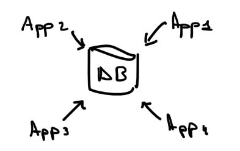

</center>

* Les données modifiées par une application doit être vue par les autres ;
* garantie de cohérence, une application ne doit pas être en mesure de corrompre les données d'une autre application
* ...

---

## Modèle standard

Quelques différences entre les bases de données relationnelles, mais globalement identiques.

* Compétences des développeurs réutilisées dans beaucoup de projets.
* Requêtes SQL et fonctionnement de base identique.
* organisation des données adaptées à la majorité des requêtes,
* Concept de transaction, trigger...

---

# Impedance missmatch

Coexistance de deux représentations

* le modèle relationnel ;
* les structures en mémoire :
  * listes,
  * tableaux,
  * objets imbriqués,
  * héritage,
  * ...

> Traduction nécessaire, frustration des développeurs...
---

<center>

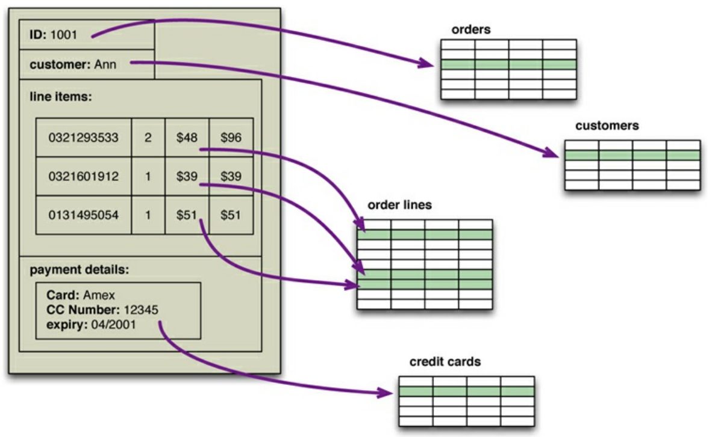

</center>

---

*1990 :* Naissance de l'orienté objet et des *bases de données orientées objet* :face_with_open_eyes_and_hand_over_mouth:.

<center>


</center>

---

> ## Les **ORM** facilite, mais le développeur ne peut ignorer ce qu'il fait.
>
> - le lazy/eager loading,
> - les associations (`1..N`, `N..N`),
> - coût des jointures,
> - la gestion des index,
> - nécessité d'écrire des requêtes plus complexes,
> - ...

---

# Bdd applicative & bdd intégrative

## Base de donnée avec le rôle d'intégrer

Application implémentée par des équipes différentes sont unies par une même base de données. Le *SQL* joue un rôle la flexibilité de l'utilisation du schéma en joue un autre.

Inconvénients : 
* La structure peut devenir extrêment complexe.
* Syncronisation entre les équipes nécessaires (développement plus difficile).
* Des applications différentes ont des besoins différents. Ex. performance -> index (problème d'insertion pour une application A - pour une meilleure recherche de l'application B).

---

## Base de donnée applicative

Changement dans les années 2000, utilisation de services web.

> ## Les services web ([Wikipedia](https://fr.wikipedia.org/wiki/Service_web))
> Un service web est un protocole d'interface informatique de la famille des technologies web permettant la communication et l'échange de données entre applications et systèmes hétérogènes dans des **environnements distribués**. Il s'agit donc d'un ensemble de fonctionnalités exposées sur internet ou sur un intranet, par et pour des applications ou machines, sans intervention humaine, de manière synchrone ou asynchrone. 
>
> Le protocole de communication est défini dans le cadre de la norme SOAP dans la signature du service exposé (WSDL). Actuellement, le protocole de transport est essentiellement TCP (via HTTP)

---

> ## Base de donnée applicative
> * communication des applications via le protocol HTTP.
> * Une et une seule application accède à la base de donnée. 

Possibilité de communiquer grâce à des structures de données plus riches ; d'abord XML, ensuite JSON.

* tableaux
* données imbriquées
* listes

---

Malgré cela, pas de ruée pour stocker les données différemment. Le modèle relationnel est maîtrisé et fonctionne suffisamment bien.

---

# Utilisation de Cluster

## Web 2.0 et bulle internet des années 2000.

Activités, tracking, gestion des données des réseaux sociaux (liens...) => la quantité de données explose.

> 2 options face à cette quantité d'information
> 
> * Scalabilité verticale
> * Scalabilité horizontale

---


## Scaling vertical (scaling-up)

<div class="columns">
<div>

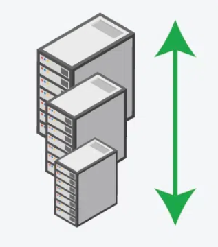
Crédits : [geeks for geeks](https://www.geeksforgeeks.org/system-design/system-design-horizontal-and-vertical-scaling/)

</div>
<div>

* Pas de changement dans le code de l'application,
* réseau plus simple,
* maintenance plus facile.

</div>
</div>


---

### Scaling horizontal (scaline-out)

<div class="columns">
<div>

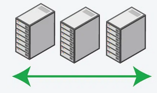
Crédits : [geeks for geeks](https://www.geeksforgeeks.org/system-design/system-design-horizontal-and-vertical-scaling/)

</div>
<div>

* Augmente la "disponibilité",
* plus robuste,
* facilité d'augmenter la charge.

</div>
</div>


⚠️ Les bases de données relationnelles ne sont pas prévues pour ce type d'architecture !

---

Adaptation des bases de données relationnelles aux clusters

* Challenges techniques :
   * Sous système avec disque partagé.
   * Séparation par shard (géré par l'application).

* Coût des licences : 1 machine = 1 licence

=> Google et Amazon influence un changement.

---

# Cluster ([Wikipédia](https://fr.wikipedia.org/wiki/Grappe_de_serveurs))
Un cluster désigne des techniques consistant à regrouper plusieurs ordinateurs **indépendants** appelés nœuds, afin de permettre une **gestion globale** et de dépasser les limitations d'un ordinateur pour **augmenter la disponibilité**, **facliliter la montée en charge**, permettre une **répartition de la charge**, faciliter la **gestion des ressources**.

La création de petits cluster est un procédé peu coûteux, consistant à grouper plusieurs ordinateurs en **réseau**.

---


# Émergence du NoSQL

## Origine du terme

1. 1998 - Apparition du terme NoSQL ([Strozzi NoSQL](https://en.wikipedia.org/wiki/Strozzi_NoSQL))
   * Fichier "ASCII" (format *relationnel*)
   * manipulé par ~~SQL~~ des scripts *shell*.
   * aucune influence sur les BDD traitées dans ce cours.

1. 2005 - première release de BigTable (Google)
   * wide-column et clé-valeur
   * forte charge opérationnelle et capacité d'analyse.


---

3. [Papier Amazon Dynamo 2007](https://www.allthingsdistributed.com/2007/10/amazons_dynamo.html).

1. **11 juin 2009**, meetup informel à SanFrancisco organisé par Johan Oskarsson. Objetif : discuter de **base de données distribuées** & **non-relationnelles**.
   > ## Il fallait
   > * un bon hashtag,
   > * pas trop utilisé sur Google
   > * => *#NoSQL* proposé dans le chan irc #cassandra. Ne représente pas vraiment le sujet, mais est un bon hashtag 🤡) 

---

Sujets des talks : 
 * Voldemort (clé-valeur)
 * Cassandra (wide column store)
 * Dynomite (clé-valeur)
 * HBase (wide column store)
 * Hypertable (wide column store)
 * CouchDB (document)
 * MongoDB (document)

---

# ~~Définition~~ Caractéristiques du NoSQL

Il n'existe pas de définition, plutôt un ensemble de caractéristiques.
* Pas d'utilisation du SQL
* XXI siècle
* Non relationnel
* Sans schéma ⚠️
* Distribué
* Autres propriétés que les propriétés ACID.

---

Les caractéristiques ne sont pas toujours rencontrées : 

Ex : Modèle graphe sur un serveur unique.

---

<!-- _class: cite -->
Au final, il est préférable de voir le NoSQL comme une mouvence. Stocker les données en choisissant le modèle de donnée et l'architecture la plus adaptée aux besoins. Les bdd NoSQL et les BDD relationnelles sont devenues des options.

---

2 raisons d'utiliser le NoSQL : 

* besoins de performance (scalabilité)
* améliorer la productivité du développement d'une applicaation

---

# Quelques mots-clés

<div class="columns">
<div>

* modèles de données
* Impédence missmatch
* Scalabilité
* Cluster
* Sans schéma
* CAP

</div>
<div>

* Sharding
* Réplication
* Aptitude au Big Data
* Performance
* dénormalisation
* Haute disponibilité

</div>
</div>

---
<!-- _class: transition2 -->

Cours XX : Modèles de données "agrégat"

---

Un *modèle de donnée* décrit comment intéragir avec les données.

* à ne pas confondre avec le modèle de stockage qui décrit comment la base de donnée stoque et manipule les donnée en interne.

---

Généralement, on fait le lien avec

> ## Modélisation des données (Wikipedia)
>
> Dans la conception d'un système d'information, la *modélisation des données* est l'analyse et la conception de l'information contenue dans le système afin de représenter la structure de ces informations et de structurer le stockage et les traitements informatiques.
>
> Il s'agit essentiellement d'*identifier les entités logiques* et *les dépendances logiques* entre ces entités. La modélisation des données est une représentation abstraite, dans le sens où les valeurs des données individuelles observées sont ignorées au profit de la structure, des relations, des noms et des formats des données pertinentes, même si une liste de valeurs valides est souvent enregistrée. 

Représentation qu'on peut faire à l'aide d'un diagramme ~~entité-relation~~ entité-association.

---

<!-- _class: cite -->

Dans les slides qui suivent, nous utiliserons le terme *modèle de données* pour décrire la manière dont les base de données organisent les données (métamodèle).

---
<center>

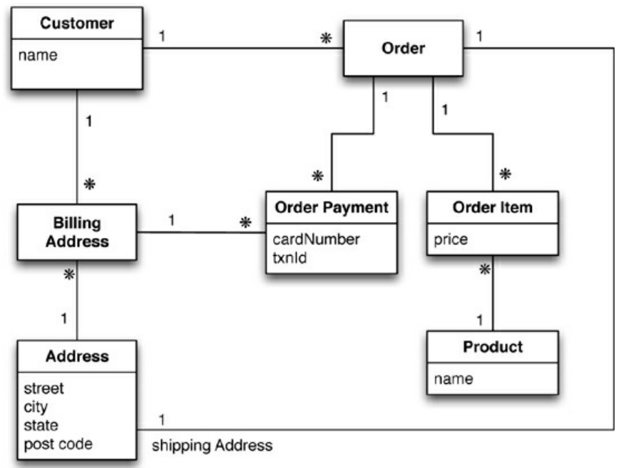

*Figure 1.1.* Diagramme entité-association normalisé.

</center>

---

## Le modèle de donnée relationnel

* Ensemble de table (*relation*)
* Chaque table possède des lignes ou enregistrement (*tuple*) qui représente des instances.
* Les instances sont décritent au travers de colonnes (⚠️ 1 valeur par *cellule*).
* Une colonne peut faire référence à un autre relation constituant une association entre elles-deux

---

## Modèles de données du NoSQL

> Orientées agrégats
> * Document
> * Clé-valeur
> * Famille de colonnes

> Non orientées agrégats
> * Graphe

---

# *Agrégats*

Orientation différente du relationnel :

- Modèle Relationnel : On prend l'information et on la divise en tuples (plats, non imbriqués)
- Orientation agrégat : On pense à comment manipuler les données. Souvent, on veut des **structures complexes** :
  - Listes
  - Structures imbriquées

---

> ## Définition
> 
> Terme qui vient de [Domain-Driven Design](https://fabiofumarola.github.io/nosql/readingMaterial/Evans03.pdf). Un *agrégat* est une collection d'objets liés que l'on souhaite traité comme *unité d'information*. En particulier, cela forme une unité pour 
> * *la manipulation de donnée* et 
> * *la gestion de la cohérence*.

## Avantages

* Un agrégat forme une unité naturelle pour la réplication et le sharding (dans un cluster).
* Le développeur a l'habitude de manipuler des données imbriquées, des listes, tableaux...

---

<center>
Diagramme entité-association normalisé.


</center>

---

<center>

Échantillon de données

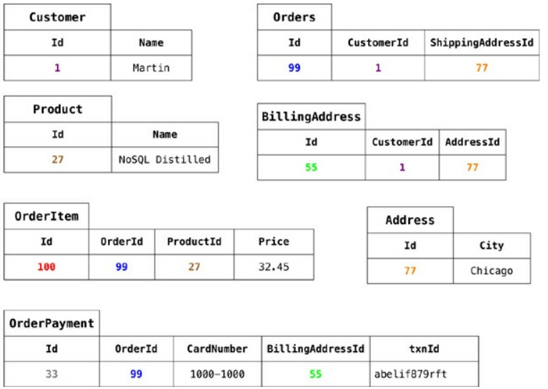

</center>

---

<center>

Diagramme pensé en terme d'agrégat (solution 1)

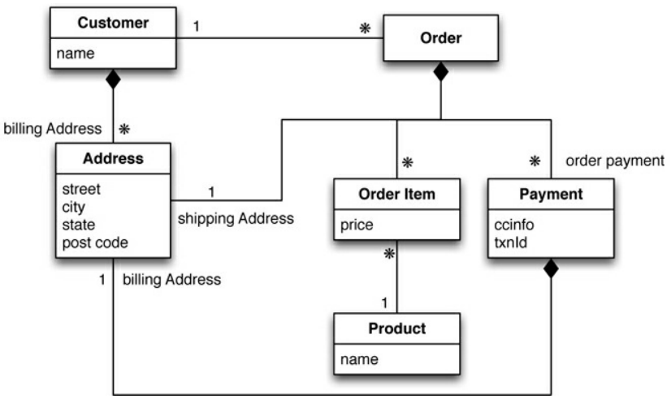

</center>

---

```json 

{ // in customers
  "id": 1,
  "name": "Martin",
  "billingAddress": [{"city": "Chicago"}] ⚠️ Dénormalisation
}

{ // in orders
  "id": 99,
  "customerId": 1,
  "orderItems": [{
      "productId": 27,
      "price": 32.45,
      "productName": "NoSQL Distilled"
    }
  ],
  "shippingAddress": [{"city":"Chicago"}], ⚠️
  "orderPayment": [{
      "ccinfo":"1000-1000-1000-1000",
      "txnId":"abelif879rft",
      "billingAddress":{"city":"Chicago"} ⚠️
    }
  ]
}
```

---

* Apparition de 3 copies d'une même adresse (*dénormalisation*). 
   * 🗒️ En relationnel, il est nécessaire de prévenir la modification d'une ligne d'adresse.
* Le lien entre un client et une commande ne fait partie d'aucun agrégat. → Il s'agit d'une association.

* > Dénormalisation du nom du produit. Pourquoi est-ce acceptable/souhaitable en NoSQl ?
  > * On souhaite minimiser le nombre accès aux agrégats.

* ⚠️ Ce qui compte, ce n'est pas vraiment la façon exacte dont on dessine la frontière d'un agrégat, mais plutôt de réfléchir à la manière dont on va accéder aux données.

---

<center>

Diagramme pensé en terme d'agrégats (solution 2)
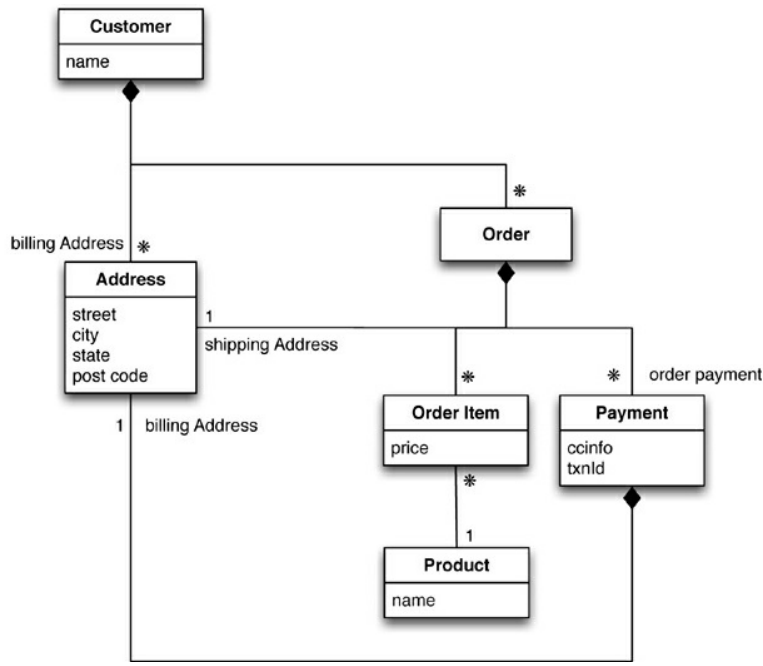
</center>

---

```json
{
  "customer": {
    "id": 1,
    "name": "Martin",
    "billingAddress": [
      { "city": "Chicago" }
    ],

    "orders": [ {
        "id": 99,
        "customerId": 1,
        "orderItems": [ {
            "productId": 27,
            "price": 32.45,
            "productName": "NoSQL Distilled"
          }
        ],
        "shippingAddress": [
          { "city": "Chicago" }
        ],
        "orderPayment": [ {
            "ccinfo": "1000-1000-1000-1000",
            "txnId": "abelif879rft",
            "billingAddress": { "city": "Chicago" }
          }
        ]
      }
    ]
  }
}
```
---

<!-- _class: cite -->

Quelle agrégation est meilleure ?

---

Cela dépend de comment on souhaite manipuler les données
* Accès client ↛  accès aux commandes ⇒ modèle 1
   > Permet d'accéder individuellement aux commandes
* Accès client → accès aux commandes ⇒ modèle 2

Dépend de l'application, ce qui en fait un désavantage par rapport aux systèmes ignorant les agrégats.

---

## Non conscient des agrégats vs orienté agrégat

- **Relational & Graph DBs** : Non conscient des agrégats
  → pas de notion d'agrégat, juste des relations sans sémantique entre les données.
- **NoSQL (Key-Value, Document, Column-Family)** : aggregate-oriented
  → l'agrégat indique l'unité de stockage et d'accès


---

## Pourquoi l'orientation agrégat ?

- Facilite le **stockage distribué en cluster**
- L'agrégat indique quelles données doivent vivre ensemble sur le même nœud 
- Simplifie la gestion de la cohérence locale

⇒ Une bdd relationnelle ne peut pas utiliser des données d'agrégat pour optimiser le stockage et la distribution de données.

---

Ne pas connaître les agrégats est-il un handicap ?

* Parmi les deux modèles d'agrégat précédement proposés.Comment réaliser un historique de la vente des produits ?

---

## Conséquence sur les transactions

- **SGBDR** : transactions ACID multi-tables (sans limite)
- **NoSQL agrégat-orienté** : atomicité **au niveau d'un seul agrégat**
  → si plusieurs agrégats : gestion à la charge de l'application
- **Graph & relationnel** : ACID complet possible

> ## Transation ACID (Atomique, cohérent, isolé, durable)
> 
> Permet 
> * de mettre à jour plusieurs table en une opération. 
> * l'opération est réussie ou non-appliquée
> * les opérations concurrente sont isolées et ne peuvent pas voir des mises à jours partielles.

---

<!-- _class: transition -->
Modèles Clé-valeur & Document

---

## Base de données Clé-valeur

- Données = { **clé** → **agrégat opaque** }
- Avantages :
  - Flexibilité totale sur le contenu
  - Performance simple (lookup par clé)
- Limite : pas de requêtes internes, pas de sous-récupération

---

## Base de données Document

- Données = { **clé** → **document structuré** }
- Avantages :
  - Requêtes par *"clé"* internes
  - Récupération partielle possible
  - Index sur le contenu
- Limite : moins libre que clé-valeur

---

## Clé-valeur vs Document

- **Key-Value** : lookup uniquement par clé
- **Document** : requêtes riches sur la structure
- La frontière est floue (Redis, Riak, etc.)

---

<!-- _class: transition -->
Famille de colonne

---

## Origine : Google Bigtable

- Modèle repris par **HBase** et **Cassandra**
- Stockage en **colonnes groupées (famille de colonnes)**
- Différent des colonnes « relationnelles » classiques

---

## Structure

- Map à **deux niveaux :**
  - **Row** (identifiant → agrégat)
  - **Columns** regroupées en **familles**
- Accès possible : tout le row ou colonnes spécifiques

---

<center>

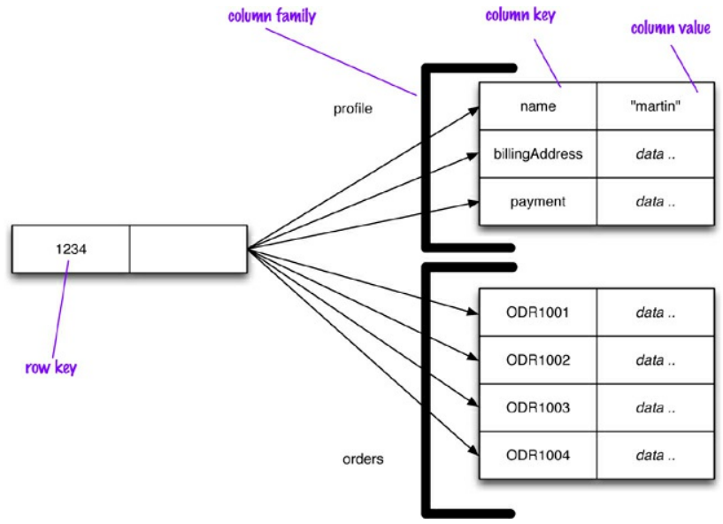

</center>

---

<!-- _class: transition -->
Comparaison des 3 modèles

---

## Comparaison des 3 modèles

- **Key-Value** : agrégat opaque, lookup par clé uniquement
- **Document** : agrégat transparent, requêtes internes possibles
- **Column-Family** : agrégat en 2 niveaux (row + familles de colonnes)

---

## Points communs

- Agrégat = unité d'accès et de mise à jour
- Optimisé pour le **cluster**
- Donne un compromis entre **structure** et **flexibilité**

---

<!-- _class: transition2 -->

Cours 03 : Plus de détail sur les modèles de données

---

<!-- _class: transition -->

Associations

---

# Rapel 
2 cas :

1. Accès client → accès aux commandes
1. Accès individuels aux commandes

---

Récupération des détails du client dans le cas n°2 :

1. on récupère l'enregistrement lié à la commande,
2. on lit l'ID du client,
3. on récupère l'agrégat du client.

> ⚠️ Attention, la base de donnée n'aura pas connaissance de ce lien.
>    * Conséquences ?
>
> Certaines bdd mettent en place des méchanismes pour optimiser : index (MongoDB), metadonnée (Riak).
---

### Modèlisation alternative (Client intégré à l'ordre)

``` json
{
  "_id": 456,
  "customer": { "id": 123, "name": "Alice", "email": "alice@example.com" },
  "total": 25.0
  ...
}
```

---

| Modèle                  | La base "connait" la relation ? | Requêtes croisées possibles ? | Risque d'incohérence |
|--------------------------|----------------------------------|--------------------------------|-----------------------|
| **SQL**                 | ✅ Oui (clé étrangère)           | ✅ Jointures puissantes         | Faible (contrainte FK et ACID) |
| **Clé-valeur pur**      | ❌ Non (juste ID stocké)        | ❌ Non                          | Moyen (c'est à l'app de gérer) |
| **Document (cas n°1 - par référence)** | ⚠️ Un peu (via index)          | ✅ Oui (via index)              | Moyen (pas de FK stricte) |
| **Document (embedding)** | ❌ Non (pas de lien)            | ❌ Non  (mais pas besoin)    | Élevé (duplication) |
| **Clé-valeur avec liens (Riak)** | ✅ Oui (via metadata)        | ⚠️ Limité (suivi de lien interne au sgbd)        | Moyen (pas de validation à l'écriture)|

---

<!-- _class: transition -->

Et avec le modèle graphe ?

---

<center>

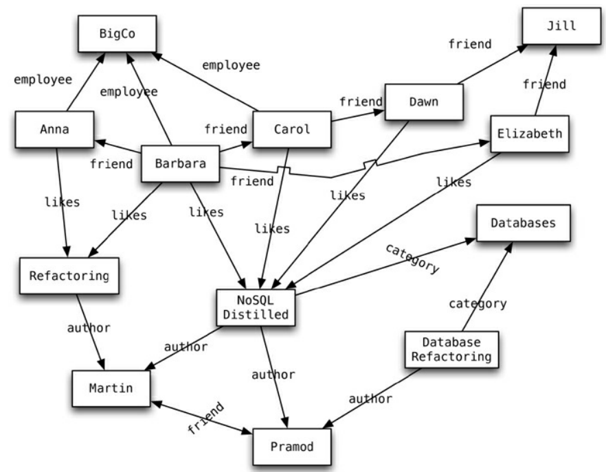
</center>

---

> ## Graphe de connaissance ([wikipedia](https://en.wikipedia.org/wiki/Knowledge_graph))
> In knowledge representation and reasoning, a *knowledge graph* is a knowledge base that uses a graph-structured data model or topology to represent and operate on data. Knowledge graphs are often used to store interlinked descriptions of entities – objects, events, situations or abstract concepts – while also encoding the free-form semantics or relationships underlying these entities.

> ## Traduction & simplification
> Un graphe de connaissances est une base de données qui utilise un graphe (sommets et arêtes) pour représenter l'information.
Il permet de stocker des descriptions reliées entre elles concernant des entités (par exemple : objets, personnes, événements, situations ou idées abstraites) et de représenter aussi les relations qui existent entre ces entités.

---

<!-- _class: cite -->

Trouver les livres de la catégorie bases de données écrits par un auteur apprécié par un ami.

---

| Modèle                  | La base "connait" la relation ? | Requêtes croisées possibles ? | Risque d'incohérence |
|--------------------------|----------------------------------|--------------------------------|-----------------------|
| **Graphe (Neo4j)** | ✅ Oui (objet de 1ère classe)        | ✅✅ Oui        | Faible ([first-class citizen](https://neo4j.com/news/5-factors-driving-graph-database-explosion/))|

---

# Dans un modèle relationnel

On peut parcourir les clés étrangères à l'aide des jointures, mais c'est vite couteux, difficile à écrire, lire...

## Exemple :
``` sql
SELECT DISTINCT vArrivee.nom, vArrivee.pays
FROM ville vDepart
JOIN troncon t1 ON vDepart.idville = t1.villeDepart
JOIN troncon t2 ON t1.villeArrivee = t2.villeDepart
JOIN troncon t3 ON t2.villeArrivee = t3.villeDepart
JOIN ville vArrivee ON t3.villeArrivee = vArrivee.idville
WHERE vDepart.nom = 'Bruxelles';
```

---

Dans une base de données graphe, la plupart des requêtes servent surtout à explorer les relations entre les données.

1. Point de départ : recherche par un attribut indexé
1. suivi des arêtes

---

# Modèle graphe vs modèles agrégats
* Nature différente des agrégats (voir opposé)
* Sur un serveur unique (~~distribué dans un cluster~~)
* ACID complet
* Liens avec les autres sgbd NoSQL : 
  * Augmentation d'intérêt conjointement
  * rejet du modèle relationnel.

---

<!-- _class: transition -->

Sans schéma

---

<!-- _class: cite -->
Les bases de données NoSQL sont « sans schéma ».

---

## Modèle relationnelle : Une camisole

* Avant de stocker des données : définir un **schéma**
  * Tables
  * Colonnes (sémantique & type)
  * contraintes
  * ...
* Impossible de stocker sans schéma préalable

--- 
## NoSQL : un stockage plus flexible

- Pas de schéma imposé
- Chaque type de NoSQL permet d'ajouter librement :
  - **Clé-valeur** : n'importe quelle donnée associée à une clé
  - **Document** : structure libre dans chaque document
  - **Famille de colonne** : données dans les colonnes au choix
  - **Graphe** : nouvelles arêtes et propriétés ajoutées librement 

---

## Avantages du *sans schéma*

* Plus grande liberté et flexibilité,
* Pas besoin de tout prévoir à l'avance,
* Adaptation facile au projet en cours,
* Suppression de données non utilisées (sans effets de bord),
* Ajout de données sans faire des "trous".

---

## Limites du *Schemaless*

- Programmes supposent une **structure implicite** / **schéma à la lecture** :
  - Ex. champ `billingAddress` ≠ `addressForBilling` (valeur ≠ "Bob")
  - Les types doivent être cohérents (ex. `5` ≠ `"five"`)
- Le schéma est **dans le code applicatif** :
  - Rend la compréhension des données plus difficile (doc)
  - La BD ne peut pas optimiser ni valider

---

## Pourquoi garder un schéma ?

* Schéma fixe pour :
  * Cohérence
  * Optimisation
  * Validation
* La **rejet du schéma** par NoSQL est une rupture importante

---

> ## *Schéma implicite*
> Ensemble de supposition - à propos de la structure de donnée - faites dans l'application qui manipule les données.

---

## Problèmes pratiques au schéma implicite

* Pour comprendre les données il peut être nécessaire de plonger de le code
   > ⚠️ Attention, aussi valide dans le modèle relationnelle (column1, column2...).
* risques ☢️ : incohérences, incompatibilités
* Approches possibles :
  * Centraliser l'accès aux données : via une seule appli + API (service web)
  * Délimiter clairement les zones accessibles par chaque appli 🤮.

---

## Schémas relationnels : plus flexibles qu'on ne pense

* SQL permet de modifier un schéma à tout moment
* Des colonnes peuvent être ajoutées à la volée
* On peut stocker différentes valeurs dans une même colonne (devrions nous le faire ?) → privilégier une bdd sans schéma.

---

## En résumé

- Le *« sans schéma »*
  * pour 👍 : Flexibilité, adaptation rapide, gestion des données variées
  * contre 👎 difficultés d'optimisation et de validation
* > ## En réalité
  > * **le schéma n'a pas disparu**, bdd ↦ app
  > * La flexibilité s'arrête à l'horizon des agrégats.

---

<!-- _class: transition -->

Vues et Vues matérialisées

---

## Limite des modèles orientés agrégats

* Pratique pour accéder à une commande complète
* moins pour des questions globales (ex. vente total de la semaine des produit)
* Nécessite souvent de lire **tous les ordres** → coûteux
* Les index aident, mais on va contre la structure.
  * à la base on veut des agrégats autonomes

---

> ## *Vue classique*
> 
> - Définie par une **requête SQL**
> - Ne stocke pas les résultats
> - À chaque accès : la requête est **recalculée**

---

> ## [Vues matérialisées](https://www.postgresql.org/docs/current/rules-materializedviews.html)
> * Vue dont le *resultat est persisté* sous format "relation"
>   ``` sql
>   CREATE MATERIALIZED VIEW mymatview AS SELECT * FROM mytab;
>   ```
> * ≠ tables : pas de modification directe
> * *requête persisté*
>   * ⟳ mise à jour
>     ``` sql
>     REFRESH MATERIALIZED VIEW mymatview;
>     ```

---

| Caractéristique | Vue classique | Vue matérialisée |
|-----------------|---------------|------------------|
| **Stockage** | Non | Oui |
| **Fraîcheur des données** | Toujours à jour | Peut être périmée |
| **Performance lecture** | Plus lente | Très rapide |
| **Mémoire utilisée** | Faible | Plus élevée |
| **Cas d'usage** | Données fraîches | Requêtes lourdes et répétées + léger retard toléré |

---

## NoSQL et vues

- Vue classique existante (potentiellement très coûteuses)
- **vues matérialisées** (usage plus fréquent)
  - fait des algorithmes type **Map-Reduce**
  - Très central dans les bases orientées agrégats 
     → requête hors agrégat fréquentes. 

Ex: 📖 [Solution MongoDB](https://www.mongodb.com/docs/manual/core/materialized-views/)

---

## Stratégies de mise à jour

* **Eager** (immédiat)
  * Mise à jour en même temps que les données de base
  * Fraîcheur maximale
  * Coût élevé en écriture

* **Batch** (périodique)
  * Recalcul régulier
  * Moins coûteux
  * Données périmée (compréhension du métier : *ex.* produit vendu / semaine)

---

## Implémentations possibles hors base de données

* Construire la vue en dehors de la BD et la réinjecter
* Laisser la base calculer et maintenir la vue selon une configruation (trigger)
* Usage d'**incremental map-reduce** (mise à jour incrémentale)

---

## Dénormalisation interne

- Exemple : document *commande* contenant un résumé (*résumé de commande*)
   - Évite de parcourir tout l'objet pour une requête simple
- Dans les bases **column-family** : vues matérialisées gérées dans d'autres familles de colonnes
- Mise à jour possible dans la **même transaction atomique**

---

## En résumé

- Les **agrégats** facilitent certains accès, mais compliquent les requêtes globales
- Les **vues matérialisées** apportent une solution :
  - Rapidité en lecture
  - Flexibilité d'accès
  - Mais nécessitent une gestion des mises à jour (eager ou batch)

---

<!-- _class: transition -->
Modélisation pour les accès données

---

## Réflexion

* Comment modéliser la bd commandes/client.
  * pour pouvoir faire des requêtes individuelles sur les commandes.
  * pouvoir récupérer efficacement les commandes réalisées par un client.

* Dans le cas développé, comment peut-on optimiser la requête : quelles commandes contiennent un produit donné.

-> la manière de créer les agrégats dépend des lectures que nous souhaitons faire.

---

<!-- _class: transition -->

 III - Distribution des données

---

<!-- _class: transition2 -->

1 - Introduction

---

<center>

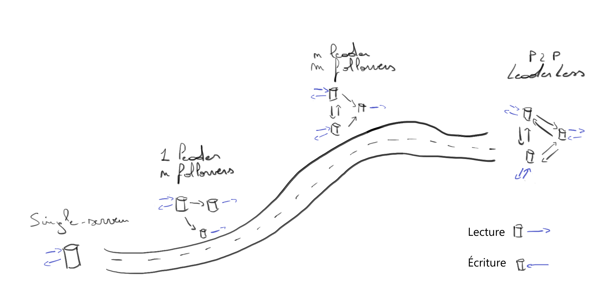

</center>

---

<!-- _class: transition3 -->

Départ : Aucune distribution

---

> « Plus simple, la première des options de distribution est celle que nous recommandons le plus souvent : **aucune distribution**. »

- La base de données tourne sur **une seule machine**
  → gère **toutes les lectures et écritures**
- Cette approche **évite toute complexité** :
  - plus simple à administrer
  - plus facile à raisonner pour les développeurs
- Si possible : **préférer toujours un modèle mono-serveur**.

---

# Quand le mono-serveur reste pertinent

Même si de nombreuses bases NoSQL sont conçues pour les **clusters** :

- Le **modèle de données** du NoSQL peut mieux convenir à l’application,
  **même sur un seul serveur**.
- Exemple :
  - **Bases de données graphe** → fonctionnement optimal sur un seul nœud
  - **Document stores** ou **key-value stores** → efficaces pour des agrégats simples

> ⚠️ Si l’on peut éviter la distribution, **on choisira toujours une approche mono-serveur**.

---

<!-- _class: transition3 -->

On the road

---

<!-- _class: cite -->

Que se passe-t-il lorsque **plusieurs machines** participent au stockage et à la récupération des données ?

---

# Pourquoi distribuer les données ?

*  **Scalabilité**
  Répartir la charge (lecture, écriture, volume) sur plusieurs machines.

* **Tolérance aux pannes / Haute disponibilité**
  Le système continue de fonctionner même si une machine (ou un datacenter) tombe en panne.

* **Latence**
  Servir les utilisateurs depuis des serveurs **géographiquement proches** pour réduire les délais réseau.

---

<!-- _class: cite -->

Quelle est la différence entre un nœud, un cluster et un datacenter ?

---

# Cas Cassandra

<center>

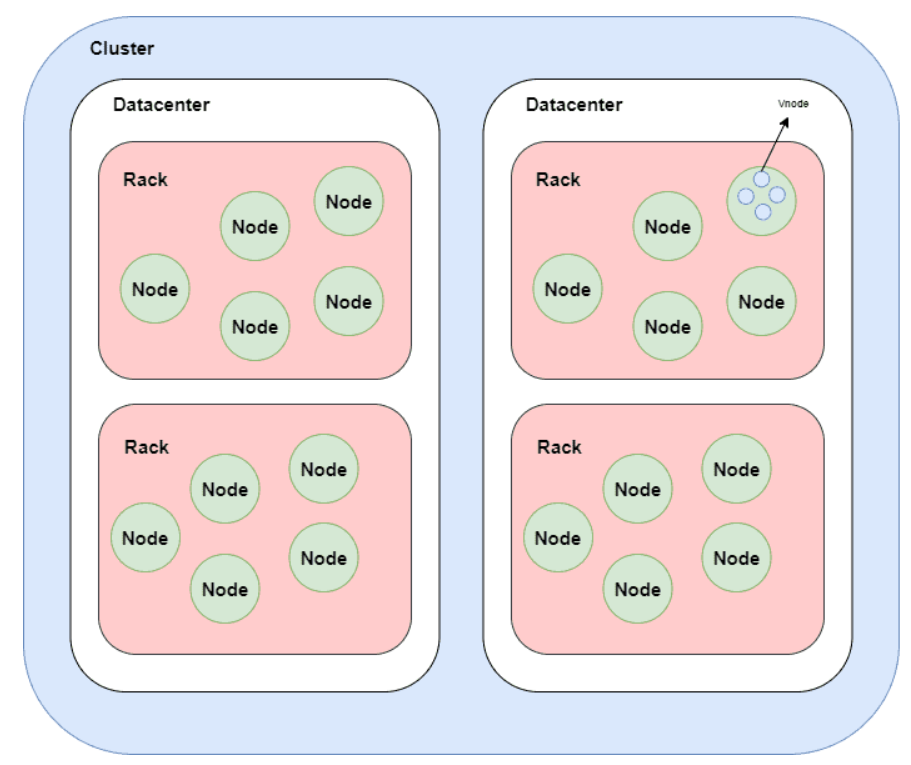
</center>

[Cluster, Datacenters, Racks and Nodes in Cassandra (Baeldung)](https://www.baeldung.com/cassandra-cluster-datacenters-racks-nodes)

---


# Monter en charge : vertical vs horizontal

##  Scalabilité verticale (scale up)
- Acheter une **machine plus puissante** : plus de CPU, RAM, disques.
- Simple à mettre en place, mais :
  - coût croît **plus vite que linéairement**
  - bottlenecks (réseau...) 
  - limites physiques (ex: nonuniform memory access) et géographiques

## Scalabilité horizontale (scale out)
- Ajouter **plusieurs machines** (nœuds) travaillant de manière distribuée.
- Nécessite des mécanismes de coordination, mais plus flexible et résilient.
---

# Architectures possibles

---

### 1️⃣ Mémoire partagée (shared-memory)
> Une seule machine avec de multiples processeurs et mémoire commune (OS unique).
✅ Simple
❌ Coût élevé, tolérance de panne limitée.

### 2️⃣ Disque partagé (shared-disk)
> Plusieurs machines partagent les mêmes disques via un réseau rapide.
✅ Utilisé en entrepôts de données.
❌ Problèmes de **verrouillage** et de **concurrence**.

### 3️⃣ Sans partage (shared-nothing)
> Chaque nœud a ses **propres CPU, RAM, disque**.
✅ Très populaire, peu coûteux, extensible
❌ Complexité accrue pour les développeurs.

---

# Entrepôt de données (data warehouse)

> [Wikipedia](https://fr.wikipedia.org/wiki/Entrep%C3%B4t_de_donn%C3%A9es)
> Un *entrepôt de données (data warehouse)* est une **base de données** regroupant une partie ou l'**ensemble des données fonctionnelles d'une entreprise**. Il entre dans le cadre de l'**informatique décisionnelle** ; son but est de fournir un ensemble de données servant de **référence unique**, utilisée pour la **prise de décisions** dans l'entreprise par le biais de **statistiques et de rapports** réalisés via des outils de reporting. 
>
> D'un point de vue technique, il sert surtout à 'délester' les bases de données opérationnelles des requêtes pouvant nuire à leurs performances.

---

<div class="columns">
<div>

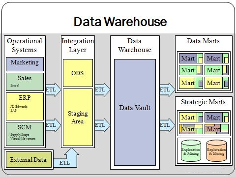
[Wikipedia](https://fr.wikipedia.org/wiki/Entrep%C3%B4t_de_donn%C3%A9es#/media/Fichier:Data_warehouse_overview.JPG)

</div>
<div>

> [Wikipedia](https://fr.wikipedia.org/wiki/Entrep%C3%B4t_de_donn%C3%A9es)
> - extraction des données de production, transformations éventuelles et chargement de l'entrepôt (c'est l'ETL ou Extract, Transform and Load ou encore datapumping).
> - on peut voir l'entrepôt de données comme une **architecture décisionnelle** capable à la fois de gérer l'**hétérogénéité** et le **changement** et dont l'enjeu est de **transformer** les données en **informations directement exploitables** par les utilisateurs du métier concerné. 
</div>
</div>

---

# Modèle "Shared-nothing" ou horizontal scaling ou scaling out

## Avantages
- Pas besoin de matériel spécialisé
- Possibilité de répartir les données **dans plusieurs régions**
- Réduction de la latence et meilleure résilience
- Accessible même aux **petites entreprises** via le cloud

## Mais attention
> Plus de puissance ⟹ aussi plus de complexité à gérer (cohérence, pannes, synchronisation…)

---

# Réplication et Partitionnement

## Réplication

> Copier les **mêmes données** sur plusieurs nœuds (potentiellement dans différents lieux).
>   * Assure la **redondance** et la **résilience** (des nœuds peuvent être indisponibles).
>   * Peut aider à améliorer les performances.

## Partitionnement (sharding)
> Découper une grosse base de donnée en sous-ensembles (appelés *partition* ou *shard*) ; répartis sur plusieurs nœuds.

---

## Réplication 🤝 partitionnement
> Les deux techniques sont souvent **combinées** ↦ compromis difficile pour réaliser, configurer, utiliser un système distribué.

<center>

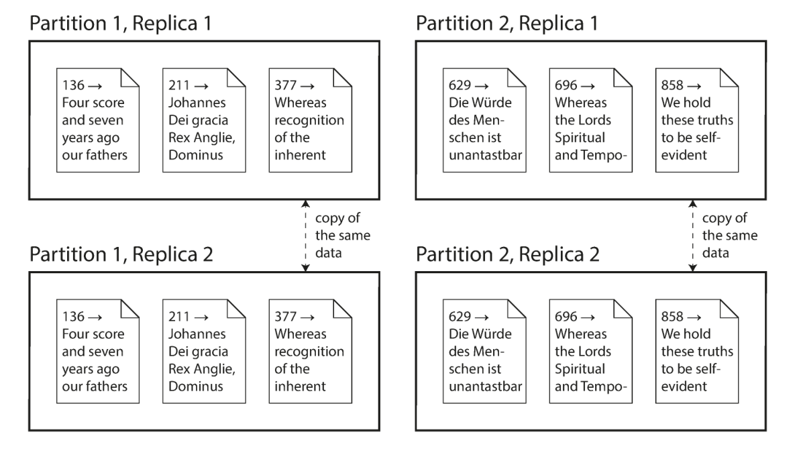

</center>

---

# Théorème CAP

<div class="columns">
<div>

<center>

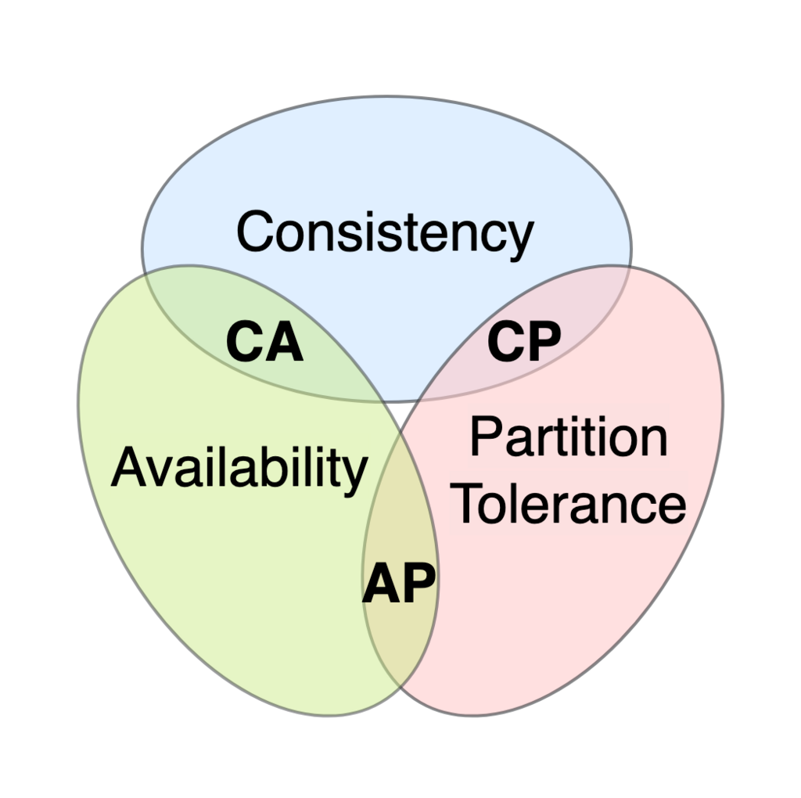

</center>

</div>
<div>

- Cohérence
- disponibilité
- tolérance aux partition
* *choisissez-en deux !*

</div>
</div>

---

> [Wikipedia](https://en.wikipedia.org/wiki/CAP_theorem)
> * **Disponibilité** - Chaque requête reçue par un nœud non défaillant du système doit aboutir à une réponse. (définition formulée dans le théorème CAP, par Gilbert et Lynch.)
>   |Théorème CAP||architecture logicielle|
>   |---|---|---|
>   |Disponibilité (pas de délais)|≠|haute disponibilité ou faible latence|
> * **Cohérence (~~consistance~~)** - Chaque lecture reçoit la donnée la plus récente écrite, ou une erreur.
>   |Théorème CAP||Transaction ACID|
>   |---|---|---|
>   |Cohérence de réplication ou linéarisable|≠|Cohérence logique|
> * **Tolérance aux partitions** - Le système continue de fonctionner même si un nombre arbitraire de messages est perdu (ou retardé) par le réseau entre les nœuds.

---

<center>

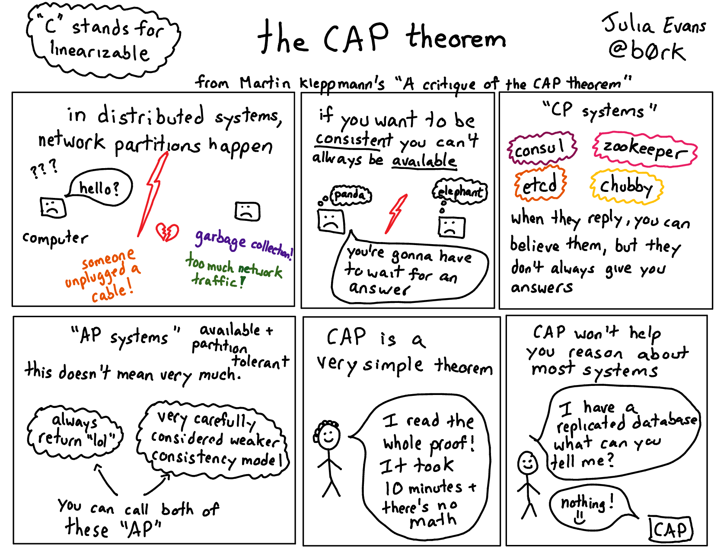

</center>

> <span class="ref">📖 [CAP - Julia Evans]https://jvns.ca/blog/2016/11/19/a-critique-of-the-cap-theorem/</span>
> <Span class="ref">📖 [Martin Kleppmann - A Critique of the CAP Theorem](https://arxiv.org/abs/1509.05393)</span>

---

<!-- _class: transition2 -->

2 - Réplication

---

<!-- _class: cite -->

La réplication consiste à conserver une copie des mêmes données sur plusieurs machines connectées entre elles via un réseau.

---

# Objectifs

* Garder les données proche géographiquement (↘ latence).
* Permettre au système de continuer à fonctionner même si certains de ses nœuds tombent en panne. (↗ la disponibilité).
* Augmenter horizontallement (scale-out) le nombre de machines qui répondent aux requêtes de lectures (↗ capacité traitement). 

---

# Approches

> **Note**
> - Le jeu de donnée peut tenir sur un seul nœud (pas de partition).
> - l'enjeu réside dans le changement (pas de changement -> on copie et c'est fini).
* 3 approches : 
   * Réplication à *leader unique*
   * Réplication à *multi-leader*
   * Réplication *sans leader (P2P)*

---

# Compromis à considérer

La réplication d’une base de données soulève de nombreux **choix techniques** :

- **Réplication synchrone** ou **asynchrone** ?
- Comment **gérer les réplicas défaillants** ?
- Quelles **garanties de cohérence** offrir aux utilisateurs ?

> Ces options varient selon les SGBD, mais les **principes généraux** sont similaires dans la plupart des systèmes.

---

# Faire du neuf avec du vieux

> La réplication des bases de données est étudiée depuis les **années 1970** 🧠

- Les **principes fondamentaux** ont peu changé, 
  car les **contraintes du réseau** (latence, pannes, déconnexion)
  restent les mêmes aujourd’hui.


Ce qui a évolué :
- L'utilisation plus générale de systèmes distribués par les développeurs applicatifs.
  → Préconception, vulgarisation (ex: cohérence éventuelle)...

⚠️Considération pour le développeur (ex: [MongoDB](https://www.mongodb.com/docs/development/))

---

# Comprendre la cohérence éventuelle

> Beaucoup de malentendus entourent la **cohérence éventuelle**.

Dans ce chapitre, nous aborderons :
- le **retard de réplication** (*replication lag*),
- les garanties de lecture :
  - **read-your-writes** (lire ce qu’on vient d’écrire),
  - **monotonic reads** (lectures toujours cohérentes dans le temps).
- ...

**Objectif** : comprendre les **conséquences pratiques**  des choix de réplication dans un système distribué.

---

# Réplica

Chaque nœud qui enregistre une copie de la base de donnée est appelée *Réplica*.

🧩 Problème :
> Comment s’assurer que toutes les répliques contiennent les **mêmes données** ?

Chaque **écriture** doit être appliquée sur **toutes les répliques**.

La méthode la plus courante : **leader-based replication** (aussi appelée **master–slave** ou **active/passive**).

---

<!-- _class: transition3 -->

Leader & followers

---
# Principe général

### Le leader
- Une réplique est désignée comme **leader** (aussi : *master* ou *primary*).
- Tous les **écritures** passent **uniquement par lui**.
- Le leader **enregistre** d’abord la donnée localement.

### Les followers
- Les autres répliques sont des **followers** (*read replicas*, *slaves*, *secondaries*).
- Le leader leur **envoie un flux de changements** (replication log / change stream).
- Chaque follower **applique les écritures dans le même ordre** que le leader.

> Ex. [MongoDB : Primary & secondary](https://www.mongodb.com/docs/manual/replication/)
---

# Lecture et écriture

- **Écritures** : uniquement sur le **leader**
- **Lectures** : possibles sur **le leader ou les followers**

<center>

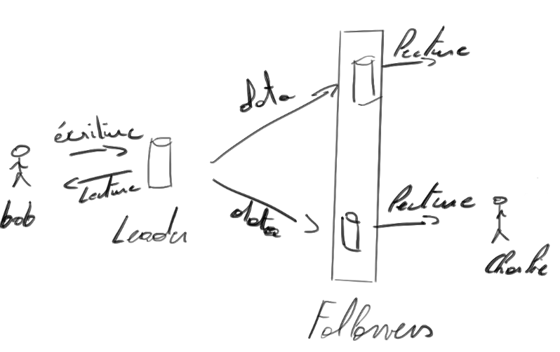
</center>

---

<!-- _class: transition3 -->

Réplication synchrone vs asynchrone

---

# Réplication : synchrone ou asynchrone ?

Un aspect important d’un système répliqué :
> **La manière dont la réplication s’effectue.**

Deux approches possibles :
- **Réplication synchrone**
- **Réplication asynchrone**

> **Info**
> - *Paramétrable* dans certaines bases relationnelles ; 
> - *Figé dans le code* dans d’autres.

---


# Fonctionnement général

1. Le client envoie une requête d’**écriture** au **leader**.
1. Le leader enregistre la modification localement.
1. Le leader **transmet le changement aux followers**.
1. Le leader **confirme le succès** au client.

> La différence entre *synchrone* et *asynchrone* : faut-il attendre une réponse du followers ?

---

<center>

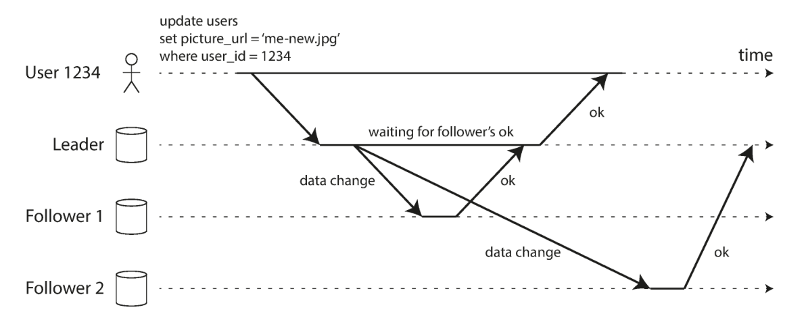
</center>

* Follower 1 - réplication synchrone. Leader attend réception du ok → notification du client.
* Follower 2 - Réplication asynchrone. Leader suppose `:writeok:` sans attendre.

---

> ⓘ Info
> La mise-à-jour d'un follower se fait généralement en moins d'une seconde.
> 
> Circonstances de délais : 
> - un follower subit ou récupère d'une panne ;
> - un follower saturé ;
> - des problèmes sur le réseau.

---

# Réplication synchrone

## ✅ Avantage :

- Le follower a toujours une copie à jour et cohérente. 
⇒ Si le leader tombe, la donnée est sûre.

## ❌ Inconvénient :

- Si le follower ne répond pas (panne, réseau), le leader bloque toutes les écritures jusqu'à rétablissement du follower.

---

# Réplication asynchrone

## ✅ Avantages :

- Le leader ne bloque jamais.
- Performances plus élevées

## ❌ Inconvénient :

- Si le leader échoue avant la réplication, certaines écritures peuvent être perdues. 
⇒ La durabilité n’est pas garantie.

---

# Réplication asynchrone et non durabilité

<center>

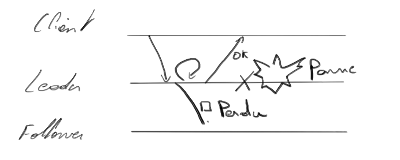
</center>

⚠️ Le client a bien reçu la confirmation d'écriture.
✅ Reste une bonne idée s'il y a beaucoup de follower ou géographiquement distribué.

---

# Tout synchroniser, une bonne idée ?

Si tous les followers étaient synchrones, la panne d’un seul nœud bloquerait tout le système 😱
⇒ **impraticable** en production.

## Solution si souhait de backup :

- *1* unique follower synchrone.
- Les autres sont asynchrones.
- Un follower synchrone trop lent est remplacé.

> Cette configuration s’appelle souvent : **Réplication semi-synchrone**

---

# Configuration d'un nouveau follower

Comment charger les données du leader ?

<div class="columns">
<div>

* copier les données du leader ? 
↦ Prend du temps & Flux de données en cours !
⇒ perte d'écriture.

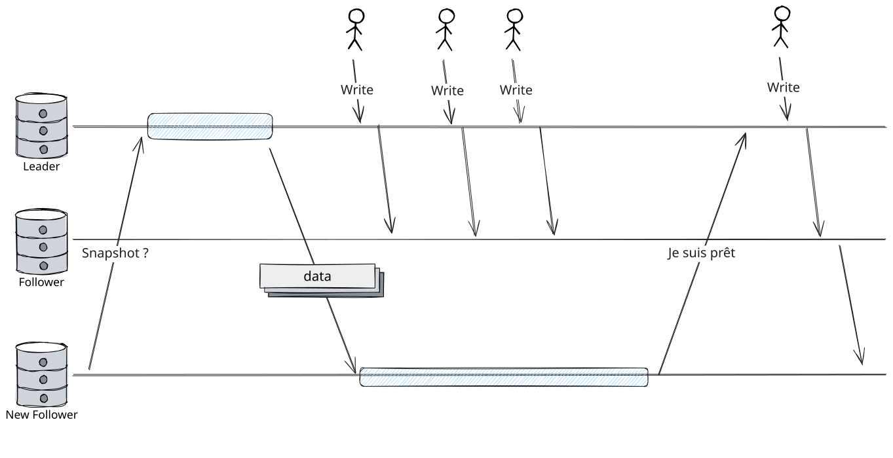
</div>

<div>

* Lock de base de donnée ? 
↦ Contre la haute disponibilité
</div>
</div>

---

## Configuration sans indisponibilité

1. Création du snapshot
2. Copie du snapshot
3. Follower demande au Leader les changements survenus depuis le snapshot
→ Snapshot associé à une position dans le *replication log*
   - Postgres - LSN (Log Sequence Number)
   - MongoDB - oplog(https://www.mongodb.com/docs/manual/core/replica-set-oplog/)
4. Lorsque le follower a rattrapé son retard, il se synchronise au flux comme les autres followers.

---

<center>

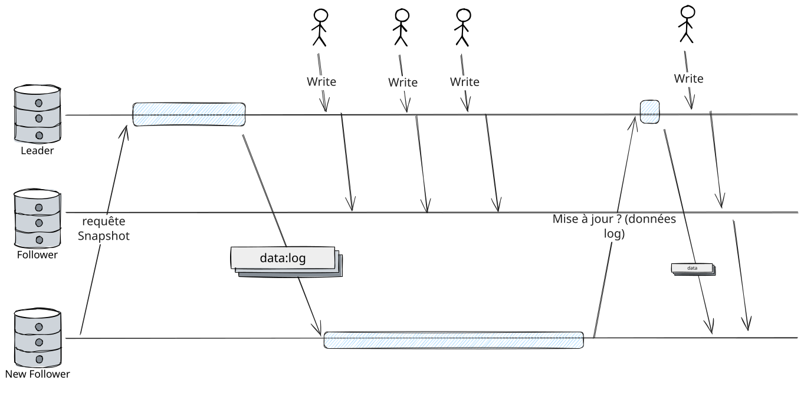
</center>

---


<!-- _class: transition3 -->

Prise en charge d'une panne de nœud (outage)

---

# Contexte

- Dans un système distribué, **n’importe quel nœud peut tomber en panne** :
  - panne matérielle
  - erreur logicielle
  - ou simple **maintenance planifiée** (ex. redémarrage après mise à jour)

---

# Objectifs

- Maintenir le **système globalement disponible**,
  même si un ou plusieurs nœuds tombent.
- Réduire au **minimum l’impact d’une panne locale**.
- Permettre le **redémarrage d’un nœud** sans interruption du service.

---

# Panne d'un follower

- Chaque **follower** conserve localement un **log des changements** reçus du leader.
- Si un follower tombe et redémarre ou s'il y a un problème réseau
  1. Lit sa dernière opération dans le log.
  2. Demande au leader les opérations manquantes.
  3. Applique ces changements pour **se resynchroniser**.
  4. peut recevoir et appliquer le flux de changements habituel.

---

# Panne du leader : failover

## Définition

- Quand le **leader échoue**, un autre nœud doit prendre le relais.
- Ce processus est appelé **failover** (ou reprise).
- Il implique de :
  1. Promouvoir un nouveau leader
  2. Reconfigurer les clients
  3. Synchroniser les autres réplicas avec le nouveau leader

---

## Type de failover

- **Manuel** : un administrateur est notifié et choisit le nouveau leader.
- **Automatique** : le système détecte l’échec et agit seul. 

---

## Failover automatique

### Étape 1 - Détecter la panne du leader

- Causes possibles : crash, coupure réseau, panne de courant...
- Pas de détection parfaite.
- Méthode la plus courante : **timeout** ⏱️
  - Si le leader ne répond plus après x secondes → on le déclare mort.
- Exemple : *heartbeat* manquant pendant 30s.

---

### Étape 2 — Choisir un nouveau leader

- Peut se faire via :
  - une **élection** entre nœuds, ou
  - un **contrôleur** déjà élu qui désigne le leader.
- Meilleur candidat
   - celui avec les **données les plus à jour** (ex : réplica synchrone)
   - celui avec une meilleure latence (au center)
- C’est un **problème de consensus**.

---

### Étape 3 — Reconfiguration

- Les clients doivent envoyer leurs **writes** au nouveau leader.
- L’ancien leader, s’il revient :
  - peut encore se croire leader ⇒ problème
  - doit être **forcé à devenir follower**.

---

## Problèmes possibles

### 1.  **Pertes de données** (réplication asynchrone)

- Le nouveau leader n’a pas tous les derniers writes.
- Si l'ancien leader revient,
  - Le nouveau leader a probablement reçu des writes conflictuel
  - Le plus courant → les writes non répliqués de l’ancien leader sont **supprimés**

---

### 2. Perte & **data leak**

> [Incident Github](https://github.blog/news-insights/github-availability-this-week/) - « Synchronisation » avec un système externe
>
> - Un follower (MySQL) est promu leader (des données ne sont pas à jour )
> - Utilisation d'un compteur auto-incrémenté pour les clés primaires.
> - Réutilisation de clés primaires déjà utilisées.
> - Clés utilisées dans Redis
> * → Des données privées ont été affichées aux mauvais utilisateurs.

---

### 3. **split brain** (deux leaders)

- Nœuds pensent être leader.
⇒ les deux nœuds acceptent les écritures ⇒ **incohérence** ou **corruption**
- Certains système on des mécanismes pour couper un nœud si 2 leaders.
  → (*Shoot The Other Node In The Head*)
- Quel nœud choisir ? ⚠️ Ne pas couper les deux nœuds par accident.

---

### 4. **Durée du sursis ?**

Combien de temps faut-il attendre avant de déclarer un nœud mort ?

- Temps trop long 
→ on augmente le risque et la gravité des problèmes.
- Temps trop court
  → faux positifs et failover inutiles.
  - un pic de requêtes peut provoquer un ralentissement (pas le meilleur moment pour changer de leader...),
  - un ralentissement sur le réseau peut survenir.


  Dans les deux cas, un failover inutile risque d'empirer la situation.

---

## En pratique

- Beaucoup d’équipes préfèrent un **failover manuel**,
  même si le système supporte l’automatique.
- Ces problèmes relèvent des **fondamentaux des systèmes distribués** :
  - Pannes de nœuds
  - Réseaux non fiables
  - Équilibre entre cohérence, disponibilité, durabilité et latence

---

<!-- _class: transition3 -->

Implémentation des logs de réplication

---

<!-- _class: cite -->

Le **leader** applique les écritures et envoie les changements à ses **followers**.
Ces changements sont enregistrés dans un **log de réplication**. Comment transmettre ces logs ?

---

# 1. Réplication basée sur les « statements » (SBR)

- Le leader *log* chaque requête d'écriture (*statement*) qu'il a reçu et les transmet à ses followers.
   > Exemple de requêtes (modèle relationnel) : `INSERT`, `UPDATE`, `DELETE`, `REPLACE`.
- Chaque follower exécute ces requêtes à leur tour.

→ Facile et léger. Mais ?

---

### Inconvénients

- **Fonctions Non-déterministes** : `NOW()` ou `RAND()` → donne des résultats différents à chaque appel.
- **Ordre d’exécution** critique pour `AUTO_INCREMENT` et `WHERE`.
   - INSERT ↦ COUNT ≠ Count ↦ INSERT
- **Effets de bord** possibles (triggers, procédures, functions).

---

### Piste de solution

- remplacer les fonctions non déterministes par avec une valeur fixe.

Trop de cas annexes. 

- MySQL v5.1 (défaut): ~~statement-based replication~~ ↦ Row-based replication (RBR)
   📖 [avantages et désavantage SBR et RBR]()
- VoltDB l'utilise encore - cas exceptionnel

---

# 2. Write-ahead log (WAL) Shipping

Le leader écrit toutes les modifications dans un journal d’écriture (*WAL*).
(⚠️ bas niveau - Quel byte a été modifié dans quel bloc du disque)


Ce même journal est :
- écrit sur disque local,
- envoyé sur le réseau vers les followers.

Le follower rejoue le WAL pour reconstruire l’état exact du leader.

---

### ✅ Avantages

- Très précis, fiable après crash.
- Reflète exactement les opérations disque du leader.
- Utilisé dans PostgreSQL et Oracle.

### ❌ Inconvénients

- Format bas niveau → lié au moteur de stockage.
- Versions différentes (leader/follower) souvent incompatibles.
- Rend les mises à jour logicielles sans arrêt difficiles (nécessite downtime).

---

# 3. Logical (row-based) log replication

- Le log de réplication est découplé du moteur de stockage interne (**logical log**).
- Chaque entrée du log correspond à une ligne d'une table modifiée :
   - INSERT - nouvelles valeurs
   - DELETE - identifiant unique (ex. clé primaire) 
   (toutes les valeurs si nécessaires. ex.  m2m)
   - UPDATE - identifiant + nouvelles valeurs

> **1 transaction**
>
> *n* modifications → *n* enregistrements dans le log + 1 « transaction commitée».

---

### ✅ Avantages

- Retrocompatibilité (*n* nœud, *m* version).
- Peut fonctionner avec plusieurs moteurs de stockage.
- Facile à parser par des systèmes externes : 
ex. Data warehouse (*change data capture*)

---

### Change Data Capture (CDC)

- Technique dérivée de la réplication logique.
- Permet d’envoyer les changements vers des systèmes externes :
   - ETL / pipelines de données (Extract Transform Load).
   - ElasticSearch, Kafka, etc.
- Base de nombreuses architectures event-driven modernes.
   - ex : [MongoDB CDC](https://www.mongodb.com/docs/kafka-connector/current/sink-connector/fundamentals/change-data-capture/?event-producer=mongodb) 
   - [MongoDB Change Streams (ex. code)](https://www.mongodb.com/docs/manual/changeStreams/)
---

# 4. Trigger-Based Replication

- Implémentée au **niveau applicatif** via des triggers SQL.
- Chaque modification déclenche un code :
   - écrit le changement dans une table spéciale
   - un processus externe lit cette table et réplique ailleurs

---

### Cas d'utilisation 

Besoin de plus de flexibilité. Ex. 
   - besoin de répliquer un sous ensemble de données,
   - répliquer d'un type de bd à un autre,
   - intégrer de la logique métier.

   → remonter la réplication au niveau applicatif.

### Comment 

Utilisation des **triggers** et ou des **procédures stockées**.

---

### Points d'attention

- Plus lent (overhead).
- Plus exposé aux bugs.

### Exemple

- [PostgreSQL - Bucardo](https://wiki.postgresql.org/wiki/Bucardo)

---

<!-- _class: transition2 -->

Problème avec le replication lag

---

# Pourquoi parle-t-on de « lag » ?

> ### Replication lag
> La réplication n’est pas instantanée :
  les **followers** peuvent avoir un **retard** sur le **leader**.

En général : < 1s, mais peut atteindre plusieurs secondes ou minutes.

---

## Architecture courante

- **Leader-based replication** :
  - écriture → **leader**
  - les lectures → **followers**
- Bon compromis si les écritures sont rares.

> **Architecture read-scaling**
> ↗ lecture → ↗ followers

⚠️ Mais cette approche repose sur une **réplication asynchrone** (pq ?).

<!-- Dans le cas d'une approche de réplication synchrone, un seul nœud down ou isolé bloque tout le système. -->

---

## Le risque : l’incohérence temporaire

- Si un follower est en retard :
  - il ne reflète pas encore les dernières écritures du leader.
- Résultat :
  - deux requêtes simultanées (leader vs follower) → **résultats différents**.
- C’est un état **temporairement incohérent** :
  > le système devient *eventually consistent*.

---

## Eventual Consistency

<center>

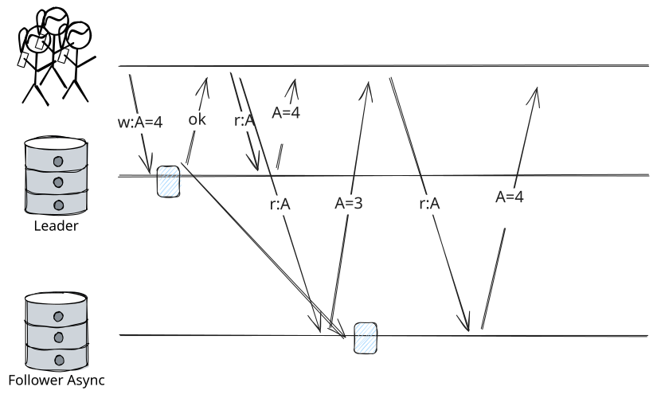
</center>

---

- Tous les réplicas **finiront par converger**,
  mais sans garantie sur **quand**
- Terme popularisé par Douglas Terry et Werner Vogels.

Le *replication lag* est généralement < 1s, s'il devient plus long → problème pour les appliciations.

---

## Trois problèmes typiques

* **Read-Your-Writes** inconsistency
* **Monotonic Reads** violation
* **Consistent Prefix Reads** violation

---

## 1. Read-Your-Writes Consistency

### Situation
- L’utilisateur écrit une donnée (sur le *leader*).
- Puis relit la même donnée (sur le *follower*).
Le follower n’a pas encore reçu la mise à jour.

### Effet
> L’utilisateur ne voit pas sa propre modification.
> → Il croit que ses données sont perdues 😬

---

<center>

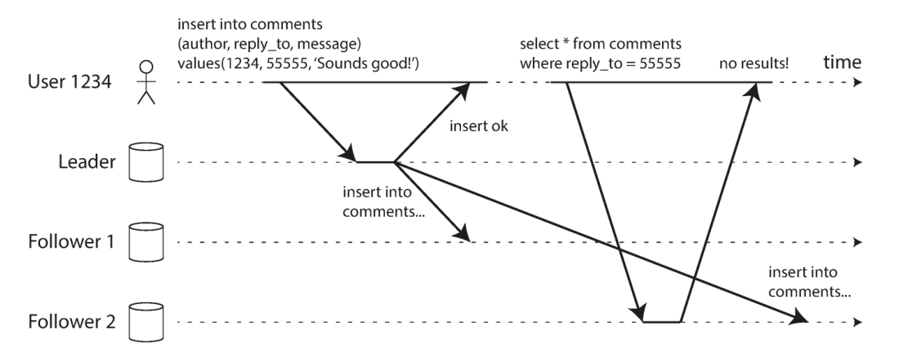
Lecture d'un réplica à jour suivi d'une lecture d'un réplica en retard.
</center>

---

Nous avons besoin de cohérence : *read-after-write* ou encore *read-your-write*

### Exemple de solution

- Lire depuis le **leader** les données que l’utilisateur peut modifier (profil utilisateur). 
- Lire depuis le **leader pendant X secondes** après une écriture (monitoring).
- Le client mémorise le **timestamp** de son dernier write : Si un follower est en retard
  - demander à un autre follower,
  - mettre la requête en pause.

> **Logical Timestamp**
> - log sequence number
> - horloge du système

---

## 2. Monotonic reads

### Situation

- Un utilisateur lit depuis deux réplicas différents.
  - 1ère lecture → follower à jour (petit lag)
  - 2e lecture → follower en retard (grand lag)
- Résultat : il voit les **données reculer dans le temps**

---

## Exemple

> L’utilisateur voit d’abord un nouveau commentaire apparaître,
> puis disparaître lors d’un rafraîchissement.

> **Garantie monotonic read**
> « On ne lit jamais une version plus ancienne que celle déjà vue. »

---

<center>

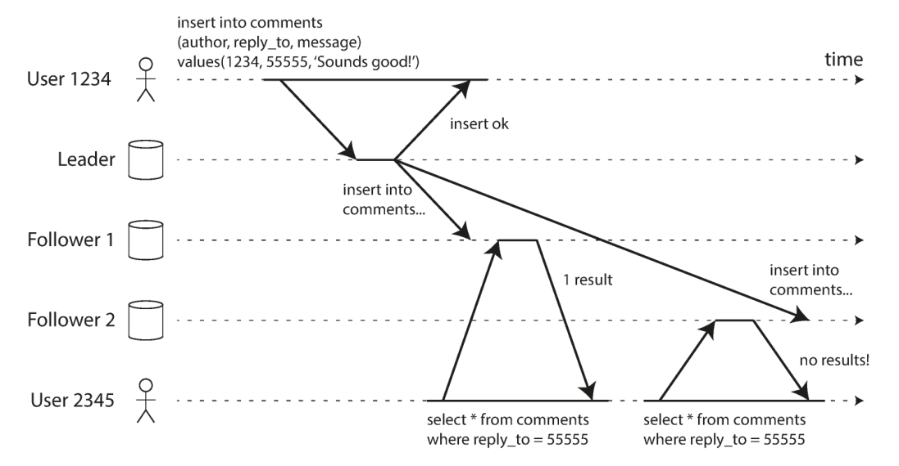
</center>

---

## Solutions

- Associer chaque utilisateur à **un même replica** :
  - ex. hash sur l’ID utilisateur.
- Si le replica échoue → basculer vers un autre plus à jour.

---


## 3. consistent Prefix Reads

### mise en situation

**Mr. Poons :** “How far into the future can you see?”
**Mrs. Cake :** “About ten seconds, Mr. Poons.”
→ Sur un follower lent : la réponse arrive avant la question.

---

<center>

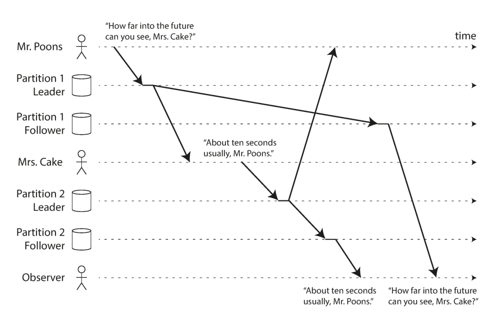

</center>

---

## Consistent Prefix Reads

> En cas de causalité, les écritures doivent toujours être lues dans l'ordre temporel.
>
> Si A précède B, on ne peut pas lire B avant A.

Difficile à garantir lorsqu'il y a **plusieurs partitions (leader)** :
- Pas d’ordre global entre partition (écriture).
- Certaines partitions peuvent être plus à jour que d’autres.

---

<!-- _class: transition2 -->
Réplication Multi-Leader

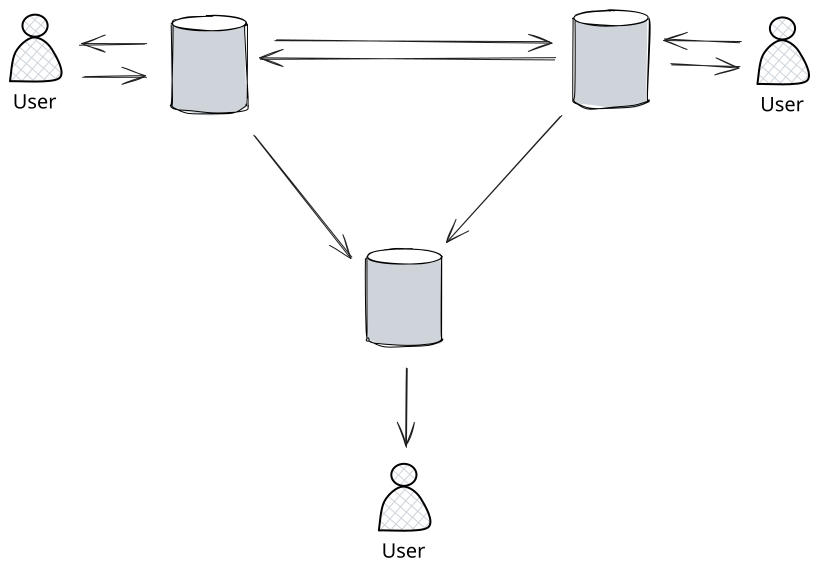

---

## Idées générales

- Au lieu d’un **seul leader**, **plusieurs nœuds** acceptent des écritures.
- Chaque leader est aussi **follower** des autres.
- Avantage clé : écrire localement même si un lien réseau vers un autre DC est coupé.
- Inconvénient majeur : **conflits d’écriture** possibles.

---

## Moins fréquent que la réplication avec un leader

- En **monodatacenter**, la complexité dépasse souvent les gains.
- Utile quand :
  - multi-datacenters (ex: réplication géographique)
  - clients **offline** (sync différée) 📱
  - édition **collaborative** en **temps réel**

---

# Cas d'usage

* Multi-datacenters
* Client offline
* Édition collaborative

---

## Cas d’usage — Multi-datacenters

- **Single-leader** :
  - toutes les écritures traversent l’Internet → **latence** élevée
  - sensibilité aux pannes du DC leader
- **Multi-leader** :
  - écriture **locale**, réplication **asynchrone** inter-DC
  - meilleure tolérance aux pannes/réseau
- ⚠️ Risque : conflits entre DC → **résolution nécessaire**

---

<center>

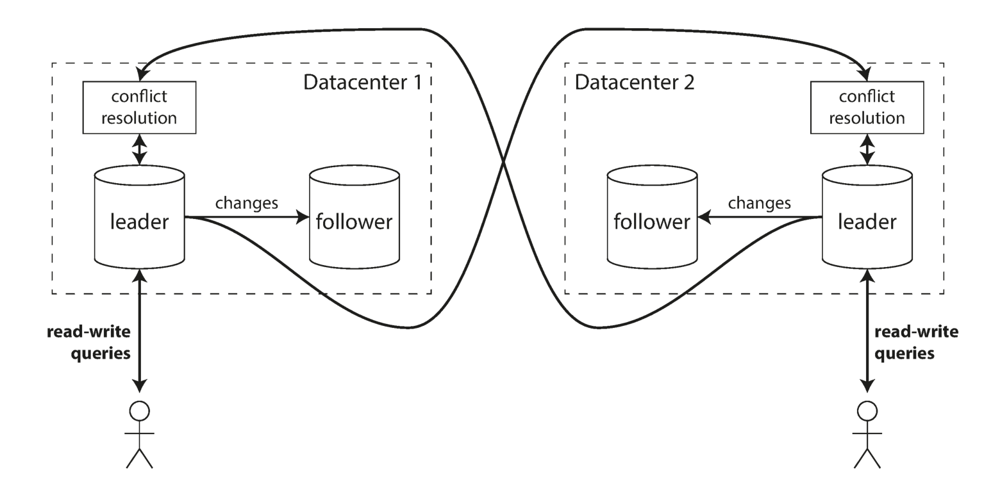
</center>

---

### ⚠️ **Multi-leader = terrain dangereux**

<small>**Contexte :** les implémentations multi-leader peuvent produire des conflits et effets de bord difficiles à diagnostiquer.</small>

<center>


</center>

- Fonctionalité **rétrofit** dans beaucoup de SGBD → pas pensée dès la conception du système,
donc moins robuste et plus sujette aux effets de bord.
- **Intéractions surprenantes** avec d’autres features : clés **auto-incrémentées**, **triggers**, **contraintes d’intégrité**…

> **Recommandation** : à éviter si possible, sauf besoin fort et maîtrise des risques.

---

## Cas d’usage — Clients offline (calendrier)

- Chaque appareil = db interne agit comme mini-leader local.
- Modifs en local, **sync asynchrone** quand réseau dispo.
- Lag de quelques **heures/jours** possible.
- Modèle conceptuel ≈ multi-DC « extrême ».
- Exemples historiques : calendriers.

> et google doc ?

---


## Cas d’usage — Édition collaborative

- Plusieurs éditeurs → **écritures concurrentes**
- Changements fins (ex. **frappe par frappe**), (pas de modification offline)
- Besoin de **résolution de conflits** (algos dédiés)
- Alternative : verrou (équivaut à single-leader + transactions)

---

# Prise en charge des conflits

---

### Deux leaders modifient **la même donnée** en parallèle

<center>

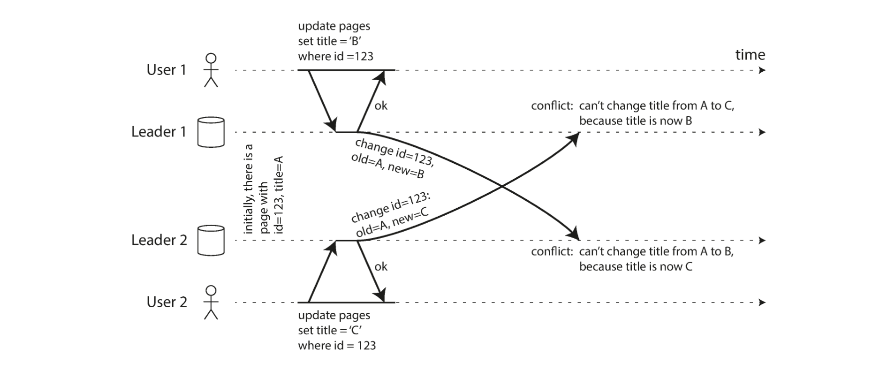
</center>

---

## Détection de conflit **Synchrone** & **Asynchrone**

<div class="columns">
<div>

### Un leader (synchrone)

Le 2ème write
- est mis en attente
- ou annulée

</div>
<div>

### Multi-leader (asynchrone)

Les deux writes **réussissent**, conflit détecté **plus tard**

</div>
</div>

> ## 💡 Réplication synchrone entre leader ?
> Perte du principal avantage : écritures indépendantes
> ⇒ 🛑 Utiliser un seul leader !

---

## Évitement de conflit

### Observation

> ℹ️ Beaucoup d'implémentation multi-leader implémentent mal la gestion des conflits

### Appliquer une gestion d'évitement de conflits ✅

* 💡 Router toutes les écritures d’un **même enregistrement** vers **un leader désigné**
   > *ex:* Données personnelles utilisateur dans un « home Datacenter » (parfait pour optimisation géographique)

* ⚠️ Re-routage possible (panne datacenter, déménagement utilisateur...)
⇒ retour du risque de conflits

---

## Converger vers un état cohérent

### Un leader
> Les écritures sont appliquées selon un ordre unique, défini par le traitement du leader.

### Plusieurs leaders
> Chaque nœud peut appliquer les écritures dans un ordre différent, ce qui conduit à plusieurs ordonnancements équivalents mais potentiellement divergents.

---

### Objectif :
> Avoir **tous les réplicas** doivent résoudre les conflits de manière à finir avec le **même état final**.

- Approches communes :
  - **LWW** (*Last Write Wins*) via timestamp/ID max → simple mais **perte de données**
  - **Priorité du # de répliques** (ID de nœud) → aussi perte potentielle
    - <span class="math"> x </span> répliques avec`v:2`
    - <span class="math"> y </span> répliques avec `v:1`
    - si <span class="math"> x < y </span> alors `v:1`
  - **Fusion** des valeurs (ex. concat triée) → dépend du domaine
  - **Conflit enregistré**, résolu plus tard (prompt à l'utilisateur/code applicatif)

---

## Logiques de résolution personnalisée

- **On write** : detection de conflit ↦ handler de conflit (rapide, *non interactif*)
- **On read** : renvoyer versions multiples → app décide (peut impliquer l’utilisateur)
> *Granularité*
> Souvent par **ligne/document**, pas de transaction entière
⇒ Chaque écriture est traitée séparément

---

### Résolution automatique (compliqué 🤯)

> **Cas d'école**
>  Pannier amazon qui conserve les items ajoutés mais peut ne supprimer certains articles.

> ### État de l'art en 2017
> - **CRDTs** : famille de structures de données modifiées - de manière concurrente - sans conflit (compteurs, sets, listes...) (merge 2-voies)
> - **Mergeable persistent data structures** : tracking de l'historique + merge 3-voies (git)
> - **Operational Transformation (OT)** : édition collaborative (suite d'élément - ex: suite de caractères (Google Doc)

---

## Exemple de conflits

- Modification d'un même champ.
- Réservation d'une chambre d'hotel
- ...

---

# Topologies multi-leaders

> **Topologie de réplication**
> Descrit les chemins de communication que les requêtes d'écriture doivent traverser pour se propager d'un leader aux autres leaders.

> Cas nb leaders ≤ 2 identiques

---

<center>

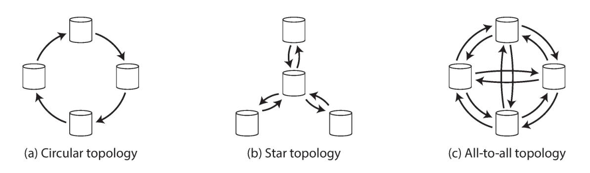
</center>

- **Ring (cercle)** : chaque leader transmet à un et un seul voisin.
- **Star / arbre** : un seul leader reçoit et transmet aux autres leaders.
- **All-to-all** : chaque leader transmet à tous les autres.
> Tag d’ID de nœuds traversés dans le log pour prévenir les boucles (pensez au parcours de graphe en 3alg3).

---

### Tolérance aux pannes & Ordonnancement

- **Ring & Star** : panne d’un nœud → propagation interrompue
- **All-to-all** : meilleure résilience (évite le single point of failure), mais **désordre d’arrivée** possible
⇒ Problème de **causalité** :
  - un **UPDATE** peut arriver avant l’**INSERT** correspondant sur un nœud
  - horloges insuffisantes → besoin de **version vectors** / suivi causal

---
<center>

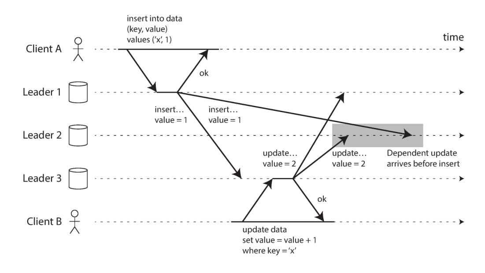
</center>

⚠️ Attention souvent pas ou mal géré. Toujours vérifier la prise en charge de ce type de conflits par le sgbd si important pour l'application.

---

<!-- _class: transition2 -->
Réplication sans leader.

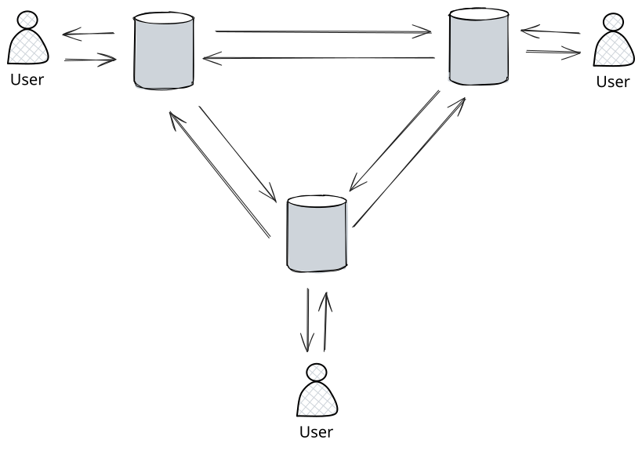

---

## Idées générales

- Pas de **leader** : **n’importe quel replica** peut accepter des écritures.
- Le client envoie aux **plusieurs réplicas** (via un **coordinateur** léger).
- Pas d’**ordre global** imposé → conséquences sur cohérence et résolutions de conflits.
- Exemples : **Cassandra**, **Riak**, **Voldemort** (inspirés de **Amazon Dynamo**).

---

# Écrire dans la bd quand un nœud est down

- Avec un ou plusieurs leader, on doit attendre un failover (reprise du leader).
- Sans leader (exemple 3 réplicas)
   - le client écrit en **parallèle** aux 3.
   - Si 1 réplique est indisponible, **2 réplicas** réponde **ok**.
   - Le nœud en retard lira ensuite une **valeur obsolète** → besoin de **réparation**.

---

### Pour résoudre le problème potentiel de valeur obsolète 
  - une lecture à la base de données = plusieurs requêtes de lecture en parallèle (≠ replicas).
  - des réponses ≠ peuvent être obtenues
  - utilisation d'un numéro de version pour connaître la valeur la plus récente.

---

<center>

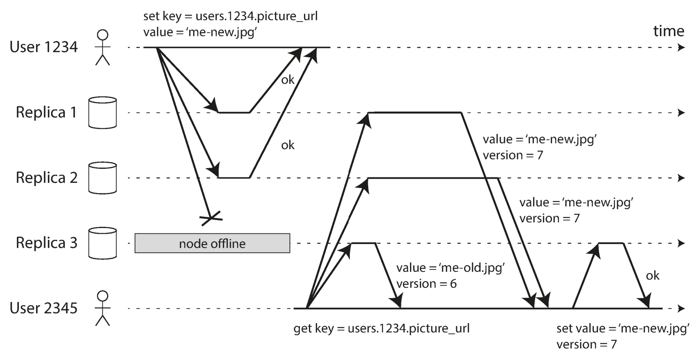
</center>

---

## Correction de valeurs obsolètes

À terme, toutes les données doivent être copiées sur chaque réplica.

### Read Repair
- Lecture envoyée à **plusieurs réplicas**.
- Si divergence : le client (ou le nœud) **réécrit** la version la plus récente vers les réplicas en retard.
- Efficace pour les **clés fréquemment lues**.

### Anti-Entropy
- **Processus de fond** qui compare et recopie les données manquantes entre réplicas.
- Pas d’ordre garanti, **latence** de rattrapage possible.
- Tous les systèmes ne l’implémentent pas.

---

## Quorums de lecture/écriture

- 3 paramètres
   - **n** : réplicas
   - **w** : acks d’écriture (nb requêtes synchrones)
   - **r** : acks de lecture

> Pour qu'une requête d'écriture / lecture soit déclarées valide, le nombre de nœuds accusant le bon traitement doit être <span class="math"> >w</span> / <span class="math"> >r </span>

---

### Quorum write & quorum read

> Avec **w + r > n**, on s'attend à avoir une **valeur à jour**.

Les lectures et écritures qui respectent ces valeurs *r* et *w* sont appelée *quorum read* et *quorum write*.

> **Typiquement**
> - *n impaire* et *w = r = (n + 1) / 2*
> - configurables dans les bd semblablent à la base de donnée Amazon Dynamo.

---

<div class="columns">
<div>

### ❌ w + r ≯  n

<center>

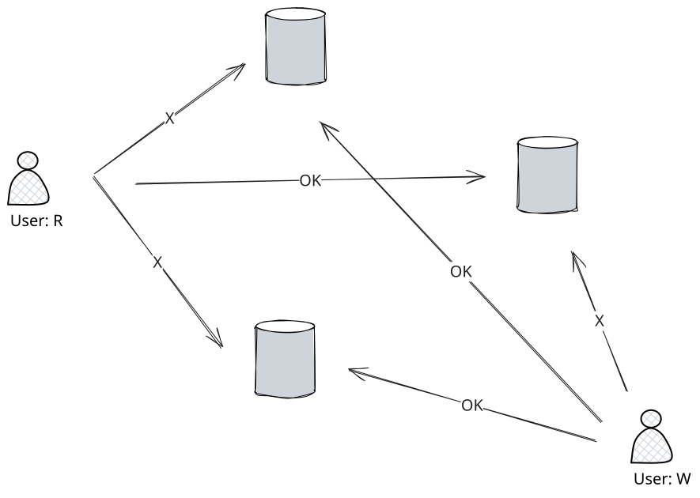
r = 1
w = 2
</center>

</div>
<div>

### ✅ w + r > n

<center>


r = 2
w = 2
∃ un nœud avec la dernière valeur
</center>

</div>
</div>

---

### Réflexion

- Si **w < n**, on peut encore traiter les écritures avec un nœud indisponible
- Si **r < n**, on peut encore traiter les lectures avec un nœud indisponible
- si **n = 3**, **r = 2** et **w = 2**, on peut tolérer un nœud indisponible
- Normalement, les lectures et écritures sont envoyées à tous les nœuds en parallèle. Ces paramètres déterminent le nombre de nœuds qu'on attend.
- Si le nombre de réponses reçue n'atteind pas le seuil désiré, les requêtes retournent une erreur.

---

<center>

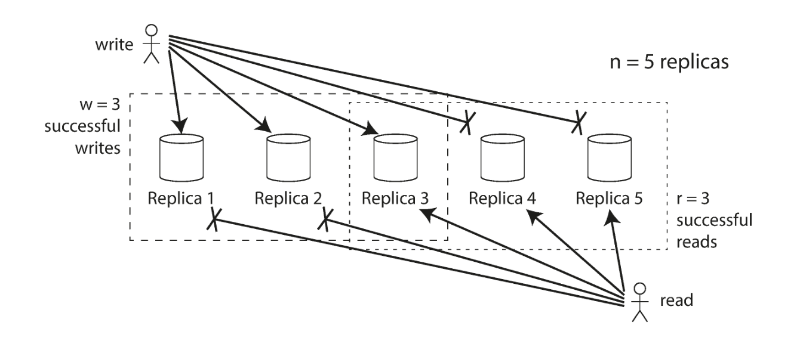
</center>

> Au moins une valeur **à jour** sera lue.

---

### Cause d'indisponibilité d'un nœud

- Crash d'un nœud,
- erreur lors de l'écriture (disque plein),
- problème réseau entre le nœud et le client,
- ...

---

## Adapter **r** et **w**

- **w &#x2197; r &#x2198;** : écritures plus strictes, lectures potentiellement plus rapides.
- **w &#x2198; r  &#x2197;** : lectures plus strictes, écritures potentiellement plus rapides.
- On envoie aux **n** réplicas en parallèle, on **attend** **w** ou **r** réponses OK.

On peut avoir r + w ≤ n. Effet : 
- &#x2197; disponibilité
- &#x2198; cohérence (&#x2197; chance de retourner des valeurs obsolètes)

---

# Limites du quorum

Même avec **w + r > n** :
- **Sloppy quorum** (voir plus loin) rompt l’overlap garanti.
- Concurrence d’écritures → laquelle est supposée être la première ?
- Conflit écriture/lecture en simultané → valeur incertaine.
- Échecs partiels (disque plein, rollback partiel non effectué) → cas limites.
- ⇒ Probabilité vs **garantie absolue**.

> Qu'est-ce que la concurrence ?

---

<div class="columns">
<div>

### r/w concurrents

<center>

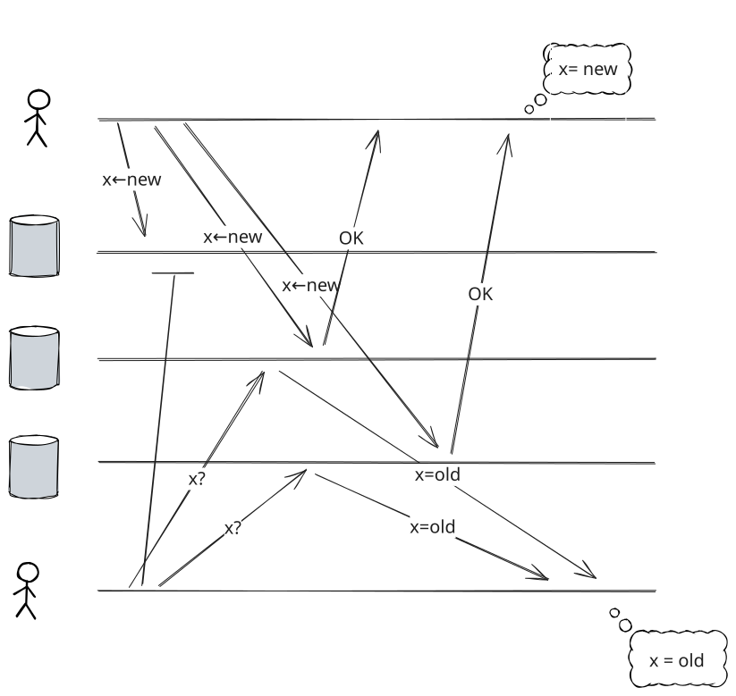
</center>


</div>
<div>

### Échecs partiels

<center>

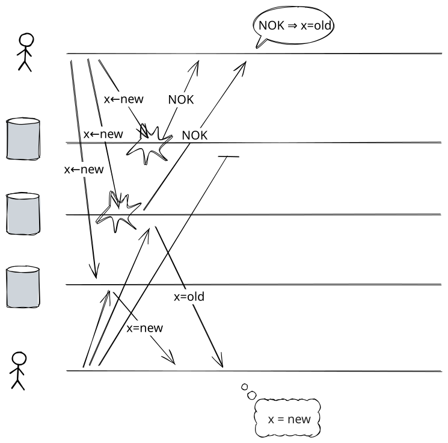
</center>

</div>
</div>

---

## Monitoring staleness

À quel point mes données sont-elles obsolètes ?

* Cas avec 1 leader

  > - Ordre déterminé par le leader.
  > - Replication log disponible.
  >
  > ⇒ log leader - log follower = lag du follower. (Pensez aux commits dans git).

* Cas sans leader

  > - Pas d'ordre.
  > - Des données sont potentiellement très vieilles sans système anti-entropie.
  > 
  > => Pas de système de monitoring généralement mis en place.

---

# Sloppy Quorums et Hinted Handoff

Dans le cas d'un cluster conséquent, que faire s'il y a une panne local temporaire dans le réseau causant l'isolement de certains nœuds ?

* retourner des erreurs pour chaque requête qui n'atteignement pas le quorum ?
* accepter les requêtes d'écriture sur des nœuds atteignables, mais n'appartenant pas au nœuds « home ».

> **Nœuds « home »**
> Nœud designé pour le stockage d'une donnée.

---

<center>

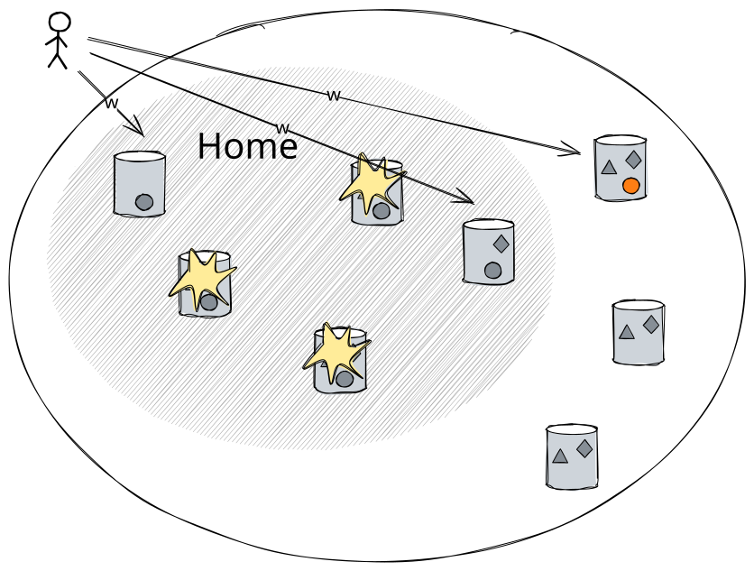
</center>


- **Sloppy quorum** : accepter w/r réponses **sur des nœuds atteignables**, pas forcément les nœuds « home ».
- **Hinted handoff** : une fois le réseau rétabli, on **réachemine** vers les nœuds « home ».
- Gain de **disponibilité** en écriture, mais **pas** de garantie de quorum strict (lire la dernière valeur) tant que le hinted handoff n’est pas terminé.

---

# Détection des écritures concurrentes

- Sans ordre global, l’arrivée peut être **dans un ordre différent** selon les nœuds.
- Objectif : être **éventuellement cohérent** (si possible sans **perdre** de données).
- Nécessité d’identifier **concurrence vs causalité**.

---

## Mise en situation

<center>

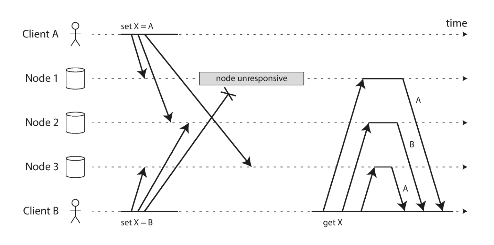
</center>

- Incohérence permanente. Le nœud 2 pense que la dernière valeur est **B**.
- Il n'y a pas vraiment de valeur "meilleure" qu'une autre.
> Comment retrouver une convergence vers un état cohérent ?

---

## Last write win (LWW)

- Résolution simple : garder la **plus récente** (timestamp/ID max) et **jeter** le reste.
- ✅ Convergence
- ❌ **Perte de données** (même si les writes ont été “ackés”), sensible au **clock skew**.
- Utilisable si clé écrite une fois ⇒ **immuable** (e.g., UUID par write) ou si perte acceptable (**cache**).

> Écritures **concurrentes**
> Si cela n'a pas vraiment de sens de dire qu'une écriture est plus récente qu'une autre, on parle d'écriture *concurrence*. (Ordre indéfini)

---


<div class="columns">
<div>

<center>

### Happened before (Causalité)

</center>

<small>A **happens-before** B si B **connaît** / **dépend** de A.</small>

</div>
<div>

<center>

### Concurrence

</center>

<small>Si A et B s’ignorent mutuellement → **concurrents**.</small>
</div>
</div>

> Si une opération est dépendante d'une autre, elle doit écraser sa valeur. Sinon, il faut gérer le conflit.

---

<!-- _class: cite -->

Il nous faut un algorithme pour déterminer si deux opérations sont concurrentes ou non.

---

## Réflexion (Concurrence, temps et relativité)

* Le moment exacte ne suffit pas à déterminer s'il y a causalité.
* En **physique (théorie de la relativité)** : Deux évènements qui ont lieu à une certaines distance ne peuvent pas avoir d'influence entre-eux si le temps qui séparent ces deux évènement est inférieur au temps nécessaire pour parcourir cette distance.
* En **informatique** : même si le temps permet à la lumière de parcourir la distance il y a d'autres facteurs qui influence (mode offline: app calendrier...).

---

## Capturer le lien *happend before*.

1. Algorithme avec 1 réplica.
2. Algorithme étendu pour n réplicas.

---

## Gestion des conflits/causalités avec 1 réplica


<div class="columns">
<div>

1. Ajout de `milk` par `client 1` (v1).
2. Ajout de `eggs` par `client 2` (v2) (2 valeurs ≠ retournées).
3. Ajout de `flour` par `client 1` (à partir de v1) (v3 avec 2 valeurs ≠ retournées).
4. Fusion et ajout de `ham` par `client2` (à partir de v2) (v4 avec 2 valeurs ≠ retournées).
  ⚠️ fusion de valeurs inférieures à la version de départ.
5. Fusion et ajout de `bacon` (à partir de v3) (v5 avec 2 valeurs ≠ retournées)

</div>
<div>

<center>

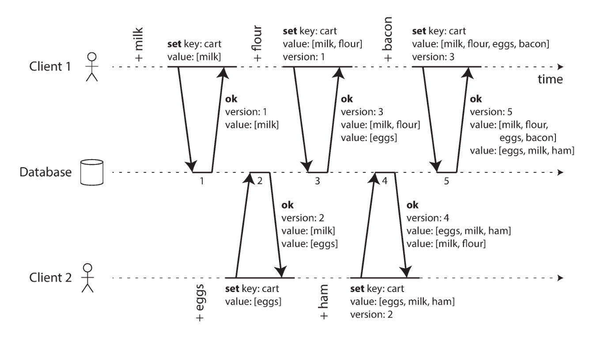
</center>

</div>
</div>

---

<center>


</center>

### Graphe de dépendance causale

<center>

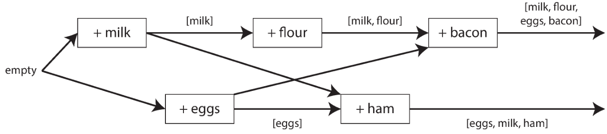
</center>

<small>Les flèches indiquent quelle opération *arrive avant* (est causale de).</small>

---

- Pour vérifier si deux opérations sont concurrentes, il suffit de vérifier les numéros de version.

**Exemples**

- à l'étape 3 : 
   - la valeur `[milk]` (v1) est remplacée par `[milk, flour]`,
   - la valeur `[eggs]` (v2) est restée inchangée (*concurrence*).
- à l'étape 5 : 
   - la valeur `[milk, flour]` (v3) est remplacée par `[milk, flour, eggs, bacon]`,
   - la valeur `[eggs, milk, ham]` (v4) est restée inchangée (*concurrence*).

---

### Étapes 

- Le serveur maintient un numéro de version pour chaque clé (et chaque valeur). La version est incrémenté à chaque écriture.
- Quand un client lit une clé, toutes les valeurs sont retournées.
- Quand un client écrit (modifie) une clé, la version du l'ancienne lecture est inclue à la requête.
- Quand le serveur reçoit un write avec une certaine version (*vx*), il peut écraser les valeurs avec une version *vy* qui vérifient *vy* ≤ *vx*.

---

## Gestion de conflit avec *n* réplicas (Version vectors)

- Un **numéro de version par réplique** et par clé, transmis aux clients à la lecture, renvoyé à l’écriture.
- Chaque réplica incrémente son numéro lorsqu'il y a une écriture et garde une trace des autres numéros lors du traitement d'une écriture.
- Permet de savoir si une écriture vient après, avant ou en parallèle d’une autre.

> La collection de ces numéros est appelée *vecteur de version*.

---

1. État initial
   Valeur : "X"
   Version vector : { A: 0, B: 0, C: 0 }
2. A écrit : "Y"
   Version vector : { A: 1, B: 0, C: 0 }
   > Cette valeur inclut tout ce que A connaissait jusque-là, plus une nouvelle écriture.
3. B écrit : "Z"
   Version vector : { A: 0, B: 1, C: 0 }
   > Ces deux écritures sont concurrentes, car :
   >  A ne connaît pas la mise à jour de B
   >
   >  B ne connaît pas celle de A
   >  → aucun des deux vecteurs ne “domine” l’autre.
---

4. Quand A et B synchronisent leurs états
   Valeur 1 : "Y" { A: 1, B: 0, C: 0 }
   Valeur 2 : "Z" { A: 0, B: 1, C: 0 }
   > → Comme aucun vecteur n’est supérieur à l’autre,
   > les deux sont conservés comme “siblings” (valeurs concurrentes).

5. Lecture + résolution (ex : par fusion )
   Version vector fusionné : { A: 1, B: 1, C: 0 } valeur "YZ"
6. Écriture sur C
   Nouvelle version : { A: 1, B: 1, C: 1 }

---

## Leaderless en quelques mots

- **Leaderless** = haute **disponibilité** & **latence** maîtrisée, mais **cohérence** plus faible.
- **Quorums** (r, w, n) → règlent un **compromis probabilité/latence**.
- Concurrence → prévoir **détection** (version vectors) & **résolution** (merge/CRDTs).
- **Sloppy quorum + hinted handoff** : robuste, mais retarde la visibilité globale.

---

# En résumé

## Pourquoi répliquer les données ?

- 🔥 **Haute disponibilité** → le système continue même si un nœud (ou un datacenter) tombe.
- 📱 **Opération déconnectée** → permettre à une appli de fonctionner sans connexion réseau.
- 🌍 **Latence réduite** → placer les données plus près géographiquement des utilisateurs.
- 📈 **Scalabilité** → répartir les lectures sur plusieurs répliques pour soulager la charge.

> *Objectif simple* : plusieurs copies cohérentes des mêmes données.
> *Réalité* : problèmes de concurrence, retards, pannes et synchronisation complexes.

---

## Trois modèles de réplication

| Modèle | Principe | Avantages | Inconvénients |
|--------|-----------|------------|----------------|
| 🟩 **Single Leader** | 1 seul nœud reçoit les écritures, réplique vers les autres | Simple, cohérent | Risque de perte si le leader tombe (asynchrone) |
| 🟧 **Multi Leader** | Plusieurs leaders acceptent des écritures, se synchronisent | Tolérance aux pannes, utile multi-datacenter | ⚠️ Conflits d’écriture possibles |
| 🟥 **Leaderless** | Tous les nœuds peuvent recevoir des écritures | Très disponible, pas de failover | Cohérence faible, détection/merge de conflits |

> La **synchronicité** (synchronous vs asynchronous) influence directement
> la cohérence et la perte potentielle de données en cas de panne.

---

## Cohérence et conflits

### Modèles de cohérence utiles
- **Read-after-write** → voir ses propres écritures immédiatement.
- **Monotonic reads** → ne jamais « revenir dans le passé ».
- **Consistent prefix** → garder l’ordre logique des événements.

### Conflits d’écriture
- Apparaissent avec les modèles multi-leader et leaderless.
- **Détection** : *version vectors* (déterminer si deux écritures sont concurrentes).
- **Résolution** : CRDTs ou fusion applicative pour convergence automatique.

> 💡 Répliquer, c’est arbitrer entre **cohérence**, **disponibilité** et **performance**.

---

<!-- _class: transition2 -->
Partitionnement (sharding)

<!-- https://www.mongodb.com/docs/manual/core/sharding-choose-a-shard-key/#choose-a-shard-key -->

---

# Introduction

Dans le chapitre précédent, nous avons vu **la réplication** :

> **Réplication**
> Plusieurs copies des mêmes données sur plusieurs nœuds.

Mais pour des **très grands volumes** ou une **forte charge de requêtes**, la réplication ne suffit plus :

> → il faut **découper les données** en *partitions* (aussi appelées *shards*).

---

## Qu’est-ce qu’une partition ?

- Chaque donnée (ligne, document, enregistrement)
  appartient **à une seule partition**.

- Une partition = une *mini-database*
  (mais le système supporte des opérations sur plusieurs partitions).

---


## **Objectif : Scalabilité**

> Différentes partitions peuvent être placées sur différents nœuds dans un cluster.

- Répartir les données sur plusieurs disques / machines
- Répartir la charge de requêtes sur plusieurs processeurs
- Permettre à chaque nœud de traiter **indépendamment** les requêtes d’une partition.

---

## Pourquoi partitionner ?

- Un seul serveur ne suffit plus
  - stockage trop grand
  - trop de requêtes par seconde

- Les partitions permettent :
  - Scalabilité en **lecture**
  - Scalabilité en **écriture**
  - Scalabilité en **stockage**
  - Possibilité de paralléliser certaines requêtes (analytique)

📌 Utilisé depuis les années 80 (Teradata, NonStop SQL)
📌 Massivement repris dans NoSQL & data warehouses modernes

---

## 🗺️ Plan du chapitre

Dans ce chapitre :

1. **Stratégies de partitionnement d'un grand ensemble de donnée**
   - Range partitioning
   - Hash partitioning
   - Partitionnement des index

2. **Rebalancing**
   - Comment déplacer les partitions
   - Ajout / suppression de nœuds

3. **Request Routing**
   - Comment savoir quel nœud contient quelle partition ?

---

<!-- _class: transition3 -->
I. Partitionnement et réplication

---

## Partitionnement & Replication

Le partitionnement est **souvent combiné** avec la réplication :

- Chaque partition est stockée **sur plusieurs nœuds**
  → pour une meilleure tolérance aux pannes
- Même si une donnée appartient à **une seule partition**,
  elle existe **en plusieurs copies**.

> **Un nœud peut contenir plusieurs partitions**.

---

## Leaders & Followers dans les partitions

Si on utilise un modèle **leader–follower** :

- Chaque partition a **un leader** sur un nœud
- Et **des followers** sur d’autres nœuds
- Un même nœud peut être :
  - leader pour certaines partitions
  - follower pour d’autres

📌 Tous les concepts du chapitre précédent sur la réplication s’appliquent aussi ici.
🗒️ Pour simplifier, la suite du chapitre ignore la réplication.

---

<center>

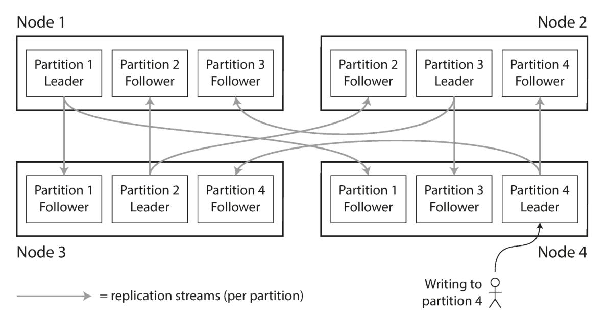
</center>

> Combinaison de partitionnement et réplication : Chaque nœud agit comme un leader pour certaines partitions et comme un follower pour d'autres.

---

<!-- _class: transition3 -->
II. Sharding de donnée type clé-valeur

---

## Comment partitionner ?

Bien partitionner équivaut à

- Répartir **équitablement** les données et la charge
- Éviter qu’un nœud devienne le goulot d’étranglement
  → phénomène de **skew** (déséquilibre)
- Un partition très sollicitée = **hot spot**

## 💡 Idée
Répartir les clés **aléatoirement** ❌
→ bonne répartition, mais impossible de savoir où lire → requêtes broadcast (requêtes envoyées en parallèle à tous les nœuds).

---


# Partitionnement par plage de clés

<center>

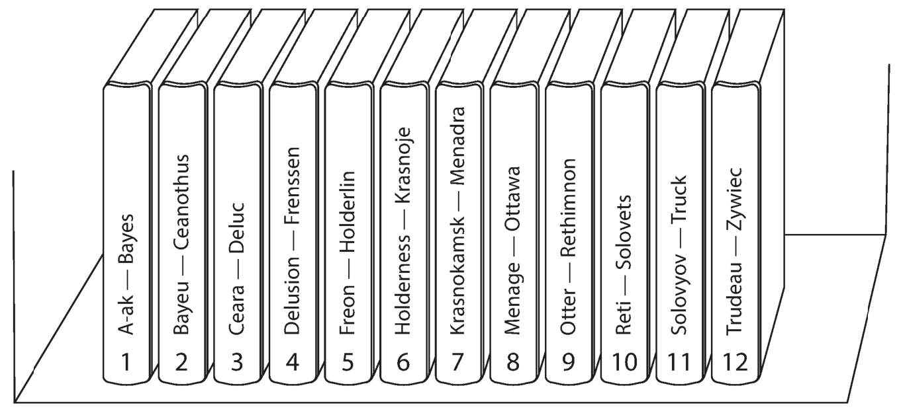
</center>

---

## Principe

- Chaque partition couvre une **plage continue de clés**
   - ex. « de A à C », « de C à F », etc.
- Analogie : les volumes d’une **encyclopédie papier**
- Si les limites des plages sont connues :
   - On peut déterminer immédiatement **dans quelle partition** se trouve une clé
   - Et contacter **directement le bon nœud**

---

## Plages inégales = meilleure distribution

- Les données réelles **ne sont pas uniformes**
- Exemple :
  - « A » et « B » ont énormément de mots
  - « X », « Y », « Z » en ont très peu
- Si on découpait naïvement « 2 lettres par tome »,
  → certains volumes seraient énormes
  → d’autres presque vides
  → donc **mauvaise répartition de la charge**

> 📌 **adapter les plages aux données réelles**
> → limites choisies **manuellement** par un administrateur ou **automatiquement** par le système.

---

## ✅ Avantages du partitionnement par plage de clés

Dans chaque partition, les clés sont **triées**. Pratique pour : 

### Range scans

  > **Exemples :** 
  > - Rechercher toutes les mesures d’un ensemble de capteurs entre
  >    `2025-01-01 00:00` et `2025-01-31 23:59`.
  > - **Index concaténé**
  >   Le clé elle-même sert d'index multi-colonnes pour récupérer des enregistrements liés en 1 requête.

Cas d'utilisation :
- Séries temporelles (logs, événement ordonnées),
- données liées...

---

## ❌ Inconvénient : Création d'Hot Spots

Si la clé = timestamp :
- Les écritures arrivent *en temps réel*
- Donc **toujours dans la même plage**
- Donc **toujours dans la même partition**
> **Conséquence :** 
> - une partition surchargée (« hot spot ») 🐜,
> - les autres restent presque inactives 🦗.

---

## Solution

Ne pas utiliser directement le timestamp comme clé.

### Ex : capteurs IoT
❌ clé = `2025-11-19T10:12:53` → même partition
✔️ clé = `capteur42:2025-11-19T10:12:53`

Effets :
- Partitionnement par **sensor_id** → répartition équilibrée
- Tri secondaire par timestamp → range scans encore possibles
  (1 requête par capteur, mais parfaitement scalable)

---

# Partitionnement par hashage de clé

*Motivation :* éviter les **hot spots** présents avec le partitionnement par plage.

💡 Idée : appliquer une **fonction de hachage** à la clé
> Transforme une distribution déséquilibrée en distribution **uniforme** sur un grand espace numérique.

**Exemple :**
Un hash 32-bit → nombre entre 0 et 2<sup>32</sup>−1
→ même si les chaînes sont proches, leur hash sont "aléatoires".

---

## Les exigences pour le hachage

- Pas besoin de propriété cryptographique forte
- Doit être:
  - **déterministe**
  - **uniformement distribué**
  - Identique sur tous les nœuds (⚠️ attention aux hash intégrés)

### Usages réels :
- Cassandra, MongoDB → MD5
- Voldemort → Fowler–Noll–Vo (FNV)

> 💀 Java `hashCode()` ou Ruby `Object#hash`
> → peuvent retourner des valeurs différentes entre processus.

---

<center>

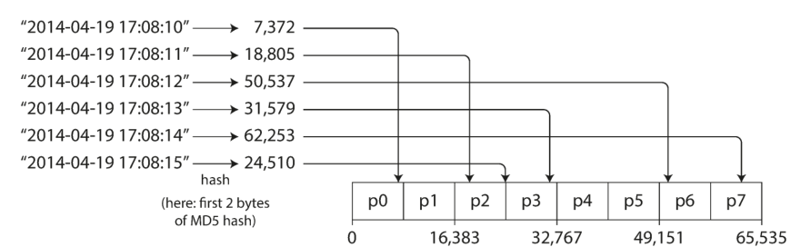
</center>

---

## Perte des capacités de Range Scans

Avec le partitionnement par hash :
- Des clés proches donnent des hash complètement différents.
- Elles se retrouvent donc dans **des partitions différentes**.
- L’ordre naturel est **perdu**.

Conséquences :
- Requêtes de plages → doivent interroger **toutes les partitions**.
- ⇒ ❌ Impossible d’effectuer un range scan efficace.

Exemples :
- MongoDB (mode hashed) → range query envoyé sur tous les nœuds
- Riak, Couchbase, Voldemort → pas de range query sur la clé primaire

---

## Cassandra : Hash + Range dans un même modèle

Cassandra utilise une **clé primaire composée** :

> `PRIMARY KEY (partition_key, clustering_key1, clustering_key2, ...)`

- Seul `partition_key` est hashé pour déterminer la partition

- Les autres colonnes
  → sont stockées **triées** dans la partition
  → permettent des **range scans efficaces**

---
## Utilisation type d'une clé primaire composée : flux d’activité / réseaux sociaux

Clé primaire :
`(user_id, update_timestamp)`

Résultat :
- Tous les posts d’un utilisateur sont sur la même partition
- Ordonnés par timestamp → parfait pour naviguer dans l’historique
- Accès rapide :
  - "Derniers posts"
  - "Posts entre t1 et t2"

Partitionnement :
- Différents utilisateurs → différentes partitions → charge répartie

---

# Charge déséquilibrée & Hot Spots

- Même avec un **partitionnement par hash**, certains scénarios créent des **hot spots**.
- Exemple : un utilisateur célèbre déclenche
  énormément de lectures/écritures sur *une seule clé*.
- Résultat : toutes les requêtes convergent vers **la même partition** → surcharge.

---

- Le hash **uniformise la distribution des clés**,
  **pas** le volume **d’accès par clé**.
- Si toutes les écritures touchent la même clé :
  - le hash produit toujours la **même valeur**
  - → la même partition est sollicitée
  - → apparition d’un **hot spot**
- Cas typiques :
  - Fil d’actualité d’un influenceur
  - Publication « viral »
  - Ressource fréquemment mise à jour

---

## Techniques pour réduire les hot spots

### Partitionnement artificiel d’une hot key

- Ajouter un **suffixe/préfixe aléatoire**
  Ex. `user123:xx` (<span class="math">xx ∈ [00–99]</span>)
- Répartit les écritures sur **100 partitions** au lieu d’une.

### Inconvénients

- Les lectures deviennent plus complexes :
  - lire `user123:*`
  - agréger les résultats
- Nécessite du **bookkeeping** :
  - suivre les quelques clés "chaudes" qui ont été divisées

---

> ⚠️ Implémentation dans l'application
> - Les systèmes distribué actuels ne savent **pas** détecter automatiquement les clés chaudes.
>   → Ce découpage est un compromis à faire dans **l’application**.

---


<!-- _class: transition3 -->
III. Partitionnement et index secondaires

---

# Une clé c'est bien mais...

- Jusqu’ici : modèle **key–value**
  → une donnée associée à une clé unique « primaire ».
- Simple et efficace :
  - Trouver la partition = appliquer la fonction de partitionnement - **f(clé)**
  - Les lectures/écritures vont directement au bon nœud.
- Fonctionne parfaitement tant que **toutes les requêtes utilisent la clé primaire**.
- Problème : les applications réelles interrogent *aussi* les données sur d’autres critères...

---

## Quand arrivent les index secondaires

- Un **index secondaire** n’identifie PAS un enregistrement unique,
   > Plutôt une manière de chercher les occurrences d'une valeur particulière :
  - Trouver toutes les actions de l'utilisateur `use:123`
  - Trouver les articles contenant « he2b»
  - Trouver toutes les voitures rouges

- Ils sont inévitables :
  - coeur du relationnelles,
  - fréquent en bases de donnée type document,
  - certains ne l'ont pas implémenté au départ, mais l'ont fait par la suite (Riak),
  - raison d'être des moteurs de recherche (Elasticsearch, [Solr](https://solr.apache.org/)).

---

- ⚠️ **Problème majeur** :
  Les valeurs d’un index secondaire ne correspondent **pas** aux limites de partition.

- Deux stratégies possibles :
  1. **Index local (document-based)**
  2. **Index global (term-based)**

  → Analysons ces deux approches.

---

# Partitionnement d'index secondaire par document (index local)

### Principe
- Chaque document possède un **ID unique**
- la partition est déterminée **par ce document ID**.
- Chaque partition :
  - stocke ses propres documents
  - **maintient un index secondaire local (qui lui est propre)**

---

<center>

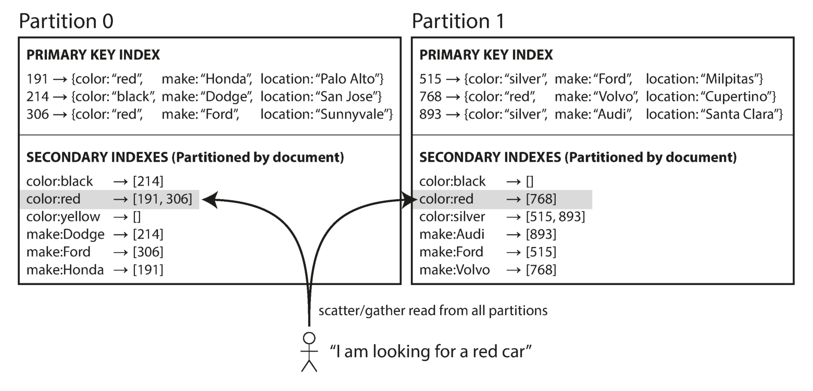
</center>

> Index `color:red` contient **uniquement** les IDs présents dans les partitions respectives ⇒ indépendance des index.

---

## ✔ Avantages
- Une écriture → touche **une seule partition**
  - ajout / update / delete d'un document efficace
- Pas de coordination inter-nœuds
- Très utilisé :
  - MongoDB, Riak, Cassandra, Elasticsearch, SolrCloud, VoltDB

---

## ❌ Limites (majeures)
- Les documents correspondant à un critère (ex. voitures rouges)
  **peuvent être répartis sur plusieurs partitions**.
- Une lecture sur un index secondaire nécessite :
  > **scatter/gather**
  > C'est-à-dire : envoyer de la requête à toutes les partitions et agrégation des réponses.
- Effets négatifs :
  - coût en réseau élevé
  - amplification de latence (“tail latency”)

---

## Tail latency

<center>

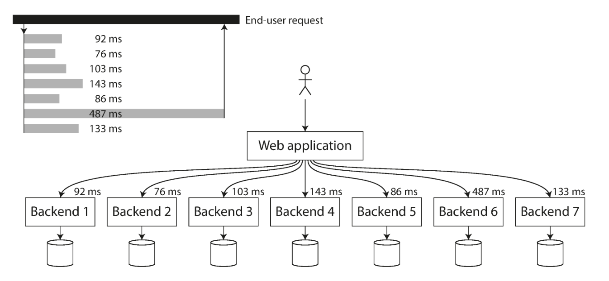
</center>

Quand une requête utilisateur nécessite **plusieurs appels backend** :

- Les appels sont appelés **en parallèle** ✔️
- Mais… la réponse finale **attend le plus lent** ❌
- Il suffit d'une seule requête lente pour rendre la requête globale lente.

---

Recommandation des « vendeurs» d'organiser le schéma de partitionnement (choix des clés, clés hashé...) de manière à éviter le scatter/gather.

> [MongoDB](https://www.mongodb.com/docs/manual/core/sharding-troubleshooting-shard-keys/)
> If you are noticing decreased query performance over time, it is possible that your cluster is performing scatter-gather queries.
> ...
> If you do not include the shard key in your most common queries, it is possible that you could increase performance by [resharding your collection](https://www.mongodb.com/docs/manual/core/sharding-reshard-a-collection/#std-label-sharding-resharding). For advice on choosing a shard key see [Choose a Shard Key](https://www.mongodb.com/docs/manual/core/sharding-choose-a-shard-key/#std-label-sharding-shard-key-selection).

⚠️ Pas toujours possible, en particulier lors de recherche sur plusieurs index secondaires.
> Ex : filtre de voiture par couleur et marque.

---

# Partitionnement d'index secondaire par terme (global)

---

## Pourquoi un index global ?

> On peut créer un **index global**, partagé par toutes les partitions. Plutôt que d'avoir chaque partition qui maintient son propre index.

Mais cet index global doit aussi être **partitionné**, sinon il devient un goulot d'étranglement.

> L'index se retrouve sur différents noeuds. À la différence d'un index local, on sait quelle partition contacter.

---

## Comment ça fonctionne ?

- Les documents sont partitionnés selon leur **primary key**.
- Les **termes d’index** (ex. `color:red`, `make:toyota`) sont, eux, partitionnés différemment.
- Le terme détermine la partition :
  - par *range* (A–R → partition 0, S–Z → partition 1)
  - ou par *hash du terme* (répartition plus uniforme)

> **Partitionnement par terme**
> Le terme recherché dirige la requête vers la partition contenant l’index.

---

<center>

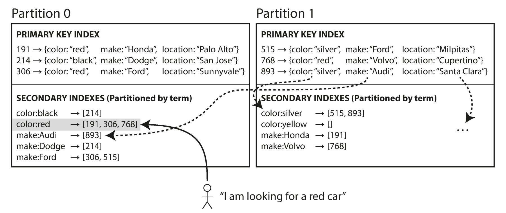
</center>

---

## Avantage principal : Lecture efficace

Une requête comme **"voitures rouges"** interroge :
- **une seule partition d’index**,
- **récolte sur une partie des partitions**,
- au lieu de faire un *scatter/gather* sur toutes les partitions du cluster.

---

## ⚠️ Inconvénients importants

### I. Écritures plus complexes et plus lente

Un seul document peut avoir plusieurs termes 
   → une mise à jour doit toucher **plusieurs partitions d’index**.

---

### II. Pas de transaction distribuée (synchrone) → index parfois en retard
<!-- transaction distribuée : veiller à ce que toutes les partitions concernées soit mise à jour ou non -->

Pour être parfaitement à jour, il faudrait une transaction distribuée entre toutes les partitions concernées—mais **ce n’est pas supporté par beaucoup de systèmes**.

Résultat :
- Mises à jour souvent **asynchrones**
- Index global parfois en **retard** après un write

> Exemple réel : DynamoDB indique que ses Global Secondary Indexes peuvent subir des retards en cas de charge élevée.

---

<!-- _class: transition3 -->
IV. Rééquilibrage de partition (rebalancing)

---

### Pourquoi rééquilibrer un cluster ?

Au fil du temps, les choses changent dans une base de donnée :
- 📈 Le **trafic augmente** → besoin de plus de CPU
- 💾 Le **volume de données grandit** → besoin de plus de stockage
- 💥 Une **machine tombe en panne** → d’autres doivent prendre le relais

> *Rééquilibrage (Rebalancing)*
> Le système doit **déplacer des données et des requêtes** entre nœuds

---

## Objectifs d’un bon rééquilibrage

Un rééquilibrage correct doit garantir :

### ✔️ 1. Une répartition équitable de la charge
- Le stockage, les lectures et écritures doivent être **uniformément distribués**
- Aucun nœud ne doit devenir un **goulot d’étranglement**.

### ✔️ 2. Une disponibilité continue
- Pendant l'opération de rééquilibrage, la base de donnée doit continuer à accepter les requêtes de lecture et d'écriture.

---

### ✔️ 3. Un mouvemement minimal des données
- Ne déplacer **que ce qui est nécessaire**
- Réduire :
  - ⏱️ le temps de migration
  - 🌐 le trafic réseau
  - 💽 l’I/O disque

---

# Stratégies de rééquilibrage

---

## Stratégie 1. Ce qu'il ne faut pas faire

### 1 partition pour 1 noeud
Une idée intuitive : *Attribuer une clé à un nœud/partition via*

`Partition = hash(key) mod N` (où **N = nombre de nœuds**)

✔️ Simple
✔️ Équilibré... jusqu'à ce que **N change** 😨

---

### ⚠️ Changer N (nombre de nœuds) casse tout

Si le nombre de nœuds change, **toutes les partitions changent aussi**.

Exemple avec `hash(key) = 123456` :

<div class="columns">
<div>

#### 2 noeuds/partitions
  |n1|n2|
  |---|---|
  |hash(key) = 12346|hash(key) = 12345|
  |hash(key) = 12340|hash(key) = 12341|

</div>
<div>

#### 3 noeuds/partitions
  |n1|n2|n3|
  |---|---|---|
  |hash(key) = 12345|hash(key) = 12346||
  ||hash(key) = 12340|hash(key) = 12341|
</div>
</div>

---

## Stratégie 2 - Nombre de partitions fixe

> **Idée clé :**
> Créer **beaucoup plus de partitions que de nœuds**,
> puis répartir ces partitions entre les nœuds.

Exemple :
- 10 nœuds
- 1 000 partitions
- ⇒ environ 100 partitions par nœud

---

### Quand un **nouveau nœud** arrive

- Il prend quelques partitions à chaque nœud existant
- Jusqu’à atteindre une répartition équilibrée

- **Seules des partitions entières sont déplacées**, pas les clés individuellement

---

<center>

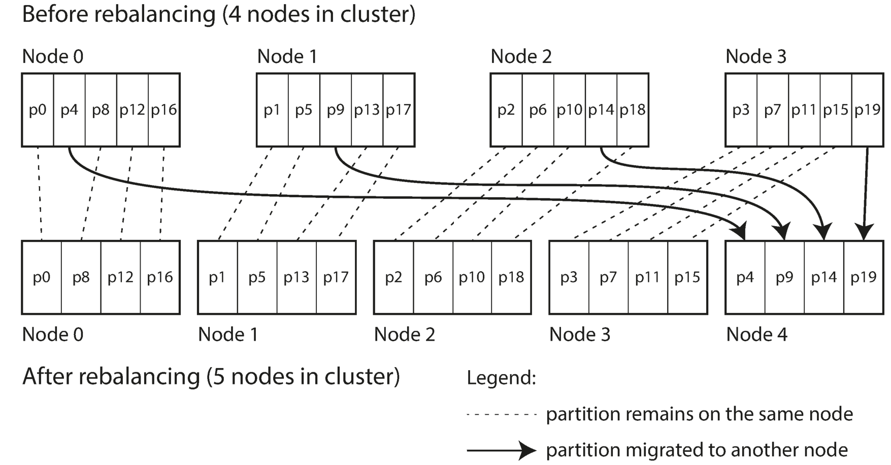
</center>

---

### Suppression d’un nœud

Si un nœud disparaît :

- Ses partitions sont **réassignées** aux autres nœuds
- Toujours sans modifier les règles de partitionnement

> Le *mapping* clé &#8596; partition reste **inchangé**
> ⇒ On ne déplace que **les partitions** (pas les clés dans les partitions).

---

### Flexibilité matérielle

On peut attribuer plus de partitions aux nœuds :

- plus puissants et/ou
- ayant plus de RAM et/ou
- ayant plus de stockage.

> Permet donc un cluster hétérogène sans difficulté.

---

### Utilisé par…

✔️ Riak
✔️ Elasticsearch
✔️ Couchbase
✔️ Voldemort

Ces systèmes reposent sur un **nombre fixe de partitions** créé dès le départ.

> ⚠️ Le nombre de partition est fixé lors de la configuration *initiale*. Si la fission de partition est possible, les différents sgbd choisissent généralement de ne pas le faire.

---

### 🤯 Choisir le bon nombre de partitions

C’est un compromis :

- Trop **peu** de partitions → partitions énormes → rebalancing coûteux
- Trop de partitions → surcharge administrative → overhead mémoire/CPU

Le juste milieu dépend :
- du volume total de données,
- de la vitesse de croissance,
- de la taille moyenne souhaitée par partition.

---

## Stratégie 3 - partitionnement dynamique

### Pourquoi en a-t-on besoin ?

Quand on partitionne **par plages de clés**, fixer les partitions à l’avance pose problème :

- **Mauvaises limites = partitions déséquilibrées**
  → risque d’avoir *toutes* les données dans une seule partition.
  → Cela arrive de faire un mauvais choix 😢

- Reconfigurer les limites **manuellement** est très lourd.

---

Les systèmes comme **HBase**, **RethinkDB** ou **MongoDB** créent et réajustent les partitions automatiquement :

- **Split** :
  Si une partition dépasse une taille (ex : 10 GB), elle est coupée en deux
  `P → P1 + P2`.

- **Merge** :
  Si elle devient trop petite, elle peut être fusionnée
  `P1 + P2 → P`.

---

### Avantages

- Le nombre de partitions **s’adapte au volume de données**.
- Les partitions restent de taille raisonnable.
- Le système maintient un bon équilibrage des charges.

---

### Assignation des partitions

- Chaque partition est **assignée à un nœud**.
- Un nœud peut gérer **plusieurs partitions**.
- Après un split, on peut déplacer une moitié vers un autre nœud pour équilibrer.

---

### Limite importante

Au démarrage :

- Une base vide commence avec **une seule partition**
  → **un seul nœud** reçoit tout le trafic au début.

**Solution** : Pre-splitting

Configurer *à l’avance* plusieurs partitions vides
→ mais nécessite de connaître la **distribution prévue des clés**.

---

## Pour quel type de partitionnement ?

- ✔️ partitionnement par plage de clé
- ✔️ partitionnement par hash

> MongoDB depuis la v2.4 permet le splitting dans les deux cas.

---

## Stratégie 4 - partitionnement proportionnellement aux noeuds

<!-- Une dernière méthode pour la route... on en a vu assez. Celle-ci est présentée dans les grandes lignes pour complétude -->

> **Idée générale**
> On définit **un nombre fixe de partitions par nœud**.
Ainsi :

- Le nombre total de partitions **augmente quand on ajoute des nœuds**.
- La taille d’une partition reste **globalement stable**.
- La répartition de charge s’ajuste automatiquement à l’échelle du cluster.

### Utilisé par

- **Cassandra** (≈ 256 partitions/nœud)
- **Ketama** (lib de consistent hashing)

---

### Quand un nœud rejoint le cluster

1. Le nœud choisit **au hasard** un ensemble de partitions existantes.
2. Pour chacune :  
   il **split** la partition en deux.
3. Il **prend la moitié** des partitions splitées.
4. L’autre moitié reste sur les nœuds d’origine.

Cela permet au nouveau nœud de récupérer une **part équitable** de la charge.

>### 🎲 Pourquoi aléatoire ?  
>Pour éviter des choix biaisés → en moyenne, les splits donnent une répartition juste.  
> Cassandra 3.0 introduit un algorithme amélioré pour éviter les “unfair splits”.

---

# Opération automatique ou rééquilibrage manuel

## Deux approches possibles

### **1) Rééquilibrage manuel**

- assignation des partitions explicitement configuré par un admin.
- change uniquement quand l'admin le reconfigure.

Dans les fait, le système suggère automatiquement une assignation de partition qui doit être validé par l'admin.

---

### **2) rééquilibrage automatique**
- Le système décide *seul* quand déplacer des partitions.
- → Très pratique, peu d’intervention humaine.  
- le rééquilibrage est couteux :
  - rerouting des requêtes
  - Déplacement massif de données  
  - ⇒ risque de :
    - surcharge réseau
    - dégradation de performance des autres requêtes.

---

### Exemple de danger : **automatisme + détection de panne**
> un nœud devient lent → le cluster croit qu’il est “mort”  
→ déclenche un rééquilibrage automatique  
→ encore plus de charge sur le nœud lent  
→ surcharge globale → **effet boule de neige (cascading failure)**

> Privilégier l'intervention/le contrôle humain.
---

<!-- _class: transition3 -->
V. Routing de requêtes

---

# Comment le client trouve le bon nœud ?

Une fois la base **partitionnée**, une question cruciale apparaît :

> **Pour lire/écrire la clé "foo", à quelle adresse IP / port dois-je envoyer la requête ?**

Comme les partitions sont **rebalancées**, l’emplacement d’une clé change →  
il faut un mécanisme fiable pour trouver le bon nœud.

---

# Trois stratégies de routage des requêtes

## **1) Le client contacte n’importe quel nœud**
- Le nœud vérifie s’il possède la partition.
   - Si oui → traite la requête.  
   - Sinon → **forward** vers le bon nœud.

Exemples : Cassandra, Riak (avec gossip).

---

## **2) Via un *routing tier* (proxy intelligent)**
- Le client envoie toutes les requêtes au routeur.  
- Le routeur connaît la localisation des partitions.  
- Il **transfère la requête au bon nœud**.

Exemples :  
- MongoDB → `mongos`  
- LinkedIn Espresso → Helix + ZooKeeper  
- SolrCloud, Kafka → ZooKeeper

---


## **3) Client partition-aware**
- Le client connaît lui-même la carte des partitions.  
- Il se connecte **directement au bon nœud**.

> Performant, mais plus complexe côté client.

---

<center>

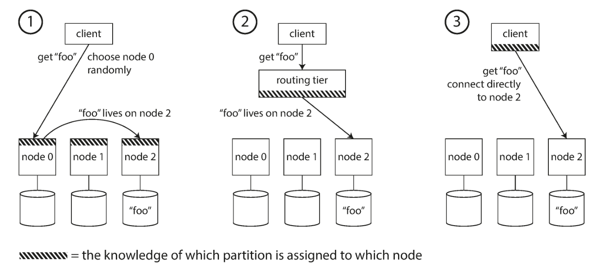
</center>

---


# Être d’accord sur l’état du cluster

- Qui possède quelle partition ?  
- Quel nœud vient de rejoindre / quitter le cluster ?  
- Quelle partition vient d’être déplacée ?

> Tous les acteurs doivent **partager la même vérité**.
Sinon : erreurs de routage, partitions inaccessibles.

Des protocoles de consensus existent, mais ils sont complexes

---

# Coordination 

## Via ZooKeeper ou équivalent

<div class="columns">
<div>

<center>


</center>

</div>
<div>

Beaucoup de systèmes utilisent un service de coordination externe (ex: [ZooKeeper](https://zookeeper.apache.org/)) :

- Les nœuds s’enregistrent  
- ZooKeeper maintient la **carte** des partitions  
- Les routeurs / clients s’abonnent aux mises à jour  
- Notification immédiate quand :  
  - un nœud arrive ou disparaît  
  - une partition change de propriétaire  

</div>
</div>

---

<center>

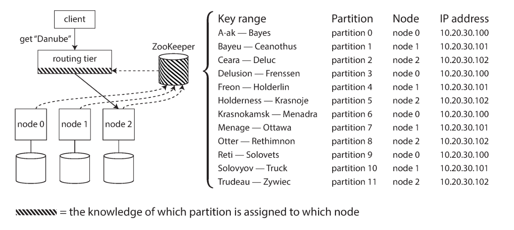
</center>

---

## Alternative : Gossip protocol (pas de dépendance externe)

Systèmes comme Cassandra et Riak :  
- Les nœuds s’échangent des informations d’état en continu.  
- Tout nœud peut recevoir une requête, puis la **redirige** localement.  
- Pas besoin de ZooKeeper.

> ✅ Simple à déployer  
> ❌ Plus complexe et interne au SGBD

---

<!-- _class: transition3 -->
VI. Résumé

---

## Pourquoi

- Stockage au-delà des capacités d’un seul serveur  
- Augmenter le débit de requêtes (scalabilité horizontale)  

## Points d'attention

- Continuer à fonctionner malgré l’ajout/retrait de nœuds  
- Maintenir un système équilibré via **rebalancing**

---

# Deux grandes familles de partitionnement

## 1) Key Range Partitioning
- Clés triées contenus dans des partitions par intervalles  
- ✔️ Permet des **range queries efficaces** 
- ❌ Risque de *hot spots* si les clés récentes/chauffées se concentrent dans une zone : 
- Rebalancing via **split automatique** (HBase, RethinkDB...)

---

# 2) Hash Partitioning

- Hash(key) → bien réparti → moins de risques de hot spots  
- ❌ Perte de l’ordre → **range queries inefficaces**  
- ✔ Souvent : **nombre fixe de partitions** → réassignation lors de l'ajout/retrait d’un nœud  

---

# Approches hybrides

Exemple : **primary key composite**  
- Premier champ → choisir la partition  
- Autres champs → maintenir l’ordre local pour range scans

Combine les avantages des deux mondes.

---


<!-- slide -->
# Partitionnement et index secondaire

## 1) Index Local (Document-Partitioned)

✔ Écriture simple : une seule partition est modifiée  
❌ Lecture coûteuse : nécessite **scatter/gather** sur toutes les partitions

## 2) Index global (Partitionnement par term)

✔ Lecture rapide : une seule partition de l’index est consultée  
❌ Écriture complexe : doit mettre à jour plusieurs partitions de l’index

---

# Routing des requêtes

Plusieurs stratégies pour diriger une requête vers le bon nœud :

1. **Client contacte n’importe quel nœud** (qui redirige si nécessaire)
2. **Tier de routage** dédié
3. **Client partition-aware** (connaît la topologie)

Mécanismes utilisés : ZooKeeper, gossip ...

---
<center>


<center>

---

<!-- _class: biblio -->

- **Kleppmann, M. (2015).** A Critique of the CAP Theorem. [🔗](https://martin.kleppmann.com/2015/05/11/please-stop-calling-databases-cp-or-ap.html)
- **Kleppmann, M. (2017).** Designing data-intensive applications.
- **Sadalage, P. J., & Fowler, M. (2013).** NoSQL distilled: a brief guide to the emerging world of polyglot persistence. Pearson Education.

---

<!-- _class: transition2 -->

Merci !