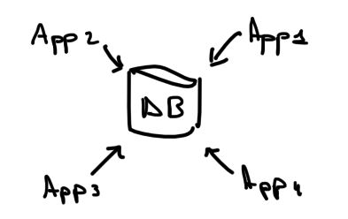
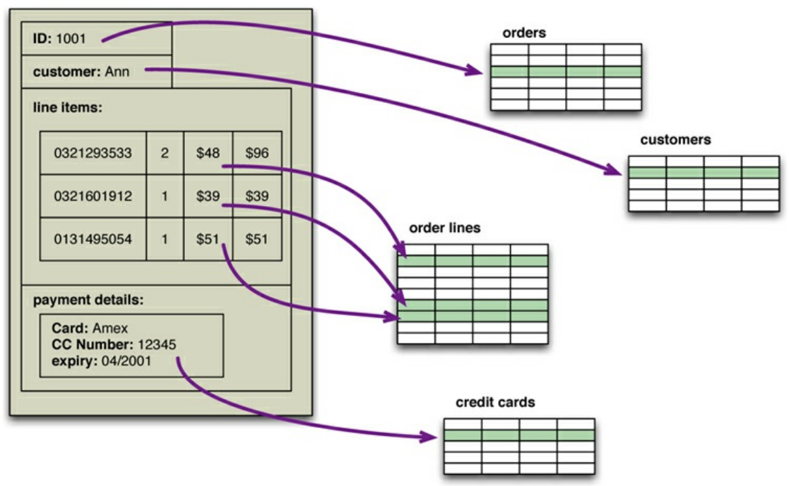
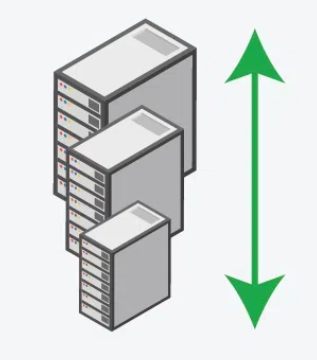
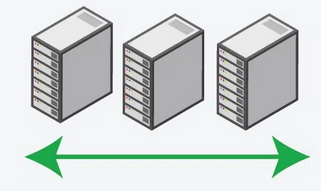
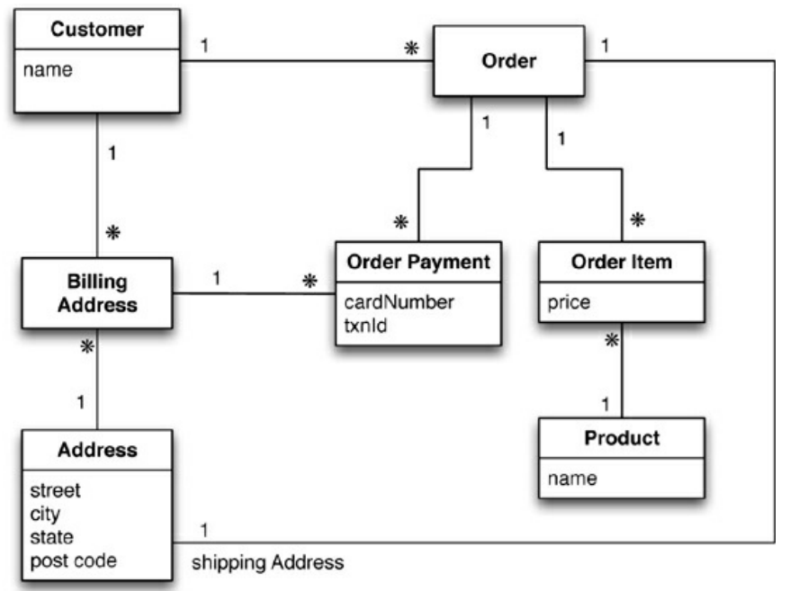
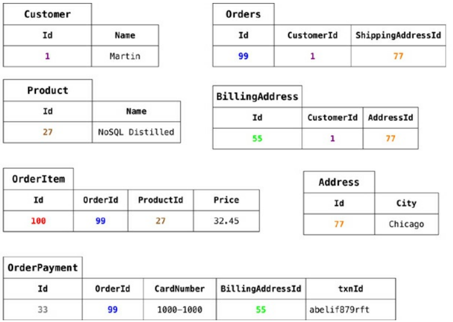
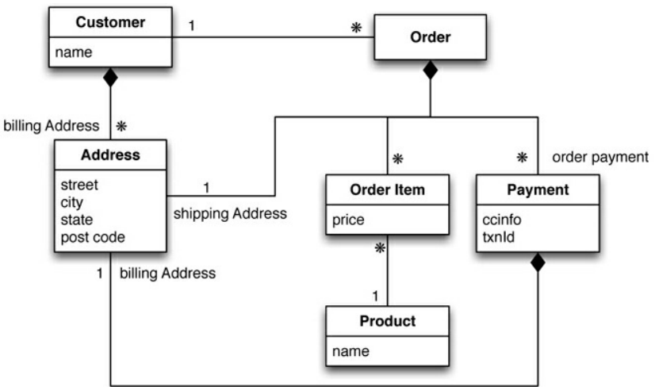
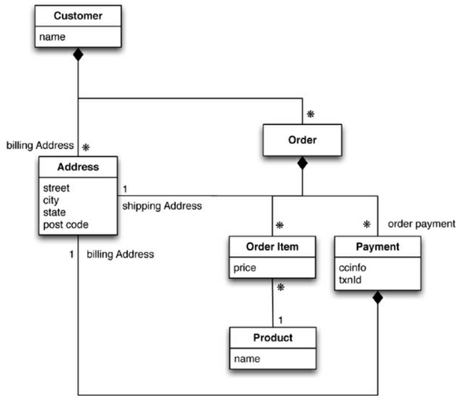
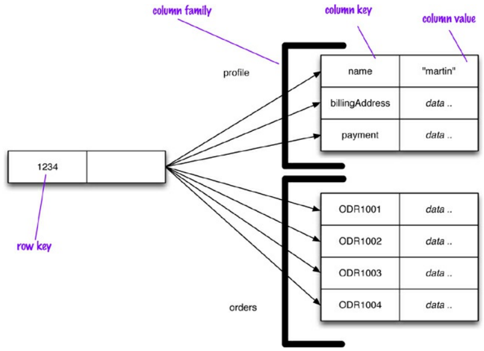

# Objectifs pédagogiques

- Comprendre et mettre en application les points forts d'un **SGBDR**.
- Comprendre et mettre en application les points forts de différents **SGBD NoSQL**.
- Critiquer les forces et les faiblesses des différents modèles de données.
- Adapter la configuration d'un système distribué à certains scénarios
- Concevoir un système multi-modèle adapté.

---

<!-- _class: cite -->

5don4 — Une histoire de compromis

---

# Organisation de l'unité

## BIM1 & BIM2

- 2h par semaine théorie
- 2h par semaine de laboratoire

--- 

L'**évaluation** repose sur 
* la réalisation d'un système **polyglotte** qui vous servira de support pour évaluer la compréhension de la gestion de données dans une application moderne.
* un examen théorique.

---

# Plan du cours (en cours de révision)

* Rappel des concepts des SGBDR
* Introduction au NoSQL
* Introduction aux 4 modèles de données "typiques"
* Réflexion sur les agrégats
* Concepts de systèmes distribués
  * CAP - BASE
  * Réplication
  * Sharding
<!-- * Série chronologique DB
* NewSQL
* Recherche de données -->

---

---

<!-- _class: transition  -->

# Rappels SGBDR — Partie 01

## SGBD, modèle Relationnel, ACID, Normalisation, Dénormalisation

### 5DON4D — Bases de données avancées

---

# Avant de commencer...

Vous utilisez une application bancaire.

Vous effectuez un virement de **100 €** :

**Alice → Bob**

Que doit garantir le système ?

---

# Quelques garanties attendues

Lors d'un virement de **100 €** :

- l'argent doit être retiré du compte d'Alice ;
- l'argent doit être ajouté au compte de Bob ;
- les deux opérations doivent réussir **ensemble** ;
- deux virements simultanés ne doivent pas corrompre les soldes ;
- une panne ne doit pas faire disparaître un virement validé.

> Ces problèmes font partie des responsabilités d'un **SGBD**.

---

# Qu'est-ce qu'une base de données ?

Une **base de données** est un ensemble organisé de données persistantes.

Exemples :

- étudiants et inscriptions ;
- comptes et transactions bancaires ;
- produits et commandes ;
- utilisateurs et publications ;
- mesures provenant de capteurs.

Mais une base de données n'est **pas** un SGBD.

---

# Base de données ≠ SGBD

**Base de données**

> Les données organisées et persistantes.

**SGBD — Système de Gestion de Bases de Données**

> Le logiciel chargé de **stocker, organiser, interroger et protéger** ces données.

Exemples : PostgreSQL, MySQL, MongoDB, Redis, Neo4j...

---

# Pourquoi ne pas utiliser des fichiers ?

Imaginons :

```text
students.csv
courses.csv
registrations.csv
```

> Cela fonctionne... jusqu'à ce que plusieurs applications veuillent :

- modifier les mêmes données ;
- garantir leur cohérence ;
- rechercher efficacement ;
- gérer les pannes ;
- contrôler les accès.

---

# Le rôle du SGBD

Un SGBD prend notamment en charge :

- la persistance ;
- l'organisation des données ;
- les requêtes ;
- les index ;
- les contraintes d'intégrité ;
- les accès concurrents ;
- les transactions ;
- la récupération après une panne ;
- les droits d'accès.

---

# Le modèle relationnel

Dans un SGBD relationnel, les données sont organisées sous forme de relations.

En pratique :

```text
STUDENT

id | name   | city
---|--------|----------
1  | Alice  | Mons
2  | Bob    | Namur
3  | Chloé  | Charleroi
```

Une relation est généralement représentée par une **table**.

---
Un peu de vocabulaire

```text
STUDENT

id | name   | city
---|--------|----------
1  | Alice  | Mons
2  | Bob    | Namur
```

- **relation** → STUDENT
- **attribut** → name
- **tuple** → (1, Alice, Mons)
- **domaine** → valeurs autorisées pour un attribut
- **clé primaire** → id

---

# Les clés

Une **clé primaire** identifie un tuple de manière unique.

```sql
CREATE TABLE student (
    id INTEGER PRIMARY KEY,
    name VARCHAR(100)
);
```

Un **clé étrangère** établit une référence vers une autre relation.
```sql
student_id INTEGER REFERENCES student(id)
```

---

# Les contraintes

Le SGBD peut garantir certaines propriétés des données.

```sql
CREATE TABLE account (
    id INTEGER PRIMARY KEY,
    owner VARCHAR(100) NOT NULL,
    balance DECIMAL(10,2)
        CHECK (balance >= 0)
);
```

Ici :
```sql
balance = -200
```
est un **état interdit**.

---

# Pourquoi les contraintes sont-elles importantes ?

## Sans contrainte :

```
Application A ──┐
                │
Application B ──┼──► Base de données
                │
Application C ──┘
```

> Leeerroooy jeeennnnnnkkkiiiiiinnnnssssssssss — at least he has chicken.

---

# Pourquoi les contraintes sont-elles importantes ?

## Avec les contraintes :

```
Applications
     │
     ▼
    SGBD
     │
     ├── PRIMARY KEY
     ├── FOREIGN KEY
     ├── UNIQUE
     ├── NOT NULL
     └── CHECK
```

Les règles sont garanties **au niveau des données**.

---
# SQL est déclaratif

Considérons :

```sql
SELECT name
FROM student
WHERE city = 'Mons';
```

Nous décrivons :

> ce que nous voulons

mais pas :

> comment le trouver

Le SGBD choisit une stratégie d'exécution.

---

# Comment trouver les données ?


```sql
SELECT *
FROM student
WHERE id = 48392;
```
Approche naïve :

1 → 2 → 3 → 4 → ... → 48392

Le SGBD pourrait devoir parcourir toute la table.

C'est un **table scan**.

---

# Les index

Un index est une structure auxiliaire permettant de retrouver plus rapidement des données.

```text
                 [50]
                /    \
             [20]    [80]
             / \      / \
           ... ...  ... ...
```

Une structure courante : **B-tree**

---

# Un index : toujours une bonne idée ?

Pas nécessairement.

## Un index :

<div class="columns"> <div>
<strong>✓ améliore</strong>

les recherches

``` sql
WHERE email = ?
```

les tris

``` sql
ORDER BY date
```
</div> <div>
<strong>✗ coûte</strong>

- de l'espace disque
- et doit être mis à jour lors des :
  - INSERT
  - UPDATE
  - DELETE
</div> </div>

---

# Un compromis récurrent

Ajouter une structure pour accélérer les **lectures** implique souvent davantage de travail lors des **écritures**.

```text
             INDEX

lecture      +++++
écriture     ---
stockage     ---
```

Nous retrouverons régulièrement ce type de compromis dans les systèmes NoSQL.

---

# Comment savoir ce que fait le SGBD ?

De nombreux SGBD permettent d'inspecter le plan d'exécution.

Avec PostgreSQL :

```sql
EXPLAIN
SELECT *
FROM student
WHERE id = 48392;
```

---

<!-- _class: transition -->
Transactions

*Que se passe-t-il lorsqu'une opération métier nécessite plusieurs modifications ?*

---

# Un virement bancaire

Alice possède 1 000 €.

Bob possède 500 €.

Alice transfère 100 € à Bob.

---

Requêtes
```sql
UPDATE account
SET balance = balance - 100
WHERE id = 'Alice';

UPDATE account
SET balance = balance + 100
WHERE id = 'Bob';
```
Résultat attendu :

```text
Alice: 900€
Bob: 600€
```

---

# Mais...

Que se passe-t-il dans le scénario de panne suivant ?

```text

Alice : 1000 €
Bob   :  500 €

UPDATE Alice -100
        │
        ▼
Alice : 900 €
Bob   : 500 €
        │
        💥
       PANNE
```

Nous avons perdu 100 €.

---

# transaction

Une **transaction** regroupe plusieurs opérations en une unité logique.

```sql
BEGIN;

UPDATE account
SET balance = balance - 100
WHERE id = 'Alice';

UPDATE account
SET balance = balance + 100
WHERE id = 'Bob';

COMMIT;
```
---

`COMMIT` signifie :

La transaction est terminée avec succès et ses modifications peuvent être validées.


```text
BEGIN ──► opérations ──► COMMIT
                           │
                           ▼
                        validé
```

---

# ROLLBACK

Si quelque chose se passe mal :

```sql
BEGIN;

UPDATE ...
UPDATE ...

ROLLBACK;
```
Les modifications de la transaction sont annulées.

---

# Mais ce n'est pas le seul problème...

Imaginons maintenant deux transactions simultanées.

Solde initial : **100 €**

Deux applications veulent modifier ce compte.

> Que peut-il se passer ?

---

# Concurrence

```text
Transaction A              Transaction B

READ → 100                 READ → 100

+ 20                       - 30

WRITE 120                  WRITE 70
```

Résultat final : **70 €**

Mais nous attendions : **90 €**

⚠️ Une modification vient de disparaître. ⚠️

---

# Le SGBD doit donc gérer...

```text
                    Transactions
                         │
          ┌──────────────┼──────────────┐
          ▼              ▼              ▼
       erreurs        pannes        concurrence
```
Nous avons besoin de garanties plus précises.

---

<!-- _class: transition -->

ACID

Quatre propriétés traditionnellement associées aux transactions.

---

# A — Atomicité

*Une transaction est exécutée entièrement ou pas du tout.*

Pour notre virement :

```text
Alice -100  ✓
Bob   +100  ✓
```
ou :

```text
Alice -100  ✗
Bob   +100  ✗
```
mais jamais :

```text
Alice -100  ✓
Bob   +100  ✗
```

---

# C — Cohérence

*Une transaction valide fait passer la base d'un état valide à un autre état valide.*

Exemple d'invariant :

```text
balance >= 0
```

ou :

```text
une inscription référence
un étudiant existant
```

Les contraintes participent au maintien de cette cohérence.

---
# Attention au mot « cohérence » ou « consistency »

Le mot **consistency** est malheureusement utilisé pour plusieurs concepts.

## ACID

Respect des règles et invariants de la base.

---

## Systèmes distribués

Cohérence entre différentes copies des données.

```text
ACID consistency ≠ replica consistency
```

Nous rencontrerons la seconde signification plus tard

Les contraintes participent au maintien de cette cohérence.

---

# I — Isolation

Deux transactions peuvent s'exécuter concurremment.

Mais leurs interactions doivent être contrôlées.

```text
T1 ──────────────┐
                 ├──► SGBD
T2 ──────────────┘
```

L'objectif est d'éviter certaines anomalies liées aux **accès concurrents**.

---

# D — Durabilité

Après :

```sql
COMMIT;
```

le SGBD annonce que la **transaction est validée**.

Même si la machine tombe en panne juste après :

```text
COMMIT
   │
   ▼
   ✓
   │
   💥
```

les données validées doivent pouvoir être récupérées.

---

ACID en quatre questions

| |	Question | 
|---|---|
|A | Que se passe-t-il si l'opération échoue au milieu ?|
|C | Les règles de la base restent-elles respectées ?|
|I | Que se passe-t-il si plusieurs transactions s'exécutent simultanément ?|
|D | Que se passe-t-il après COMMIT si le serveur tombe en panne ?|

---

# À vous !

Une commande contient :

```text
Order
 ├── OrderLine A
 ├── OrderLine B
 └── Payment
 ```

La commande est créée, mais une panne survient avant la création du paiement.

Quelle propriété ACID est principalement concernée ?

---

# À vous !

Une transaction produit :

```text
balance = -50 €
```

alors que la règle métier impose :

```text
balance >= 0
```

Quelle propriété ACID est principalement concernée ?

---

# À vous !

Deux utilisateurs modifient simultanément la même donnée et l'une des modifications est perdue.

Quelle propriété ACID est principalement concernée ?

---

# À vous !

Le SGBD répond :

```text
COMMIT ✓
```

Une seconde plus tard :

```text
💥 panne électrique
```

Après redémarrage, la transaction a disparu.

Quelle propriété ACID n'a pas été respectée ?

---

# Normalisation des données

---

# Normalisation des données

La **normalisation** consiste à organiser les données afin de :

- limiter la **redondance**
- éviter les **incohérences**
- faciliter les **mises à jour**
- garantir l'**intégrité** des données

---

## Exemple

Avec une seule table :

| id_commande | client | adresse_client | produit | prix |
|-------------|--------|----------------|---------|------|
| 1 | Alice | Bruxelles | Clavier | 80 € |
| 2 | Alice | Bruxelles | Souris | 30 € |

➡️ Les informations concernant **Alice sont répétées**.

---

## Après normalisation

On sépare les différentes entités :

**CLIENT**

| id | nom | adresse |
|----|-----|---------|
| 12 | Alice | Bruxelles |

**COMMANDE**

| id | client_id |
|----|-----------|
| 1 | 12 |
| 2 | 12 |

---

**PRODUIT / LIGNE_COMMANDE**

Les relations permettent ensuite de **reconstruire l'information**
avec des jointures.

> On cherche avant tout à stocker les données de manière
> **cohérente et structurée**.

La question : Comment vais-je intérroger mes données ? N'est que peux considérée ici.

---

# Dénormalisation des données

---

# Normaliser... toujours ?

La **normalisation** vise notamment à éviter :

- la redondance des données ;
- les anomalies de mise à jour ;
- les incohérences.

Mais une base parfaitement normalisée peut nécessiter :

- davantage de jointures ;
- davantage de calculs ;
- des requêtes plus complexes ou coûteuses.

> Il peut parfois être intéressant de **dupliquer volontairement une information**.

---

# Dénormalisation

La **dénormalisation** consiste à stocker volontairement une information
qui pourrait être **retrouvée ou calculée à partir d'autres données**.

Exemple :

```text
ORDER
─────────────────────────
id
customer_id
...

ORDER_LINE
─────────────────────────
order_id
quantity
unit_price
```

---

Le montant total peut être calculé :

```sql
SELECT SUM(quantity * unit_price)
FROM order_line
WHERE order_id = 42;
```

Mais on pourrait aussi stocker :

```text
ORDER
─────────────
id
customer_id
total_amount  ← donnée calculée
```

* **Avantage :** lecture plus rapide.
* **Inconvénient :** `total_amount` doit rester cohérent avec les lignes de commande.

---
 <!-- Cours 02 -->

 # Exemple Odoo

 Dans Odoo, un champ peut être calculé à partir d'autres champs.

```python
total = fields.Float(
  compute = "_compute_total"
  store = True
)
```

Avec `store=True`, une valeur qui pourrait être calculée à la demande
est conservée en base de donnée.

On échange donc de l'**espace + coût de mise à jour** contre **une lecture plus rapide**

---

<!-- _class=cite --->
Si je modifie `quantity`, que doit-il arriver à `total_amount` ?

* il faut **recalculer la valeur**. ⚠️ dès qu'on duplique une information, **la cohérence devient notre responsabilité** — ou celle d'Odoo dans cet exemple.

Dans un SGBDR sur une machine, Odoo peut maintenir cette valeur calculée. Que se passe-t'il lorsqu'elle est **répliquée sur plusieurs nœuds** ou représentée dans **plusieurs modèles de données**.
  > *comment maintenir toutes ces représentations cohérentes ?*


---

# Récapitulatif

Aujourd'hui :

```text
                  SGBD
                   │
       ┌───────────┼───────────┐
       ▼           ▼           ▼
    données     requêtes   transactions
       │           │           │
 contraintes    index         ACID
```

Un SGBD ne se contente donc pas de stocker des données.

Il fournit des garanties sur leur manipulation.

---

# Et maintenant ?

Jusqu'ici, nous avons implicitement supposé :

```text
  1 Application (1 client)
             │
             ▼
        ┌─────────┐
        │  SGBD   │
        └─────────┘
             │
             ▼
          disque
```

Que se passe-t-il lorsque plusieurs transactions, plusieurs machines et plusieurs copies des données entrent en jeu ?

---

---

<!-- _class: transition  -->

# Rappels SGBD — Partie 02

## Concurrence, logique, durabilité et limites

### 5DON4D — Bases de données avancées

---

# Rappel

Lors du cours précédent :

- rôle d'un **SGBD** ;
- modèle relationnel et contraintes ;
- index ;
- transactions ;
- `COMMIT` / `ROLLBACK` ;
- propriétés **ACID**.

Aujourd'hui, nous allons regarder ce qui se passe lorsque...

> plusieurs choses arrivent **en même temps**.

---

<!-- Ce slide devrait avoir un style particulier. -->

# 1. Concurrence

## Plusieurs transactions, une même base de données

---

# Pourquoi exécuter plusieurs transactions simultanément ?

Un SGBD peut recevoir des requêtes provenant de :

```text
Utilisateur A ──┐
Utilisateur B ──┤
Utilisateur C ──┼──► SGBD
Utilisateur D ──┤
Application  ───┘
```

Exécuter toutes les transactions l'une après l'autre serait simple...

Mais limiterait fortement les performances.

---

Un produit possède un stock de :

```text
stock = 10
```

Deux clients commandent simultanément le dernier lot de produits.

```text
Transaction A          Transaction B

READ stock             READ stock
     ↓                       ↓
    10                      10

stock = 10 - 6         stock = 10 - 5
```

Que peut-il se passer ?

---

# Lost Update

```text
Transaction A          Transaction B

READ → 10              READ → 10

10 - 6 = 4             10 - 5 = 5

WRITE 4
                        WRITE 5
```

Résultat :

```text
stock = 5
```

La modification de la `transaction A` a été perdue.

---

# Une autre anomalie

Transaction A :

```sql
SELECT balance
FROM account
WHERE id = 42;
```

Résultat :

```
1000 €
``` 

Pendant ce temps...

La `Transaction B` modifie ce compte.

---

# A. Non-repeatable read

```text
Transaction A                 Transaction B

READ balance
→ 1000 €

                              UPDATE balance
                              → 800 €
                              COMMIT

READ balance
→ 800 €
```

La même transaction lit deux valeurs différentes pour la même donnée.

---

# B. Dirty Read

Une transaction peut-elle lire une modification qui n'a pas encore été validée ?

```text
Transaction A                 Transaction B

UPDATE balance
→ 500 €

                              READ balance
                              → 500 €

ROLLBACK
```

Transaction B a utilisé une valeur...

qui n'a finalement jamais existé dans un état validé.

---

# Phantom Read

Une transaction effectue :

```sql
SELECT COUNT(*)
FROM student
WHERE year = 3;
```

Résultat : `42`

Une autre transaction ajoute un étudiant puis valide.

La même requête retourne ensuite : `43`

Une nouvelle ligne est « apparue ».

---

# Isolation

Le I de ACID :

Les transactions concurrentes doivent être suffisamment isolées les unes des autres.

Mais isoler complètement les transactions peut avoir un coût.

```text
  Isolation
      ▲
      │ •
      │     
      │   •
      │          •
      └──────────── ► Concurrence
```

Il existe donc différents compromis.

---

# Niveaux d'isolation SQL

Classiquement :

| Niveau           | Isolation |
| ---------------- | --------- |
| Read Uncommitted | faible    |
| Read Committed   | ↑         |
| Repeatable Read  | ↑         |
| Serializable     | forte     |

Plus l'isolation est forte, plus le SGBD doit contrôler les interactions entre transactions.

---

# A. Serializable

Idéalement, l'exécution concurrente :

```text
T1 ─────┐
        ├──── exécution concurrente
T2 ─────┘
```

produit un résultat équivalent à une exécution :

```text
T1 → T2
```

ou :

```text
T2 → T1
```

Serializable est le niveau d'isolation le plus fort.

---

# Comment faire ?

Plusieurs mécanismes existent :

- verrous ;
- MVCC ;
- contrôle optimiste ;
- détection de conflits ;
- ordonnancement des transactions.

Le choix dépend du SGBD.

---

# Verrouillage

Exemple simplifié : `Transaction A`

```text
LOCK account 42
      │
      ▼
   UPDATE
      │
      ▼
   COMMIT
      │
      ▼
   UNLOCK
```

Une autre transaction doit éventuellement attendre.

---

# Le problème des verrous

Transaction A :

```text
LOCK account A
LOCK account B
```

Transaction B :

```text
LOCK account B
LOCK account A
```

Que peut-il se passer ?

---

# Deadlock

```text
Transaction A                 Transaction B

LOCK A                        LOCK B
   │                             │
   ▼                             ▼
attend B ◄────────────────── attend A
```

Les deux transactions attendent indéfiniment.

C'est un *deadlock*.

Le SGBD peut détecter la situation et annuler une transaction.

---

# 2. Logique dans le SGBD

## Toutes les règles doivent-elles être dans l'application ?

---

# Où placer la logique ?

Prenons une règle :

> Le stock d'un produit ne peut jamais être négatif.

On pourrait vérifier cela dans l'application:

```text
Application
     │ if stock >= quantity
     │ 
     ▼
    SGBD
```

Mais que se passe-t-il si plusieurs applications accèdent à la même base ?

---

# Contraintes

Certaines règles peuvent être placées directement dans la base :

```sql
CREATE TABLE product (
    id INTEGER PRIMARY KEY,
    name VARCHAR(100) NOT NULL,
    stock INTEGER CHECK (stock >= 0)
);
```

Toutes les applications bénéficient alors de la même garantie.

---

# Les vues

Une vue représente le résultat d'une requête comme une table virtuelle.

```sql
CREATE VIEW active_students AS
SELECT id, name
FROM student
WHERE active = true;
```

Puis :

```sql
SELECT *
FROM active_students;
```

---

# Pourquoi utiliser une vue ?

Une vue peut :

* simplifier des requêtes complexes (ex: 4web3d — jointures) ;
* masquer certains détails du schéma ;
* contrôler l'accès à certaines données ;
* fournir une représentation adaptée à un usage.

Elle ne contient généralement pas elle-même les données.

---

# Vue matérialisée

Une vue matérialisée stocke le résultat de la requête.

```text
Tables
  │
  │ calcul
  ▼
┌──────────────────┐
│ Vue matérialisée │
└──────────────────┘
```

✅ Avantage : **lecture plus rapide**

❌ Inconvénient : **il faut maintenir ou rafraîchir le résultat.**

---

# Procédure stockée

Une procédure stockée est du code exécuté dans le SGBD.

## Par exemple :

```sql
CALL transfer_money(1, 2, 100);
```

La procédure peut réaliser plusieurs opérations :

```text
transfer_money()
      │
      ├── vérifier le solde
      ├── débiter Alice
      ├── créditer Bob
      └── enregistrer le transfert
```

---

# Pourquoi une procédure stockée ?

## Quelques avantages :

- logique proche des données ;
- plusieurs opérations regroupées ;
- réduction des échanges réseau ;
- possibilité de gérer une transaction ;
- logique commune à plusieurs applications.

## Mais également :

- dépendance au SGBD ;
- logique métier répartie entre application et base ;
- maintenance parfois plus difficile.

---

# Trigger

Un trigger exécute automatiquement une action lorsqu'un événement se produit.

```text
        INSERT order
             │
             ▼
          TRIGGER
             │
             ▼
       journalisation
```

Exemples d'événements :

```text
INSERT
UPDATE
DELETE
```

---

# Question

Nous avons :

```text
Application
     │
     ▼
INSERT INTO orders ...
     │
     ▼
   Trigger
     │
     ▼
UPDATE statistics ...
```

- ✅ Quel avantage ?
- ❌ Quel risque ?

---

# Une idée importante

Avec les triggers et procédures stockées :

```text
Une écriture
    │
    ▼
peut provoquer
    │
    ▼
d'autres écritures
```

Gardez cette idée en tête.

Elle deviendra importante lorsque les données seront réparties sur plusieurs machines.

---

# 3. Durabilité

## Comment le SGBD peut-il tenir sa promesse ?

---

## Le D de ACID

Le SGBD répond :

```text
COMMIT ✓
```

Puis immédiatement : 💥

## Après redémarrage...

la transaction doit toujours être présente.

**Comment est-ce possible ?**

---

# Mémoire ≠ stockage durable

La mémoire vive est rapide :

```text
 RAM 
 ↑↑↑
rapide
```

mais son contenu peut être perdu lors d'une panne.

Le disque / SSD est persistant :

```text
Stockage
    ↓
plus lent
```

Le SGBD doit donc concilier : *performance + durabilité*

---

# Write-Ahead Log

Une technique fondamentale :

## WAL — Write-Ahead Log

Principe simplifié :

> Avant de considérer une modification comme durable, le SGBD écrit suffisamment d'informations dans un journal persistant.

---

# Principe du WAL

```text
             UPDATE
                │
                ▼
        ┌───────────────┐
        │      WAL      │
        └───────────────┘
                │
                ▼
             COMMIT
                │
                ▼
        pages de données
```

Les pages de données peuvent être écrites plus tard.

---

# Pourquoi un journal ?

Après une panne :

```text
💥
│
▼
redémarrage
│
▼
lecture du journal
│
▼
récupération
```

Le SGBD peut utiliser le journal pour retrouver un état cohérent.

---

# Le journal aura une autre utilité...

Nous venons de voir :

```text
Transaction
     │
     ▼
    WAL
```

Le WAL représente une suite ordonnée de modifications.

## Que pourrait-on faire de cette suite si nous avions...

**une deuxième machine ?**

---

# 4. Une seule machine...

## ...est-ce toujours suffisant ?

---

# Notre architecture jusqu'ici

```text
       Clients
          │
          ▼
     Application
          │
          ▼
     ┌─────────┐
     │  SGBD   │
     └─────────┘
          │
          ▼
       Stockage
```

Simple. ⚠️ **Et souvent parfaitement suffisant.** ⚠️

---

# Problème 1

Notre base contient :

**500 Go**

Puis :

**1 To**

Puis :

**50 To**

## Que faisons-nous ?

---

# Scale up

## Première solution :

Utiliser une machine plus puissante.

```text
CPU     ↑
RAM     ↑
Disque  ↑
```

C'est le scaling vertical ou scale up.

**Simple...
mais pas illimité.**

---

# Problème 2

Notre serveur peut traiter :

```text
10 000 requêtes/s
```

Nous devons maintenant en traiter :

```text
100 000 requêtes/s
```

Une seule machine devient un goulot d'étranglement.

---

# Scale out

Autre possibilité :

```text
             Application
                  │
        ┌─────────┼─────────┐
        ▼         ▼         ▼
      Node A    Node B    Node C
```

Ajouter plusieurs machines :

**scaling horizontal / scale out**

Mais une question apparaît immédiatement...

---

# Où sont les données ?

Solution possible :

```text
Node A          Node B          Node C
──────          ──────          ──────
A → H           I → Q           R → Z
```

Nous avons réparti les données.

> **Partitionnement**

---

# Problème 3

Notre serveur fonctionne parfaitement.

```text
Jusqu'au jour où...

             💥
        ┌─────────┐
        │  SGBD   │
        └─────────┘
```

**Que deviennent nos utilisateurs ?**

---

# Plusieurs copies ?

Nous pourrions avoir :

```text
            données
                 │
       ┌─────────┼─────────┐
       ▼         ▼         ▼
    Node A     Node B     Node C
      copie      copie      copie
```

Si une machine disparaît, les données existent ailleurs.

> Réplication

---

# Facile ?

Nous écrivons :

```text
x ← 42
```

sur trois machines :

```text
       x ← 42
      /      \
     ▼        ▼
 x ← 42     x ← 42
```

Mais...

---

# Et si le réseau tombe ?

```text
              WRITE x ← 43
                   │
             ┌─────┴─────┬──────x─────┐
             ▼           ▼            ▼   
          Node A       Node B       Node C
          x ← 43       x ← 43       x = 42
```

Quelle est maintenant la valeur de x ?

---

# Et si deux utilisateurs écrivent ?

```text
Utilisateur A                  Utilisateur B
     │                              │
     ▼                              ▼
 x = "Alice"                    x = "Bob"
     │                              │
     ▼                              ▼
  Node A                         Node C
```

Les deux écritures ont lieu pratiquement simultanément.

> **Laquelle gagne ?**

---

# Nous avons résolu un problème...

Nous voulions :

- plus de capacité ;
- plus de performances ;
- plus de disponibilité.

Nous avons introduit :

- plusieurs machines ;
- plusieurs copies ;
- des communications réseau ;
- des pannes partielles ;
- des écritures concurrentes.

---

# ...et créé de nouveaux problèmes

```text
                 Base distribuée
                       │
       ┌───────────────┼────────────────┐
       ▼               ▼                ▼
  Réplication    Partitionnement    Cohérence
       │               │                │
       ▼               ▼                ▼
   plusieurs       répartir les      quelle valeur
    copies            données         est correcte ?
```

---

# Une différence fondamentale

## Sur une machine :

Machine 💥

> Le système fonctionne ou ne fonctionne plus.

---

## Dans un système distribué :

```text
Node A ✓

Node B ✓

Node C ?

Réseau A ↔ B ✓

Réseau B ↔ C ✗
```

Une partie du système peut fonctionner pendant qu'une autre ne fonctionne plus.

---

# La suite de 5DON4

Nous allons maintenant étudier comment les systèmes de données gèrent ces problèmes :

* Modèles de données
* Réplication
* Partitionnement
* Transactions distribuées
* Cohérence

Et nous allons découvrir qu'il existe rarement une solution parfaite.

Il s'agit surtout de comprendre les... **compromis**.

---

---

<!-- _class: transition  -->

# Introduction au NoSQL — Partie 03

## Concurrence, logique, durabilité et limites

### 5DON4D — Bases de données avancées


---

<!-- _class: cite -->

Qu'est ce que le NoSQL ?

Est-il meilleur que le modèle relationnel ?

---

<!-- _class: transition -->

Retour sur le modèle relationnel

---

Les bases de données relationnelles, ont longtemps été le choix par défaut.

* Oracle DB
* MySQL,
* PostgreSQL,
* ...

---

# Clés du succès

* **Persistance** et **manipulation** des données
* Gestion de la **concurrence**
* **Intégration**
* **Modèle standard**
---
## Données persistantes

* Gestion de données non volatile.
* Lecture, écriture, recherche plus facile qu'un système de fichier.
  - manipulation de petits éléments d'information,
  - récupération en *lots*,
  - agréger l'information (somme, moyenne...)
  - ...

---

## Contrôle de la concurrence

* Plusieurs utilisateurs peuvent modifier le même morceau d'information en même temps.
  > Risque : *conflits*
  > Solution : *transactions* (atomicité & rollback en cas d'erreur)
---

## Intégrer (lier) des applications en utilisant une base de données partagée

<center>



</center>

* Les données modifiées par une application doit être vue par les autres ;
* garantie de cohérence, une application ne doit pas être en mesure de corrompre les données d'une autre application
* ...

---

## Modèle standard

Quelques différences entre les bases de données relationnelles, mais globalement identiques.

* Compétences des développeurs réutilisées dans beaucoup de projets.
* Requêtes SQL et fonctionnement de base identique.
* organisation des données adaptées à la majorité des requêtes,
* Concept de transaction, trigger...

---

# Impedance missmatch

Coexistance de deux représentations

* le modèle relationnel ;
* les structures en mémoire :
  * listes,
  * tableaux,
  * objets imbriqués,
  * héritage,
  * ...

> Traduction nécessaire, frustration des développeurs...
---

<center>



</center>

---

*1990 :* Naissance de l'orienté objet et des *bases de données orientées objet* :face_with_open_eyes_and_hand_over_mouth:.

<center>


</center>

---

# Les **ORM** facilite...
## ..mais le développeur ne peut ignorer ce qu'il fait.
- le lazy/eager loading,
- les associations (`1..N`, `N..N`),
- coût des jointures,
- la gestion des index,
- nécessité d'écrire des requêtes plus complexes,
- ...

---

# BDD intégrative vs BDD applicative

## Base de donnée intégrative

Application implémentée par des équipes différentes sont unies par une même base de données. Le *SQL* joue un rôle la flexibilité de l'utilisation du schéma en joue un autre.

Inconvénients : 
- La structure peut devenir extrêment complexe.
- Syncronisation entre les équipes nécessaires (développement plus difficile).
- Des applications différentes ont des besoins différents. Ex. performance -> index (problème d'insertion pour une application A - pour une meilleure recherche de l'application B).

---

## Base de donnée applicative

Changement dans les années 2000, utilisation de services web.

> ## Les services web ([Wikipedia](https://fr.wikipedia.org/wiki/Service_web))
> Un service web est un protocole d'interface informatique de la famille des technologies web permettant la communication et l'échange de données entre **applications et systèmes hétérogènes** dans des **environnements distribués**. Il s'agit donc d'un ensemble de fonctionnalités exposées sur internet ou sur un intranet, par et pour des applications ou machines, sans intervention humaine, de manière synchrone ou asynchrone. 
>
> Le protocole de communication est défini dans le cadre de la norme SOAP dans la signature du service exposé (WSDL). **Actuellement**, le protocole de transport est essentiellement TCP (via HTTP)

---

> ## Base de donnée applicative
> * communication des applications via le protocol HTTP.
> * Une et une seule application accède à/aux la base(s) de donnée. 

Possibilité de communiquer grâce à des structures de données plus riches ; d'abord XML (ex: Odoo), ensuite JSON (ex: gitlab...).

* tableaux
* données imbriquées
* listes

---

<!-- _class: cite -->

Malgré cela, pas d'aspiration à stocker les données différemment. Le modèle relationnel est maîtrisé et fonctionne suffisamment bien.

---

# Utilisation de Cluster

## Web 2.0 et bulle internet des années 2000.

Activités, tracking, gestion des données des réseaux sociaux (liens...) => la quantité de données explose.

> 2 options face à cette quantité d'information
> 
> * Scalabilité verticale
> * Scalabilité horizontale

---


## Scaling vertical (scaling-up)

<div class="columns">
<div>


Crédits : [geeks for geeks](https://www.geeksforgeeks.org/system-design/system-design-horizontal-and-vertical-scaling/)

</div>
<div>

* Pas de changement dans le code de l'application,
* réseau plus simple,
* maintenance plus facile.

</div>
</div>


---

### Scaling horizontal (scaline-out)

<div class="columns">
<div>


Crédits : [geeks for geeks](https://www.geeksforgeeks.org/system-design/system-design-horizontal-and-vertical-scaling/)

</div>
<div>

* Augmente la "disponibilité",
* plus robuste,
* facilité d'augmenter la charge.

</div>
</div>


⚠️ Les bases de données relationnelles ne sont pas prévues pour ce type d'architecture !

---

Adaptation des bases de données relationnelles aux clusters

* Challenges techniques :
   * Sous système avec disque partagé.
   * Séparation par shard (géré par l'application).

* Coût des licences : 1 machine = 1 licence

=> Google et Amazon influence un changement.

---

# Cluster ([Wikipédia](https://fr.wikipedia.org/wiki/Grappe_de_serveurs))
Un cluster désigne des techniques consistant à regrouper plusieurs ordinateurs **indépendants** appelés nœuds, afin de permettre une **gestion globale** et de dépasser les limitations d'un ordinateur pour **augmenter la disponibilité**, **facliliter la montée en charge**, permettre une **répartition de la charge**, faciliter la **gestion des ressources**.

La création de petits cluster est un procédé peu coûteux, consistant à grouper plusieurs ordinateurs en **réseau**.

---


# Émergence du NoSQL

## Origine du terme

1. 1998 - Apparition du terme NoSQL ([Strozzi NoSQL](https://en.wikipedia.org/wiki/Strozzi_NoSQL))
   * Fichier "ASCII" (format *relationnel*)
   * manipulé par ~~SQL~~ des scripts *shell*.
   * aucune influence sur les BDD traitées dans ce cours.

1. 2005 - première release de BigTable (Google)
   * wide-column et clé-valeur
   * forte charge opérationnelle et capacité d'analyse.


---

3. [Papier Amazon Dynamo 2007](https://www.allthingsdistributed.com/2007/10/amazons_dynamo.html).

1. **11 juin 2009**, meetup informel à SanFrancisco organisé par Johan Oskarsson. Objetif : discuter de **base de données distribuées** & **non-relationnelles**.
   > ## Il fallait
   > * un bon hashtag,
   > * pas trop utilisé sur Google
   > * => *#NoSQL* proposé dans le chan irc #cassandra. Ne représente pas vraiment le sujet, mais est un bon hashtag 🤡) 

---

# Sujets des talks : 
 * Voldemort (clé-valeur)
 * Cassandra (wide column store)
 * Dynomite (clé-valeur)
 * HBase (wide column store)
 * Hypertable (wide column store)
 * CouchDB (document)
 * MongoDB (document)

---

# ~~Définition~~ Caractéristiques du NoSQL

Il n'existe pas de définition, plutôt un ensemble de caractéristiques.
* Pas d'utilisation du SQL
* XXI siècle
* Non relationnel
* Sans schéma ⚠️
* Distribué
* Autres propriétés que les propriétés ACID.

---

# Les caractéristiques ne sont pas toujours rencontrées : 

*Ex :* Modèle graphe sur un serveur unique.

---

<!-- _class: cite -->
Au final, il est préférable de voir le NoSQL comme une mouvence. Stocker les données en choisissant le modèle de donnée et l'architecture la plus adaptée aux besoins. Les SGBD NoSQL et les SGBD relationnelles sont devenues des options.

---

# 2 raisons d'utiliser le NoSQL : 

- besoins de performance (scalabilité)
- améliorer la productivité du développement d'une applicaation

---

# Quelques mots-clés

<div class="columns">
<div>

- modèles de données
- Impédence missmatch
- Scalabilité
- Cluster
- Sans schéma
- CAP

</div>
<div>

- Sharding
- Réplication
- Aptitude au Big Data
- Performance
- dénormalisation
- Haute disponibilité

</div>
</div>

---

---

<!-- _class: transition  -->

# Modèles de données *agrégat* — Partie 04

## SGBD, modèle Relationnel, ACID, Normalisation, Dénormalisation

### 5DON4D — Bases de données avancées


---

Un *modèle de donnée* décrit comment intéragir avec les données.

* à ne pas confondre avec le modèle de stockage qui décrit comment la base de donnée stoque et manipule les donnée en interne.

---

Généralement, on fait le lien avec

> ## Modélisation des données (Wikipedia)
>
> Dans la conception d'un système d'information, la *modélisation des données* est l'analyse et la conception de l'information contenue dans le système afin de représenter la structure de ces informations et de structurer le stockage et les traitements informatiques.
>
> Il s'agit essentiellement d'*identifier les entités logiques* et *les dépendances logiques* entre ces entités. La modélisation des données est une représentation abstraite, dans le sens où les valeurs des données individuelles observées sont ignorées au profit de la structure, des relations, des noms et des formats des données pertinentes, même si une liste de valeurs valides est souvent enregistrée. 

Représentation qu'on peut faire à l'aide d'un diagramme ~~entité-relation~~ entité-association.

---

<!-- _class: cite -->

Dans les slides qui suivent, nous utiliserons le terme *modèle de données* pour décrire la manière dont les base de données organisent les données (métamodèle).

---
<center>



*Figure 1.1.* Diagramme entité-association normalisé.

</center>

---

## Le modèle de donnée relationnel

* Ensemble de table (*relation*)
* Chaque table possède des lignes ou enregistrement (*tuple*) qui représente des instances.
* Les instances sont décritent au travers de colonnes (⚠️ 1 valeur par *cellule*).
* Une colonne peut faire référence à un autre relation constituant une association entre elles-deux

---

## Modèles de données du NoSQL

> Orientées agrégats
> * Document
> * Clé-valeur
> * Famille de colonnes

> Non orientées agrégats
> * Graphe

---

# *Agrégats*

Orientation différente du relationnel :

- Modèle Relationnel : On prend l'information et on la divise en tuples (plats, non imbriqués)
- Orientation agrégat : On pense à comment manipuler les données. Souvent, on veut des **structures complexes** :
  - Listes
  - Structures imbriquées

---

> ## Définition
> 
> Terme qui vient de [Domain-Driven Design](https://fabiofumarola.github.io/nosql/readingMaterial/Evans03.pdf). Un *agrégat* est une collection d'objets liés que l'on souhaite traité comme *unité d'information*. En particulier, cela forme une unité pour 
> * *la manipulation de donnée* et 
> * *la gestion de la cohérence*.

## Avantages

* Un agrégat forme une unité naturelle pour la réplication et le sharding (dans un cluster).
* Le développeur a l'habitude de manipuler des données imbriquées, des listes, tableaux...

---

<center>
Diagramme entité-association normalisé.


</center>

---

<center>

Échantillon de données



</center>

---

<center>

Diagramme pensé en terme d'agrégat (solution 1)



</center>

---

```json 

{ // in customers
  "id": 1,
  "name": "Martin",
  "billingAddress": [{"city": "Chicago"}] ⚠️ Dénormalisation
}

{ // in orders
  "id": 99,
  "customerId": 1,
  "orderItems": [{
      "productId": 27,
      "price": 32.45,
      "productName": "NoSQL Distilled"
    }
  ],
  "shippingAddress": [{"city":"Chicago"}], ⚠️
  "orderPayment": [{
      "ccinfo":"1000-1000-1000-1000",
      "txnId":"abelif879rft",
      "billingAddress":{"city":"Chicago"} ⚠️
    }
  ]
}
```

---

* Apparition de 3 copies d'une même adresse (*dénormalisation*). 
   * 🗒️ En relationnel, il est nécessaire de prévenir la modification d'une ligne d'adresse.
* Le lien entre un client et une commande ne fait partie d'aucun agrégat. → Il s'agit d'une association.

* **Dénormalisation** du nom du produit. Pourquoi est-ce acceptable/souhaitable en NoSQl ?
  > * On souhaite minimiser le nombre accès aux agrégats.

* ⚠️ Ce qui compte, n'est pas tant la façon exacte dont on dessine la frontière d'un agrégat, mais plutôt de réfléchir à la manière dont on va accéder aux données.

---

<center>

Diagramme pensé en terme d'agrégats (solution 2)

</center>

---

```json
{
  "customer": {
    "id": 1,
    "name": "Martin",
    "billingAddress": [
      { "city": "Chicago" }
    ],

    "orders": [ {
        "id": 99,
        "customerId": 1,
        "orderItems": [ {
            "productId": 27,
            "price": 32.45,
            "productName": "NoSQL Distilled"
          }
        ],
        "shippingAddress": [
          { "city": "Chicago" }
        ],
        "orderPayment": [ {
            "ccinfo": "1000-1000-1000-1000",
            "txnId": "abelif879rft",
            "billingAddress": { "city": "Chicago" }
          }
        ]
      }
    ]
  }
}
```

---

# Quelle agrégation est meilleure ?

Cela dépend de comment on souhaite manipuler les données
* Accès client ↛  accès aux commandes ⇒ modèle 1
   > Permet d'accéder individuellement aux commandes
* Accès client → accès aux commandes ⇒ modèle 2

Dépend de l'application, ce qui en fait un désavantage par rapport aux systèmes ignorant les agrégats.

---

## Non conscient des agrégats vs orienté agrégat

- **Relational & Graph DBs** : Non conscient des agrégats
  → pas de notion d'agrégat, juste des relations sans sémantique entre les données.
- **NoSQL (Key-Value, Document, Column-Family)** : aggregate-oriented
  → l'agrégat indique l'unité de stockage et d'accès


---

## Pourquoi l'orientation agrégat ?

- Facilite le **stockage distribué en cluster**
- L'agrégat indique quelles données doivent vivre ensemble sur le même nœud 
- Simplifie la gestion de la cohérence locale

⇒ Une bdd relationnelle ne peut pas utiliser des données d'agrégat pour optimiser le stockage et la distribution de données.

---

Ne pas connaître les agrégats est-il un handicap ?

* Parmi les deux modèles d'agrégat précédement proposés.Comment réaliser un historique de la vente des produits ?
* Idem avec le schéma relationnel ?

---

## Conséquence sur les transactions

- **SGBDR** : transactions ACID multi-tables (sans limite)
- **NoSQL agrégat-orienté** : atomicité **au niveau d'un seul agrégat**
  → si plusieurs agrégats : gestion à la charge de l'application
- **Graph & relationnel** : ACID complet possible

> ## Transation ACID (Atomique, cohérent, isolé, durable)
> 
> Permet 
> * de mettre à jour plusieurs table en une opération. 
> * l'opération est réussie ou non-appliquée
> * les opérations concurrente sont isolées et ne peuvent pas voir des mises à jours partielles.

---

# Modèle Clé-valeur & Modèle Document

---

## Base de données Clé-valeur

- Données = { **clé** → **agrégat opaque** }
- Avantages :
  - Flexibilité totale sur le contenu
  - Performance simple (lookup par clé)
- Limite : pas de requêtes internes, pas de sous-récupération

---

## Base de données Document

- Données = { **clé** → **document structuré** }
- Avantages :
  - Requêtes par *"clé"* internes
  - Récupération partielle possible
  - Index sur le contenu
- Limite : moins libre que clé-valeur

---

## Clé-valeur vs Document

- **Key-Value** : lookup uniquement par clé
- **Document** : requêtes riches sur la structure
- La frontière est floue (Redis, Riak, etc.)

---

# Famille de colonne

---

## Origine : Google Bigtable

- Modèle repris par **HBase** et **Cassandra**
- Stockage en **colonnes groupées (famille de colonnes)**
- Différent des colonnes « relationnelles » classiques

---

## Structure

- Map à **deux niveaux :**
  - **Row** (identifiant → agrégat)
  - **Columns** regroupées en **familles**
- Accès possible : tout le row ou colonnes spécifiques

---

<center>



</center>

---

# Comparaison des 3 modèles

---

## Comparaison des 3 modèles

- **Key-Value** : agrégat opaque, lookup par clé uniquement
- **Document** : agrégat transparent, requêtes internes possibles
- **Column-Family** : agrégat en 2 niveaux (row + familles de colonnes)

---

## Points communs

- Agrégat = unité d'accès et de mise à jour
- Optimisé pour le **cluster**
- Donne un compromis entre **structure** et **flexibilité**

---

<center>


<center>


---

<!-- _class: biblio -->

- **Kleppmann, M. (2015).** A Critique of the CAP Theorem. [🔗](https://martin.kleppmann.com/2015/05/11/please-stop-calling-databases-cp-or-ap.html)
- **Kleppmann, M. (2017).** Designing data-intensive applications.
- **Sadalage, P. J., & Fowler, M. (2013).** NoSQL distilled: a brief guide to the emerging world of polyglot persistence. Pearson Education.

---

<!-- _class: transition2 -->

Merci !